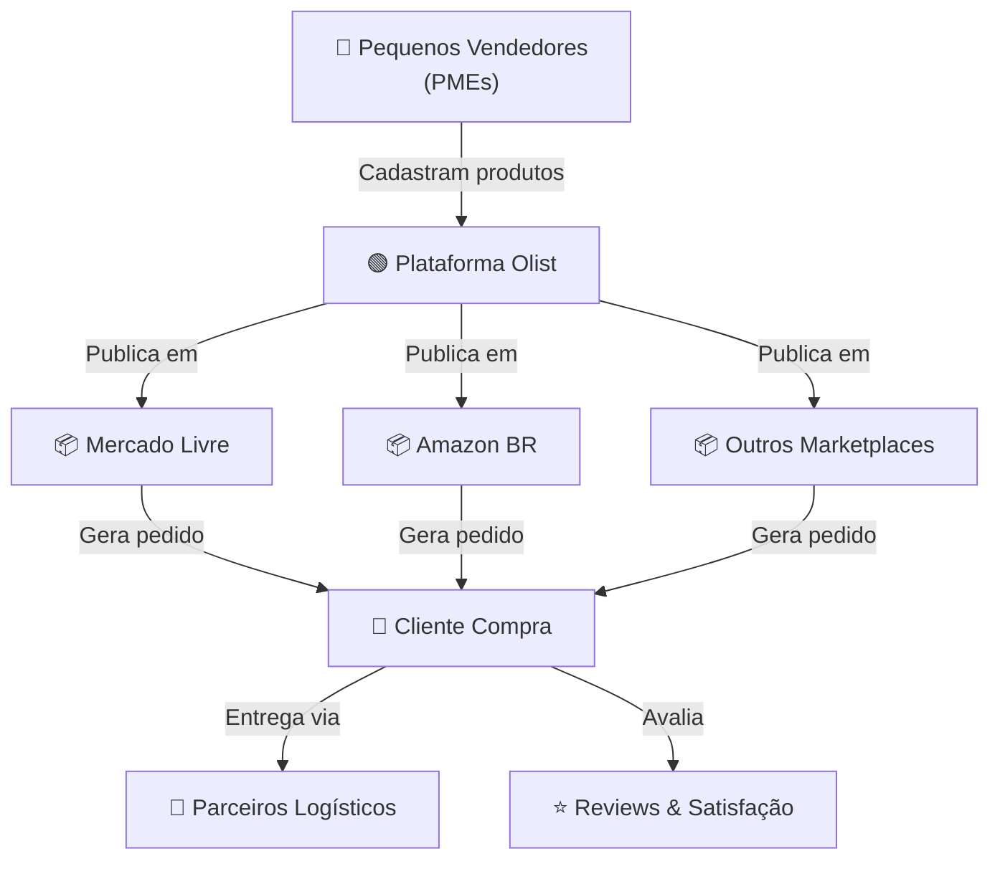
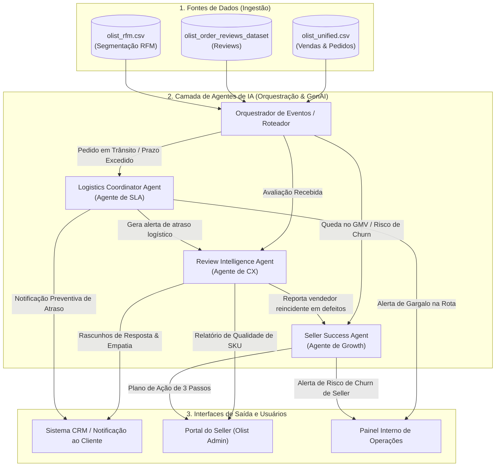

# 📖 Relatório Executivo de Engenharia de Dados e Proposta de IA Agêntica

## Tech Challenge — Fase 1 (Caso: Plataforma Olist)
**Disciplina:** IA vs Agentes de IA: o que muda?  
**Data:** 20 de Julho de 2026  
**Local de Salvamento:** `c:\Users\paler\Documents\DataScience\POS TECH Agentes de IA\FASE 1\TechChallenge\abordagem 1\`  
**🎥 Vídeo Executivo (Link):** `[Cole aqui o link do vídeo gravado - YouTube/Vimeo/Drive]`  
**📜 Roteiro do Vídeo:** [roteiro_video_executivo.md](file:///c:/Users/paler/Documents/DataScience/POS%20TECH%20Agentes%20de%20IA/FASE%201/TechChallenge/Abordagem%201/roteiro_video_executivo.md)  
**📊 Slides para Apresentação:** [slides_apresentacao_executiva.md](file:///c:/Users/paler/Documents/DataScience/POS%20TECH%20Agentes%20de%20IA/FASE%201/TechChallenge/Abordagem%201/slides_apresentacao_executiva.md) | [apresentacao_executiva.html](file:///c:/Users/paler/Documents/DataScience/POS%20TECH%20Agentes%20de%20IA/FASE%201/TechChallenge/Abordagem%201/apresentacao_executiva.html)

---

## 1. Visão Geral do Negócio (Olist)

A **Olist** é um ecossistema integrador de marketplaces operando como PaaS (Platform as a Service) no e-commerce brasileiro. A plataforma viabiliza que pequenos e médios varejistas (PMEs) publiquem e vendam seus produtos em grandes canais de vendas do país sob uma marca única unificada, centralizando a gestão de catálogos, processamento de pedidos, faturamento e logística.

### Fluxo Transacional do E-commerce:



---

## 2. Diagnóstico da Qualidade de Dados (Data Discovery)

O ecossistema de dados da Olist é constituído por 9 tabelas relacionais de dados reais (coletados de Set/2016 a Out/2018). Executamos análises completas para identificar anomalias e falhas de consistência estrutural.

### 2.1 Inventário dos Dados
- `olist_orders_dataset.csv` (99.441 linhas): Cadastro mestre de pedidos.
- `olist_order_items_dataset.csv` (112.650 linhas): Detalhamento de itens por pedido (1:N).
- `olist_order_payments_dataset.csv` (103.886 linhas): Formas de pagamento utilizadas (1:N).
- `olist_order_reviews_dataset.csv` (99.224 linhas): Pesquisas de satisfação e comentários de clientes (1:N).
- `olist_customers_dataset.csv` (99.441 linhas): Cadastro demográfico de clientes.
- `olist_products_dataset.csv` (32.951 linhas): Catálogo de produtos cadastrados.
- `olist_sellers_dataset.csv` (3.095 linhas): Vendedores cadastrados na rede.
- `olist_geolocation_dataset.csv` (1.000.163 linhas): Coordenadas de latitude/longitude por CEP.
- `product_category_name_translation.csv` (71 linhas): Tradução de categorias PT-BR para EN.

### 2.2 Problemas de Qualidade Identificados
- **Produtos sem Categoria (610 produtos):** 1,85% do catálogo de produtos não possuía classificação, embora contivesse peso e dimensões físicas. Essa lacuna afetou **1.603 itens vendidos** (1,32% da receita total).
- **Reviews com IDs Duplicados (814 duplicatas):** Detectamos 789 IDs de reviews repetidos. O diagnóstico indicou que os registros continham dados de texto e score idênticos, porém com `order_id` distintos. O comportamento reflete avaliações automáticas ou a replicação do mesmo feedback para múltiplos pedidos feitos simultaneamente pelo mesmo cliente.
- **Armadilha do ID de Cliente:** `customer_id` é transacional (muda a cada novo pedido), enquanto o cliente real e recorrente deve ser identificado pelo `customer_unique_id`. O uso incorreto mascara a real retenção.
- **Ineficiência de Geolocalização:** O dataset de geolocalização possui 1 milhão de coordenadas brutas, contendo centenas de pontos de latitude/longitude diferentes para o mesmo CEP.

---

## 3. Decisões de Tratamento e Unificação (Abordagem 1)

Para gerar uma base analítica coesa, implementamos o script **[build_unified_dataframe_a1.py](file:///c:/Users/paler/Documents/DataScience/POS%20TECH%20Agentes%20de%20IA/FASE%201/TechChallenge/abordagem%201/build_unified_dataframe_a1.py)** baseado nas diretrizes da **Abordagem 1**:

1. **Granularidade nível Pedido (99.441 linhas):** Agregamos itens de compra (`order_items`) por `order_id` somando valores financeiros (`price_total`, `freight_total`) e contando a quantidade de itens.
2. **Integração de Geolocalização:** Agregamos as coordenadas geográficas de latitude/longitude pela **mediana** agrupada por CEP. Anexamos as coordenadas finais para clientes (`customer_lat`, `customer_lng`) e vendedores (`seller_lat`, `seller_lng`).
3. **Tratamento de Nulos:** Rotulamos os produtos sem categoria como `"sem_categoria"` (e `"uncategorized"` na coluna em inglês).
4. **Deduplicação de Reviews:** Deduplicamos as avaliações com base no `order_id` (mantendo o primeiro registro) antes do join.
5. **Formato de Saída:** Exportado para **[olist_unified.csv](file:///c:/Users/paler/Documents/DataScience/POS%20TECH%20Agentes%20de%20IA/FASE%201/TechChallenge/abordagem%201/olist_unified.csv)** (65.7 MB, 52 colunas). A documentação detalhada do schema está disponível em **[olist_unified_schema.md](file:///c:/Users/paler/Documents/DataScience/POS%20TECH%20Agentes%20de%20IA/FASE%201/TechChallenge/abordagem%201/olist_unified_schema.md)**.

---

## 4. Análise de Correlação: Tempo de Entrega vs. Satisfação

Executada via **[analise_correlacao.py](file:///c:/Users/paler/Documents/DataScience/POS%20TECH%20Agentes%20de%20IA/FASE%201/TechChallenge/abordagem%201/analise_correlacao.py)** sobre 95.824 pedidos entregues que continham avaliações válidas.

### 4.1 Resultados de Correlação
- **Correlação de Spearman (Review Score vs. delay_days):** `-0.1758` (Correlação negativa relevante).
- **Correlação de Spearman (Review Score vs. lead_time_days):** `-0.2346`.

### 4.2 Métricas Detalhadas por Nota:
- **Nota ⭐1 (Detratores):** Apresentou uma taxa de atraso alarmante de **37,9%**, sofrendo atrasos logísticos médios de **3,3 dias** além do prazo prometido.
- **Nota ⭐5 (Promotores):** Apresentou apenas **3.0%** de taxa de atraso, sendo entregues em média **12,7 dias antes** do prazo limite.

### 4.3 O Impacto no NPS:
A separação categórica da base revela o impacto devastador do atraso logístico sobre os indicadores de retenção:

| Categoria | Pedidos | Nota Média (1 a 5) | NPS Proxy | Classificação de Qualidade |
|---|---|:---:|:---:|---|
| **No Prazo** | 88.163 | 4.29 | **+73.6** | Zona de Qualidade/Excelência |
| **Atrasado** | 7.661 | 2.57 | **-19.5** | Zona Crítica (Detração Pura) |

Quando ocorre atraso, o NPS Proxy cai **93.1 pontos**, derrubando a nota média de 4.29 para 2.57.

---

## 5. Análise de Segmentação RFM

Executada via **[analise_rfm.py](file:///c:/Users/paler/Documents/DataScience/POS%20TECH%20Agentes%20de%20IA/FASE%201/TechChallenge/abordagem%201/analise_rfm.py)** sobre a base de **96.096 clientes únicos**.

Devido à baixíssima recompra estrutural da Olist no período (96.8% dos clientes realizaram apenas uma compra no histórico), a pontuação de Frequência (F) foi dividida em faixas customizadas (`1` para F=1, `3` para F=2 e `5` para F>=3), e Recência (R) e Monetário (M) divididos em quintis.

### 5.1 Distribuição dos Segmentos de Clientes:

| Segmento | Clientes | % Clientes | Recência Média | Freq. Média | Monetário Médio | Receita Total | % Receita |
| :--- |---:|---:|---:|---:|---:|---:|---:|
| **Novos Promissores** | 22.451 | 23.4% | 141.8 dias | 1.00 | R$ 207.92 | R$ 4.667.943.76 | 34.3% |
| **Hibernando** | 21.585 | 22.5% | 445.8 dias | 1.00 | R$ 212.12 | R$ 4.578.613.63 | 33.7% |
| **Prestes a Dormir** | 18.414 | 19.2% | 271.2 dias | 1.00 | R$ 129.27 | R$ 2.380.299.11 | 17.5% |
| **Perdidos** | 15.791 | 16.4% | 447.5 dias | 1.00 | R$ 38.59 | R$ 609.309.44 | 4.5% |
| **Novos Clientes** | 14.858 | 15.5% | 139.5 dias | 1.00 | R$ 38.81 | R$ 576.655.79 | 4.2% |
| **Fiéis** | 1.624 | 1.7% | 184.4 dias | 2.04 | R$ 271.71 | R$ 441.249.23 | 3.2% |
| **Em Risco de Churn** | 1.054 | 1.1% | 433.4 dias | 2.08 | R$ 251.09 | R$ 264.648.51 | 1.9% |
| **Campeões** | 130 | 0.1% | 142.6 dias | 3.52 | R$ 489.53 | R$ 63.638.71 | 0.5% |

### 5.2 Insights Relevantes
- **Oportunidade nos Hibernantes:** O grupo representa 22.5% da base de clientes e é responsável por **33.7% do faturamento total**. Com ticket médio robusto de R$ 212,12 mas sem compras recentes (média 445 dias), reativá-los via IA com sugestões customizadas trará alto retorno financeiro.
- **Novos Promissores:** É o maior cluster financeiro (34.3% do faturamento). Devem ser impactados proativamente para que gerem a segunda compra e transitem para o grupo de Fiéis.

---

## 6. Mapa de Agentes de IA (Entregável 2 — PDF Tech Challenge)

Conforme os requisitos da Fase 1, propomos a implementação de **3 agentes inteligentes de IA** integrados para atuar sobre as principais dores operacionais e financeiras identificadas nas análises de dados da Olist (atraso logístico de 8,1%, taxa de recompra de apenas 3,12% e 11,5% de reviews detratores).

---

### 6.1 Agente 1: Review Intelligence Agent (Agente de Satisfação)
* **Nome do Agente:** Review Intelligence Agent (Agente de CX & NPS)
* **Objetivo:** Analisar avaliações de clientes em tempo real, classificar automaticamente a causa raiz da insatisfação, identificar produtos defeituosos e gerar rascunhos de respostas personalizadas ao consumidor.
* **Problema Resolvido:** Alto volume de comentários em formato livre (41,3% dos reviews contêm texto) sem categorização sistemática, gerando demora no atendimento e perda de NPS.
* **Usuários Envolvidos:** Equipe de Customer Experience (CX) da Olist, Analistas de Atendimento e Vendedores (Sellers).
* **Ancoragem Analítica nos Dados:** O dataset `olist_order_reviews_dataset` possui 99.224 registros com 11,51% de avaliações Nota 1. A análise de correlação provou que clientes no prazo possuem NPS de +73.6, enquanto clientes com atraso caem para -19.5 (Zona Crítica).
* **Benefício Esperado:** Resposta instantânea a detratores, recuperação proativa de clientes insatisfeitos e bloqueio preventivo de anúncios com problemas recorrentes de qualidade.

---

### 6.2 Agente 2: Logistics Coordinator Agent (Agente de SLA)
* **Nome do Agente:** Logistics Coordinator Agent (Agente de Logística & SLA)
* **Objetivo:** Monitorar continuamente a jornada física de cada pedido em trânsito, comparar prazos e emitir alertas preventivos antes que a entrega atinja o limite do SLA.
* **Problema Resolvido:** 8,1% dos pedidos entregues fora do prazo prometido, constituindo o principal motivo de avaliações 1 estrela e detratores na plataforma.
* **Usuários Envolvidos:** Equipe de Operações Logísticas da Olist, Transportadoras Parceiras e Clientes Finais.
* **Ancoragem Analítica nos Dados:** O tempo médio de transporte é de 12,6 dias. Atrasos geram nota média de 2.57 contra 4.29 de pedidos no prazo.
* **Benefício Esperado:** Redução de chamados no pós-venda via notificação proativa ao cliente e identificação imediata de gargalos por rota/transportadora.

---

### 6.3 Agente 3: Seller Success & Growth Agent (Agente de Engajamento)
* **Nome do Agente:** Seller Success & Growth Agent (Agente de Performance de Sellers)
* **Objetivo:** Avaliar o desempenho comercial e operacional dos lojistas parceiros, fornecendo mentoria automatizada e planos de recuperação para alavancar o GMV e evitar churn.
* **Problema Resolvido:** Baixa retenção de clientes (96,88% dos clientes compram apenas 1 vez na Olist) e concentração extrema de sellers no Estado de SP (59,7%), onerando o frete para o restante do Brasil.
* **Usuários Envolvidos:** Vendedores Parceiros (Sellers) e Gerentes de Contas / Seller Success da Olist.
* **Ancoragem Analítica nos Dados:** A análise RFM revelou que o segmento "Hibernando" detém 33,7% da receita, mas tem recência média de 445 dias. Capacitar os sellers para re-engajar essa base é vital.
* **Benefício Esperado:** Descentralização geográfica do catálogo de produtos, aumento da taxa de recompra e redução das taxas de cancelamento por parte dos lojistas.

---

## 7. Arquitetura Conceitual Inicial (Entregável 3 — PDF Tech Challenge)

A arquitetura conceitual abaixo descreve o ecossistema de ingestão, a orquestração dos 3 agentes de IA, suas conexões com as fontes de dados unificadas e os pontos de saída para os usuários finais.

### 7.1 Desenho do Fluxo de Informação (Diagrama Mermaid)



### 7.2 Componentes da Arquitetura:
* **Fontes de Dados Utilizadas:** A base analítica unificada [olist_unified.csv](file:///c:/Users/paler/Documents/DataScience/POS%20TECH%20Agentes%20de%20IA/FASE%201/TechChallenge/abordagem%201/olist_unified.csv) (granularidade por pedido), a base de reviews desduplicada e os clusters calculados em [olist_rfm.csv](file:///c:/Users/paler/Documents/DataScience/POS%20TECH%20Agentes%20de%20IA/FASE%201/TechChallenge/abordagem%201/olist_rfm.csv).
* **Agentes Propostos:** Review Intelligence Agent, Logistics Coordinator Agent e Seller Success & Growth Agent.
* **Usuários Envolvidos:** Clientes finais do e-commerce, Lojistas (Sellers) cadastrados na Olist e Equipes de Operações/CX internas.
* **Entradas e Saídas:** Entradas incluem dados transacionais, notas e textos de avaliações; saídas envolvem mensagens empáticas no CRM, notificações de contingência e recomendações estratégicas em formato JSON.
* **Interações entre Agentes:** O Agente Logístico reporta atrasos iminentes ao Agente de CX para contextualizar o atendimento. O Agente de CX notifica o Agente de Seller Success quando um lojista acumula reclamações de defeito de produto.

---

## 8. Estruturação de Prompts para Agentes de IA (Entregável 4 — PDF Tech Challenge)

Em conformidade com a especificação do PDF oficial, apresentamos 1 prompt estruturado para cada um dos 3 agentes, contendo o objetivo do prompt, o contexto fornecido, a instrução principal e o resultado esperado.

---

### 8.1 Prompt do Review Intelligence Agent

* **a) Objetivo do Prompt:** Classificar o sentimento e a causa raiz de avaliações de clientes (nota 1 a 5), gerando um rascunho de resposta empática em português e alertas de qualidade.
* **b) Contexto fornecido ao agente:**
  * Dados do Pedido: `order_id`, categoria do produto, dias de atraso logístico (`days_late`).
  * Dados do Review: Nota (`review_score`) e texto digitado pelo cliente (`review_comment`).
* **c) Instrução Principal (Prompt):**
```text
Você é o Review Intelligence Agent da Olist, especialista sênior em Customer Experience (CX) no e-commerce brasileiro.
Sua tarefa é analisar o comentário de avaliação abaixo e extrair informações críticas estruturadas.

DADOS DO PEDIDO:
- ID do Pedido: {order_id}
- Categoria do Produto: {product_category}
- Dias de Atraso Logístico: {days_late} (se <=0, foi entregue no prazo)
- Nota da Avaliação: {review_score}
- Texto do Comentário: "{review_comment}"

INSTRUÇÕES:
1. Classifique a CAUSA RAIZ principal em: "Atraso na Entrega", "Qualidade do Produto", "Atendimento", "Problema com Estorno" ou "Outro".
2. Defina o SENTIMENTO do texto: "Muito Negativo", "Negativo", "Neutro", "Positivo".
3. Escreva um RASCUNHO DE RESPOSTA profissional e empático em português (PT-BR) pedindo desculpas e explicando os próximos passos de suporte.
4. Escreva um ALERTA INTERNO DE AÇÃO para o lojista caso a causa raiz seja qualidade do produto ou erro de anúncio.

Responda EXCLUSIVAMENTE em formato JSON com as chaves: "causa_raiz", "sentimento", "justificativa", "rascunho_resposta", "alerta_seller".
```
* **d) Resultado Esperado:** Saída JSON com diagnóstico da causa raiz, sentimento inferido e minutas prontas de comunicação para o CRM e para o seller, reduzindo o tempo de atendimento humano.

---

### 8.2 Prompt do Logistics Coordinator Agent

* **a) Objetivo do Prompt:** Avaliar o risco de atraso em tempo real de um pedido em trânsito e recomendar ações de contingência operacional e mensagens preventivas ao cliente.
* **b) Contexto fornecido ao agente:**
  * Dados da Rota: UF de origem do seller e UF de destino do cliente.
  * Prazos: Data de postagem (`delivered_carrier_date`) e Data limite estimada (`estimated_delivery_date`).
  * Desempenho Histórico: Taxa de atraso histórico na rota e nome da transportadora.
* **c) Instrução Principal (Prompt):**
```text
Você é o Logistics Coordinator Agent da Olist. Seu papel é atuar preventivamente para garantir o SLA de entrega.
Analise a situação do pedido abaixo e determine o risco de atraso.

DADOS DO PEDIDO:
- ID do Pedido: {order_id}
- UF de Origem (Vendedor): {seller_state}
- UF de Destino (Cliente): {customer_state}
- Data de Postagem: {delivered_carrier_date}
- Data Limite Estimada de Entrega: {estimated_delivery_date}
- Histórico de Atrasos nessa Rota (Últimos 30 dias): {route_delay_rate}% de atraso histórico
- Transportadora Responsável: {carrier_name}

INSTRUÇÕES:
1. Calcule o nível de risco de atraso ("Baixo", "Médio", "Alto").
2. Identifique o gargalo principal da operação logística deste caso (ex: distância, ineficiência da transportadora, atraso no despacho).
3. Gere uma recomendação de ação de contingência para a equipe de operações.
4. Crie uma sugestão de notificação preventiva (e-mail/SMS) para o cliente acalmando-o e informando que o pedido está sendo acompanhado.

Responda EXCLUSIVAMENTE em formato JSON com as chaves: "nivel_risco", "fator_risco_principal", "acao_contingencia", "mensagem_preventiva_cliente".
```
* **d) Resultado Esperado:** JSON estruturado contendo a categorização do risco, plano de ação corretivo e mensagem preventiva para o cliente final, mitigando potenciais avaliações negativas.

---

### 8.3 Prompt do Seller Success & Growth Agent

* **a) Objetivo do Prompt:** Diagnosticar gargalos operacionais e comerciais de lojistas parceiros e estruturar um plano de recuperação em 3 passos com e-mail de engajamento.
* **b) Contexto fornecido ao agente:**
  * Identificação: `seller_id`, categoria principal de atuação.
  * Métricas Comerciais: GMV acumulado nos últimos 3 meses (`gmv_3m`), tendência de vendas (`gmv_trend`) e taxa de cancelamento.
  * Qualidade: Nota média de avaliação do seller (`avg_review_score`).
* **c) Instrução Principal (Prompt):**
```text
Você é o Seller Success & Growth Agent da Olist. Seu objetivo é ajudar parceiros lojistas a venderem mais e com melhor qualidade, prevenindo cancelamentos e churn.
Analise os dados do lojista abaixo e desenhe um plano de recuperação focado.

DADOS DO SELLER:
- ID do Seller: {seller_id}
- Categoria Principal: {top_category}
- GMV dos últimos 3 meses: R$ {gmv_3m} (Tendência: {gmv_trend})
- Taxa de Cancelamento de Pedidos pelo Seller: {cancellation_rate}%
- Média de Avaliações (Review Score Médio): {avg_review_score} estrelas

INSTRUÇÕES:
1. Diagnostique os 2 maiores problemas operacionais ou de catálogo que estão travando o crescimento desse lojista.
2. Formule um Plano de Recuperação prático em 3 passos específicos (ex: melhoria de embalagem, revisão de estoque, otimização de preços de frete).
3. Escreva um e-mail de engajamento amigável e motivador apresentando o plano.

Responda EXCLUSIVAMENTE em formato JSON com as chaves: "diagnostico", "plano_recuperacao_passos" (lista), "email_engajamento".
```
* **d) Resultado Esperado:** Diagnóstico em formato JSON acompanhado por um plano tático de 3 passos e minuta de e-mail personalizada para envio automático ao seller.

---

## 9. Conclusão e Próximos Passos (Fase 2)

A Fase 1 estabeleceu uma base de dados sólida e estruturada em CSV na pasta `abordagem 1` contendo as variáveis agregadas de negócio, as coordenadas espaciais integradas de geolocalização e as métricas de tempo de entrega calculadas. As análises de correlação e segmentação RFM subsidiaram o desenho dos agentes de IA de suporte à operação da Olist.

### Roteiro para a Fase 2:
1. **Instanciação dos Agentes:** Conectar as bases geradas na pasta `abordagem 1` (dados unificados e RFM) às APIs de Large Language Models (LLMs) via LangChain/LangGraph.
2. **Desenho de Pipelines em Tempo Real:** Criar conectores para rodar os prompts estruturados à medida que novos pedidos/reviews entram na base simulada.
3. **Avaliação Qualitativa:** Testar a assertividade das respostas dos agentes de atendimento comparando as notas inferidas automaticamente com as reais notas dos clientes detratores.
