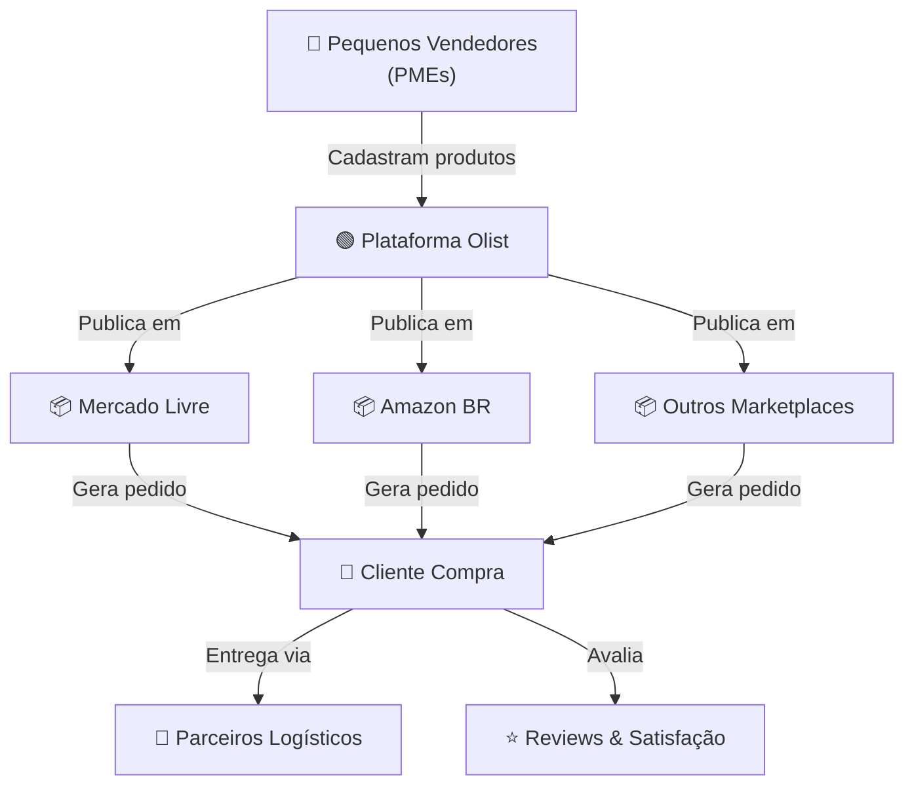
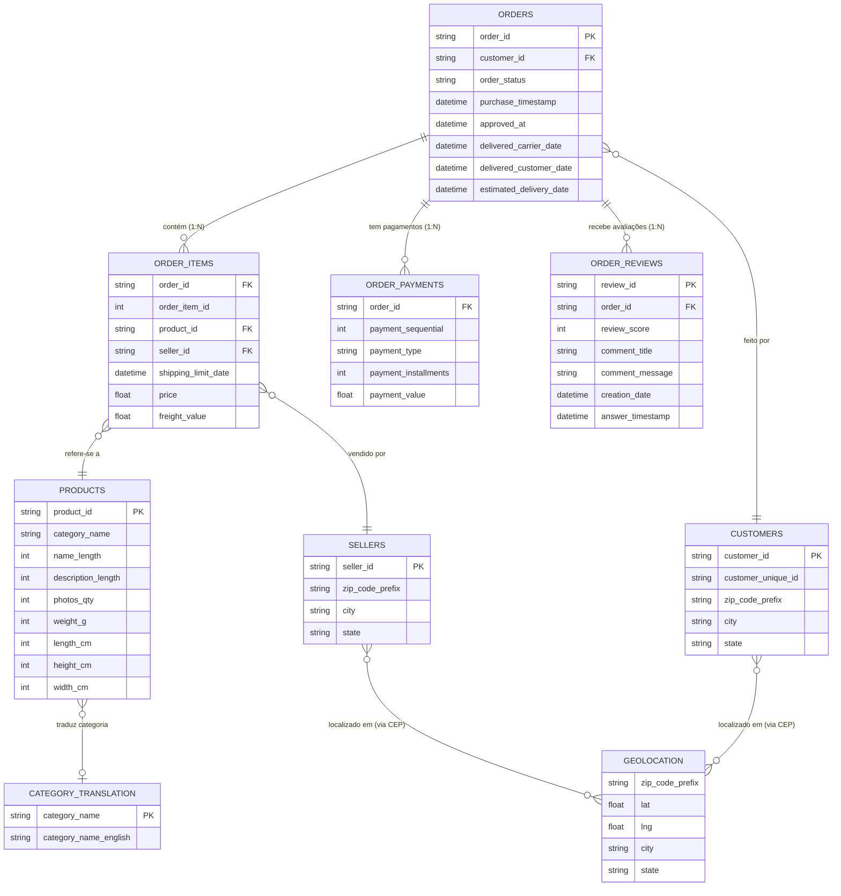
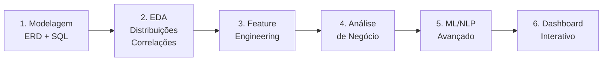

# 🔍 Discovery Completo — Estudo de Caso: Plataforma Olist (Brazilian E-Commerce)

> **Fonte principal:** [https://www.kaggle.com/datasets/olistbr/brazilian-ecommerce/data](https://www.kaggle.com/datasets/olistbr/brazilian-ecommerce/data)
>
> Este discovery integra informações de **todas as seções do Kaggle**: Data Card, Data Explorer, Code (notebooks da comunidade), e Discussion, além da análise local dos 9 datasets CSV.

---

## 1. Contexto do Negócio

### 1.1 O que é a Olist?

A **Olist** é um ecossistema brasileiro de e-commerce que atua como **integrador de marketplaces** e plataforma-como-serviço (PaaS). Seu modelo de negócio conecta pequenas e médias empresas (PMEs) aos maiores marketplaces do Brasil (Mercado Livre, Amazon, B2W, etc.) sob a marca unificada "Olist".

> *"Olist connects small businesses from all over Brazil to channels without hassle and with a single contract."* — Data Card, Kaggle

### 1.2 Fluxo do Pedido (conforme Data Card)

1. Cliente compra o produto na **Olist Store** (em um marketplace)
2. Vendedor é **notificado** para atender o pedido
3. Vendedor envia o produto via **parceiros logísticos da Olist**
4. Quando o cliente recebe o produto (ou a data estimada de entrega vence), ele recebe uma **pesquisa de satisfação por e-mail**
5. O cliente pode dar uma **nota (1-5)** e escrever **comentários**

### 1.3 Proposta de Valor

| Stakeholder | Benefício |
|---|---|
| **Vendedores (PMEs)** | Acesso imediato a marketplaces de alto tráfego sem complexidade técnica; gestão centralizada de estoque, pedidos e logística |
| **Marketplaces** | Expansão rápida da variedade de produtos e base de vendedores |
| **Clientes Finais** | Maior oferta de produtos com reputação garantida pela marca Olist |

### 1.4 Componentes do Ecossistema

- **Integração Multicanal** — Publicação e sincronização de produtos em múltiplos marketplaces
- **Logística (Olist Pax)** — Centros de cross-docking e entrega last-mile
- **Serviços Financeiros** — Capital de giro e contas digitais para lojistas
- **ERP & POS** — Sistemas de gestão integrados (via aquisições Tiny e Vnda)

---

## 2. Fontes de Dados e Metadados do Kaggle

### 2.1 Dataset Principal

| Atributo | Valor |
|---|---|
| **Nome** | Brazilian E-Commerce Public Dataset by Olist |
| **URL** | [kaggle.com/datasets/olistbr/brazilian-ecommerce/data](https://www.kaggle.com/datasets/olistbr/brazilian-ecommerce/data) |
| **Criador** | [Olist](https://www.kaggle.com/organizations/olistbr) (@olistbr) |
| **Licença** | CC BY-NC-SA 4.0 |
| **Versão** | 2 |
| **Última Modificação** | 01/10/2021 |
| **Tamanho Download** | ~44,7 MB (ZIP) |
| **Período dos Dados** | Setembro/2016 a Outubro/2018 |
| **Volume** | ~100.000 pedidos reais |
| **Arquivos** | 9 CSVs |
| **Anonimização** | Nomes de empresas/parceiros substituídos por casas de Game of Thrones |

### 2.2 Estatísticas da Plataforma (Kaggle)

| Métrica | Valor |
|---|---|
| 👁️ Visualizações | **2.281.728** |
| ⬇️ Downloads | **560.394** |
| ❤️ Likes/Upvotes | **4.300** |
| 💬 Comentários/Discussões | **74** |
| **Keywords** | business, data visualization, EDA, NLP, multiclass classification, brazil |

### 2.3 Dataset Complementar: Marketing Funnel

| Atributo | Valor |
|---|---|
| **Nome** | Marketing Funnel by Olist |
| **URL** | [kaggle.com/datasets/olistbr/marketing-funnel-olist](https://www.kaggle.com/datasets/olistbr/marketing-funnel-olist) |
| **Descrição** | 8k Marketing Qualified Leads (MQLs) que solicitaram contato entre Jun/2017 e Jun/2018 |
| **Chave de junção** | `seller_id` (liga ao dataset principal) |
| **Tamanho** | ~285 KB |

> [!TIP]
> O Marketing Funnel pode ser integrado ao dataset principal via `seller_id`, permitindo analisar o pedido desde a perspectiva de marketing (funil de aquisição de vendedores). Instruções de junção disponíveis no [Kernel de Andre Sionek](https://www.kaggle.com/andresionek/joining-marketing-funnel-with-brazilian-e-commerce).

**Fluxo do Funil de Marketing:**
1. Vendedor se cadastra em uma landing page
2. SDR (Sales Dev Representative) entra em contato e agenda consultoria
3. SR (Sales Representative) faz a consultoria → fecha ou perde o deal
4. Lead se torna vendedor e começa a montar catálogo na Olist
5. Produtos são publicados nos marketplaces

### 2.4 Classified Dataset (Nota do Data Card)

> *"We had previously released a classified dataset, but we removed it at Version 6. We intend to release it again as a new dataset."*

O dataset classificado foi removido na versão atual. Para análises que requeiram classificação de produtos, usar a versão 5 ou anterior.

---

## 3. Regras de Negócio Documentadas (Data Card — Seção "Attention")

> [!IMPORTANT]
> **Atenções oficiais documentadas pela Olist no Data Card:**

1. **Um pedido pode ter múltiplos itens** — cada item pode ter um vendedor diferente
2. **Cada item pode ser atendido por um vendedor distinto** — modelo de marketplace puro
3. **Textos anonimizados** — referências a lojas/parceiros substituídas por nomes de casas de Game of Thrones nos reviews

---

## 4. Inventário e Dicionário de Dados

### 4.1 Visão Geral dos Datasets

| # | Arquivo | Linhas | Colunas | Descrição |
|---|---|---:|---:|---|
| 1 | `olist_orders_dataset.csv` | 99.441 | 8 | Tabela central de pedidos |
| 2 | `olist_order_items_dataset.csv` | 112.650 | 7 | Itens de cada pedido (1:N) |
| 3 | `olist_order_payments_dataset.csv` | 103.886 | 5 | Pagamentos por pedido (1:N) |
| 4 | `olist_order_reviews_dataset.csv` | 99.224 | 7 | Avaliações de clientes |
| 5 | `olist_customers_dataset.csv` | 99.441 | 5 | Dados demográficos de clientes |
| 6 | `olist_products_dataset.csv` | 32.951 | 9 | Catálogo de produtos |
| 7 | `olist_sellers_dataset.csv` | 3.095 | 4 | Cadastro de vendedores |
| 8 | `olist_geolocation_dataset.csv` | 1.000.163 | 5 | Geolocalização por CEP |
| 9 | `product_category_name_translation.csv` | 71 | 2 | Tradução de categorias PT→EN |

### 4.2 Dicionário de Dados Detalhado

#### 📋 `olist_orders_dataset.csv` — Pedidos (Tabela Fato Principal)

| Coluna | Tipo | Descrição |
|---|---|---|
| `order_id` | string (PK) | Identificador único do pedido |
| `customer_id` | string (FK) | Referência ao cliente **neste pedido** |
| `order_status` | enum | `delivered`, `shipped`, `canceled`, `unavailable`, `processing`, `created`, `invoiced`, `approved` |
| `order_purchase_timestamp` | datetime | Data/hora da compra |
| `order_approved_at` | datetime | Data/hora da aprovação do pagamento |
| `order_delivered_carrier_date` | datetime | Data/hora de entrega à transportadora |
| `order_delivered_customer_date` | datetime | Data/hora de entrega ao cliente |
| `order_estimated_delivery_date` | datetime | Data estimada de entrega |

#### 📦 `olist_order_items_dataset.csv` — Itens do Pedido

| Coluna | Tipo | Descrição |
|---|---|---|
| `order_id` | string (FK) | Referência ao pedido |
| `order_item_id` | int | Sequencial do item dentro do pedido (1, 2, 3...) |
| `product_id` | string (FK) | Referência ao produto |
| `seller_id` | string (FK) | Referência ao vendedor **deste item** |
| `shipping_limit_date` | datetime | Data limite para o vendedor enviar |
| `price` | float | Preço do item (R$) |
| `freight_value` | float | Valor do frete do item (R$) |

#### 💳 `olist_order_payments_dataset.csv` — Pagamentos

| Coluna | Tipo | Descrição |
|---|---|---|
| `order_id` | string (FK) | Referência ao pedido |
| `payment_sequential` | int | Sequencial (1 pedido pode ter N formas de pagamento) |
| `payment_type` | enum | `credit_card`, `boleto`, `voucher`, `debit_card`, `not_defined` |
| `payment_installments` | int | Número de parcelas |
| `payment_value` | float | Valor pago (R$) |

#### ⭐ `olist_order_reviews_dataset.csv` — Avaliações

| Coluna | Tipo | Descrição | Nulidade |
|---|---|---|---|
| `review_id` | string (PK*) | Identificador da avaliação | — |
| `order_id` | string (FK) | Referência ao pedido | — |
| `review_score` | int (1-5) | Nota de satisfação | — |
| `review_comment_title` | string | Título do comentário | **88,3% nulo** |
| `review_comment_message` | string | Mensagem do comentário | **58,7% nulo** |
| `review_creation_date` | datetime | Data de criação | — |
| `review_answer_timestamp` | datetime | Data de resposta | — |

> [!WARNING]
> *`review_id` possui **814 duplicatas** — pode não ser uma PK estrita.

#### 👤 `olist_customers_dataset.csv` — Clientes

| Coluna | Tipo | Descrição |
|---|---|---|
| `customer_id` | string (PK) | ID do cliente **neste pedido** (transacional) |
| `customer_unique_id` | string | ID único real do comprador (**usar para recompra!**) |
| `customer_zip_code_prefix` | string | CEP (5 primeiros dígitos) |
| `customer_city` | string | Cidade |
| `customer_state` | string (UF) | Estado (sigla) |

> [!CAUTION]
> **`customer_id` vs `customer_unique_id`** — Esta é a armadilha mais frequente reportada nas Discussions do Kaggle. O `customer_id` é único por pedido e muda a cada compra. Para análises de retenção/recompra, **sempre usar `customer_unique_id`**.

#### 🏷️ `olist_products_dataset.csv` — Produtos

| Coluna | Tipo | Descrição | Nulidade |
|---|---|---|---|
| `product_id` | string (PK) | Identificador do produto | — |
| `product_category_name` | string | Categoria em PT-BR | **1,85% nulo** (610) |
| `product_name_lenght` | int | Comprimento do nome | 1,85% nulo |
| `product_description_lenght` | int | Comprimento da descrição | 1,85% nulo |
| `product_photos_qty` | int | Quantidade de fotos | 1,85% nulo |
| `product_weight_g` | int | Peso em gramas | 0,01% nulo |
| `product_length_cm` | int | Comprimento em cm | 0,01% nulo |
| `product_height_cm` | int | Altura em cm | 0,01% nulo |
| `product_width_cm` | int | Largura em cm | 0,01% nulo |

#### 🏪 `olist_sellers_dataset.csv` — Vendedores

| Coluna | Tipo | Descrição |
|---|---|---|
| `seller_id` | string (PK) | Identificador do vendedor |
| `seller_zip_code_prefix` | string | CEP (5 primeiros dígitos) |
| `seller_city` | string | Cidade |
| `seller_state` | string (UF) | Estado (sigla) |

#### 🌍 `olist_geolocation_dataset.csv` — Geolocalização

| Coluna | Tipo | Descrição |
|---|---|---|
| `geolocation_zip_code_prefix` | string | CEP (5 primeiros dígitos) |
| `geolocation_lat` | float | Latitude |
| `geolocation_lng` | float | Longitude |
| `geolocation_city` | string | Cidade (⚠️ pode ter variações para mesmo CEP) |
| `geolocation_state` | string (UF) | Estado |

#### 🔤 `product_category_name_translation.csv` — Tradução de Categorias

| Coluna | Tipo | Descrição |
|---|---|---|
| `product_category_name` | string | Categoria em PT-BR |
| `product_category_name_english` | string | Categoria em inglês |

---

## 5. Schema Relacional (ERD)

> Schema oficial referenciado no Data Card: [https://i.imgur.com/HRhd2Y0.png](https://i.imgur.com/HRhd2Y0.png)

### Chaves de Junção

| Tabela Origem | → | Tabela Destino | Chave | Cardinalidade |
|---|---|---|---|---|
| `orders` | → | `customers` | `customer_id` | 1:1 |
| `order_items` | → | `orders` | `order_id` | N:1 |
| `order_items` | → | `products` | `product_id` | N:1 |
| `order_items` | → | `sellers` | `seller_id` | N:1 |
| `order_payments` | → | `orders` | `order_id` | N:1 |
| `order_reviews` | → | `orders` | `order_id` | N:1 |
| `customers` | → | `geolocation` | `zip_code_prefix` | 1:N (⚠️ muitas coordenadas por CEP) |
| `sellers` | → | `geolocation` | `zip_code_prefix` | 1:N |
| `products` | → | `category_translation` | `product_category_name` | N:1 |
| `sellers` | → | `marketing_funnel` | `seller_id` | 1:1 (dataset complementar) |

---

## 6. Resultados do Profiling de Qualidade dos Dados

> Profiling executado via [discovery_profiling.py](file:///c:/Users/paler/Documents/DataScience/POS%20TECH%20Agentes%20de%20IA/FASE%201/TechChallenge/discovery_profiling.py). Outputs em [discovery_output/](file:///c:/Users/paler/Documents/DataScience/POS%20TECH%20Agentes%20de%20IA/FASE%201/TechChallenge/discovery_output).

### 6.1 Análise de Valores Nulos

| Dataset | Coluna | Nulos | % Nulos | Criticidade |
|---|---|---:|---:|---|
| reviews | `review_comment_title` | 87.656 | **88,3%** | 🟡 Esperado — maioria não escreve título |
| reviews | `review_comment_message` | 58.247 | **58,7%** | 🟡 Esperado — ~41% escrevem comentário |
| orders | `order_delivered_customer_date` | 2.965 | 2,98% | 🟡 Pedidos ainda não entregues |
| products | `product_category_name` | 610 | 1,85% | 🟡 Produtos sem categoria |
| products | dimensões + fotos | 610 | 1,85% | 🟡 Mesmos 610 produtos |
| orders | `order_delivered_carrier_date` | 1.783 | 1,79% | 🟡 Pedidos não enviados |
| orders | `order_approved_at` | 160 | 0,16% | 🟢 Mínimo |
| products | peso + dimensões físicas | 2 | 0,01% | 🟢 Desprezível |

### 6.2 Verificação de Chaves Primárias

| Dataset | Chave Primária | Total | Únicos | Status |
|---|---|---:|---:|---|
| orders | `order_id` | 99.441 | 99.441 | ✅ Sem duplicatas |
| customers | `customer_id` | 99.441 | 99.441 | ✅ Sem duplicatas |
| products | `product_id` | 32.951 | 32.951 | ✅ Sem duplicatas |
| sellers | `seller_id` | 3.095 | 3.095 | ✅ Sem duplicatas |
| reviews | `review_id` | 99.224 | 98.410 | ⚠️ **814 duplicatas** |

### 6.3 Consistência de Datas (Pedidos Entregues)

| Verificação | Ocorrências | Status |
|---|---|---|
| Aprovação anterior à Compra | 0 | ✅ Consistente |
| Entrega ao Carrier anterior à Aprovação | 0 | ✅ Consistente |
| Entrega ao Cliente anterior ao Carrier | 0 | ✅ Consistente |

### 6.4 Consistência Pagamentos vs. Itens

| Métrica | Valor |
|---|---|
| Pedidos comparados | 98.665 |
| Valores consistentes (diff < R$1) | **98.415 (99,7%)** ✅ |
| Com divergência | 250 (0,3%) |
| Maior divergência | R$ 182,81 |

### 6.5 Categorias sem Tradução

- Categorias únicas: **73**
- Com tradução EN: **71**
- **Sem tradução (2):** `pc_gamer`, `portateis_cozinha_e_preparadores_de_alimentos`

### 6.6 Geolocalização — Duplicidade

| Métrica | Valor |
|---|---|
| Total de registros | 1.000.163 |
| CEPs únicos | 483 |
| Média registros/CEP | 52,6 |
| Máximo registros/CEP | 1.146 |

---

## 7. Problemas de Qualidade Reportados pela Comunidade (Kaggle Discussions)

> [!WARNING]
> **Issues frequentes reportados nos 74 tópicos de discussão da comunidade:**

| # | Problema | Fonte | Impacto | Recomendação |
|---|---|---|---|---|
| 1 | **`customer_id` vs `customer_unique_id`** | Discussions | 🔴 Crítico para análise de retenção | Usar `customer_unique_id` para identificar comprador real |
| 2 | **Cidades inconsistentes na geolocalização** | Discussions | 🟠 Alto | Múltiplos nomes de cidade para mesmo CEP → usar **moda** (valor mais frequente) |
| 3 | **Cartão de crédito com 0 parcelas** | Discussions | 🟡 Médio | Anomalia nos dados de pagamento — verificar e tratar |
| 4 | **Divergências pagamento vs. itens** | Discussions + Profiling | 🟡 Médio | 0,3% de divergência — possíveis cupons/descontos |
| 5 | **Colunas datetime como string** | Discussions | 🟡 Médio | Converter para datetime na ingestão |
| 6 | **Caracteres especiais nos reviews** | Discussions | 🟡 Médio | Limpeza de texto necessária antes de NLP |
| 7 | **Erros de grafia em campos categóricos** | Discussions | 🟡 Médio | Padronizar cidades e categorias |
| 8 | **`review_id` com duplicatas** | Profiling | 🟡 Médio | 814 IDs duplicados — deduplicar antes de análises |
| 9 | **Discrepância orders vs. items** | Discussions | 🟡 Médio | Nem todo `order_id` de orders aparece em items |

---

## 8. Insights dos Top Notebooks (Kaggle Code Tab)

> A aba Code do Kaggle contém **centenas de notebooks**. Os insights abaixo foram extraídos dos mais votados pela comunidade (560k+ downloads, 2.2M+ views).

### 8.1 Principais Descobertas da Comunidade

| Insight | Detalhe | Notebooks |
|---|---|---|
| 🚚 **Delivery time é o driver #1 de satisfação** | Tempo de entrega é mais correlacionado com review score do que preço ou frete | Top notebooks, análises de correlação |
| 🌎 **60%+ dos pedidos vêm do Sudeste** | SP, RJ, MG concentram vendas — infraestrutura logística melhor | Análises geográficas |
| 📊 **RFM é a técnica de segmentação mais usada** | Recency, Frequency, Monetary para identificar clientes de alto valor vs. churn | Notebooks de clustering |
| 💬 **NLP em PT-BR com LeIA** | Biblioteca `LeIA` (Léxico para Inferência Adaptada) é a mais usada para sentimento em português | Notebooks de NLP |
| 📈 **Cohort analysis revela padrões sazonais** | Black Friday e Natal geram picos significativos | Análises temporais |
| 🏗️ **SQL + ERD é best practice** | Melhores notebooks começam com modelagem relacional (PostgreSQL, SQLite) | Projetos end-to-end |
| 📊 **Dashboards interativos** | Projetos avançados integram Power BI, Tableau ou Metabase | Pipelines ETL |

### 8.2 Abordagens Recomendadas pelos Top Notebooks

### 8.3 Sugestões de Análise do Próprio Data Card (Seção "Inspiration")

| Tema | Descrição do Kaggle | Técnicas Sugeridas |
|---|---|---|
| **NLP** | *"Supreme environment to parse reviews text through multiple dimensions"* | Análise de sentimento, topic modeling, word clouds |
| **Clustering** | *"Some customers didn't write a review. But why are they happy or mad?"* | K-Means, DBSCAN, RFM |
| **Sales Prediction** | *"Predict future sales with purchase date information"* | Prophet, ARIMA, LSTM |
| **Delivery Performance** | *"Work through delivery performance and find ways to optimize"* | Análise de tempos, regressão, mapas |
| **Product Quality** | *"Discover product categories more prone to customer insatisfaction"* | Cross-tabs, chi-quadrado, heatmaps |
| **Feature Engineering** | *"Create features or attach external public information"* | IBGE, dados econômicos, clima |

---

## 9. Resultados da Análise Exploratória (Profiling Local)

### 9.1 Status dos Pedidos

| Status | Quantidade | % |
|---|---:|---:|
| delivered | 96.478 | 97,02% |
| shipped | 1.107 | 1,11% |
| canceled | 625 | 0,63% |
| unavailable | 609 | 0,61% |
| outros | 622 | 0,63% |

### 9.2 Performance de Entrega

| Métrica | Valor |
|---|---|
| **Lead Time Médio** | **12,6 dias** |
| Lead Time Mediana | 10,4 dias |
| **Entregas no Prazo (OTIF)** | **91,9%** |
| Entregas Atrasadas | 8,1% |

### 9.3 Satisfação do Cliente (Reviews)

| Score | Quantidade | % |
|---|---:|---:|
| ⭐⭐⭐⭐⭐ (5) | 57.328 | 57,78% |
| ⭐⭐⭐⭐ (4) | 19.142 | 19,29% |
| ⭐⭐⭐ (3) | 8.179 | 8,24% |
| ⭐⭐ (2) | 3.151 | 3,18% |
| ⭐ (1) | 11.424 | 11,51% |

| Indicador | Valor |
|---|---|
| **NPS Proxy** | **+62,4** |
| Promotores (4-5) | 77,1% |
| Detratores (1-2) | 14,7% |

### 9.4 Pagamentos

| Tipo | % | Parcelas (cartão) |
|---|---:|---|
| **credit_card** | **73,9%** | Média: 3,5 / Mediana: 3 / Máx: 24 |
| boleto | 19,0% | — |
| voucher | 5,6% | — |
| debit_card | 1,5% | — |

### 9.5 Top Categorias por Receita

| # | Categoria | Receita | Itens |
|---|---|---:|---:|
| 1 | health_beauty | R$ 1.258.681 | 9.670 |
| 2 | watches_gifts | R$ 1.205.006 | 5.991 |
| 3 | bed_bath_table | R$ 1.036.989 | 11.115 |
| 4 | sports_leisure | R$ 988.049 | 8.641 |
| 5 | computers_accessories | R$ 911.954 | 7.827 |

### 9.6 Distribuição Geográfica

| Estado | % Clientes | % Vendedores | Observação |
|---|---:|---:|---|
| **SP** | **42,0%** | **59,7%** | Concentração extrema |
| RJ | 12,9% | 5,5% | Demanda alta, oferta baixa |
| MG | 11,7% | 7,9% | Demanda alta, oferta baixa |
| PR | 5,1% | 11,3% | Oferta alta, demanda moderada |

### 9.7 Evolução Temporal

| Métrica | Valor |
|---|---|
| **Período** | Set/2016 a Out/2018 (25 meses) |
| **GMV Total** | **R$ 15.843.553** |
| **Total de Pedidos** | **99.441** |
| **AOV** | **R$ 159,33** |

### 9.8 Recompra

| Métrica | Valor |
|---|---|
| Compradores únicos | 96.096 |
| **Recorrentes** | **2.997 (3,12%)** ⚠️ |
| Single-purchase | 93.099 (96,88%) |

### 9.9 Outliers

| Métrica | Preço (R$) | Frete (R$) |
|---|---:|---:|
| Mediana | 74,99 | 16,26 |
| Média | 120,65 | 19,99 |
| Máximo | 6.735,00 | 409,68 |
| Outliers | 7,5% | 10,8% |

---

## 10. KPIs Consolidados

| KPI | Valor | Interpretação |
|---|---|---|
| 💰 **GMV** | R$ 15,84M | Volume total no período |
| 🎯 **AOV** | R$ 159,33 | Ticket médio por pedido |
| ❌ **Taxa Cancelamento** | 0,63% | Excelente |
| 📊 **NPS Proxy** | +62,4 | Bom (77% promotores) |
| 🚚 **OTIF** | 91,9% | Bom (8,1% de atrasos) |
| ⏱️ **Lead Time Médio** | 12,6 dias | Mediana 10,4d |
| 🔄 **Taxa Recompra** | 3,12% | ⚠️ Muito baixa |
| 💳 **Pagamento Top** | Cartão 73,9% | Média 3,5 parcelas |
| 📦 **Frete/Preço** | ~16,6% | Frete ≈ 17% do item |

---

## 11. Roadmap de Análises Recomendadas

```mermaid
gantt
    title Roadmap de Análise — Olist Discovery
    dateFormat X
    axisFormat %s

    section Fase 1: EDA
    Limpeza e Preparação dos Dados        :a1, 0, 2
    Análise Exploratória Descritiva       :a2, 2, 4
    Análise de Qualidade dos Dados        :a3, 2, 3

    section Fase 2: Análise de Negócio
    Performance Comercial e Temporal      :b1, 4, 6
    Análise Geográfica e Logística        :b2, 5, 7
    Análise de Satisfação e Reviews       :b3, 6, 8

    section Fase 3: Avançado
    NLP nos Reviews em PT-BR              :c1, 8, 11
    Segmentação RFM de Clientes           :c2, 8, 11
    Previsão de Vendas                    :c3, 9, 12
    Classificação de Satisfação           :c4, 10, 12
```

### Fase 1 — Exploração e Preparação
| Etapa | Técnicas |
|---|---|
| **1.1** Limpeza de nulos, duplicatas, tipos | Pandas, validação de schema |
| **1.2** EDA descritiva | Histogramas, boxplots, heatmaps |
| **1.3** Quality profiling | YData Profiling |

### Fase 2 — Análise de Negócio
| Etapa | Técnicas |
|---|---|
| **2.1** Séries temporais, sazonalidade, categorias | Line charts, decomposição temporal |
| **2.2** Mapas de calor, tempos de entrega | Folium, Geopandas |
| **2.3** Scores vs. categorias, correlação com entrega | Cross-tabs, chi-quadrado |

### Fase 3 — Análises Avançadas
| Etapa | Técnicas |
|---|---|
| **3.1** Sentimento em PT-BR | BERTimbau, LeIA, WordCloud, Topic Modeling |
| **3.2** Segmentação RFM | K-Means, DBSCAN |
| **3.3** Forecast de vendas | Prophet, ARIMA |
| **3.4** Prever satisfação | XGBoost, LightGBM |

---

## 12. Riscos e Mitigações

| Risco | Impacto | Mitigação |
|---|---|---|
| Dados de 2016-2018 — podem estar datados | Conclusões temporais | Focar em padrões estruturais |
| Anonimização impede identificar parceiros | Limita análise competitiva | Foco em métricas genéricas |
| Reviews em PT-BR | Modelos genéricos falham | BERTimbau / LeIA |
| Geolocalização duplicada (~2k registros/CEP) | Mapas imprecisos | Agregar por mediana |
| Taxa de recompra naturalmente baixa | Superestimar problema | Comparar com benchmarks marketplace |
| 814 review_ids duplicados | Viés em análise | Deduplicar |
| customer_id vs customer_unique_id | Erro de retenção | Documentar e padronizar uso |

---

## 13. Rastreabilidade de Fontes

| Seção do Kaggle | O que foi extraído | Status |
|---|---|---|
| **Data Card** | Descrição completa, contexto, atenções, schema oficial, classified dataset, inspirações, acknowledgements | ✅ Completo |
| **Metadados** | Licença, versão, tamanho, keywords, creator, estatísticas (views, downloads, likes, comments) | ✅ Completo |
| **Data Explorer** | Estrutura dos 9 CSVs (colunas, tipos, linhas, amostra) — analisado localmente dos arquivos CSV | ✅ Via profiling local |
| **Code (Notebooks)** | Insights dos top notebooks (delivery time, RFM, NLP/LeIA, ERD, dashboards, cohort) | ✅ Via web search |
| **Discussion** | Problemas de qualidade reportados (customer_id vs unique_id, geolocalização, pagamentos, duplicatas) | ✅ Via web search |
| **Marketing Funnel** | Dataset complementar (8k MQLs, junção via seller_id) | ✅ Completo |
| **Data Schema Image** | ERD oficial da Olist (https://i.imgur.com/HRhd2Y0.png) | ✅ Referenciado |

---

## 14. Arquivos Gerados

| Arquivo | Descrição |
|---|---|
| [discovery_profiling.py](file:///c:/Users/paler/Documents/DataScience/POS%20TECH%20Agentes%20de%20IA/FASE%201/TechChallenge/discovery_profiling.py) | Script Python completo de profiling |
| [discovery_output/](file:///c:/Users/paler/Documents/DataScience/POS%20TECH%20Agentes%20de%20IA/FASE%201/TechChallenge/discovery_output) | Pasta com todos os outputs |
| `00_summary.csv` | KPIs consolidados |
| `01_null_report.csv` | Relatório de nulos por coluna |
| `01-09_*.png` | 9 gráficos de visualização |

---

> [!TIP]
> **Próximos passos recomendados:**
> 1. ✅ ~~Checklist de qualidade~~ — Concluído
> 2. ✅ ~~Análise de todas as fontes Kaggle~~ — Concluído
> 3. Tratar os 610 produtos sem categoria e 814 reviews duplicadas
> 4. Construir DataFrame unificado (join de todas as tabelas)
> 5. Investigar correlação delivery time × review score (insight #1 da comunidade)
> 6. Aplicar segmentação RFM usando `customer_unique_id`
> 7. Priorizar perguntas de negócio conforme objetivos do Tech Challenge
