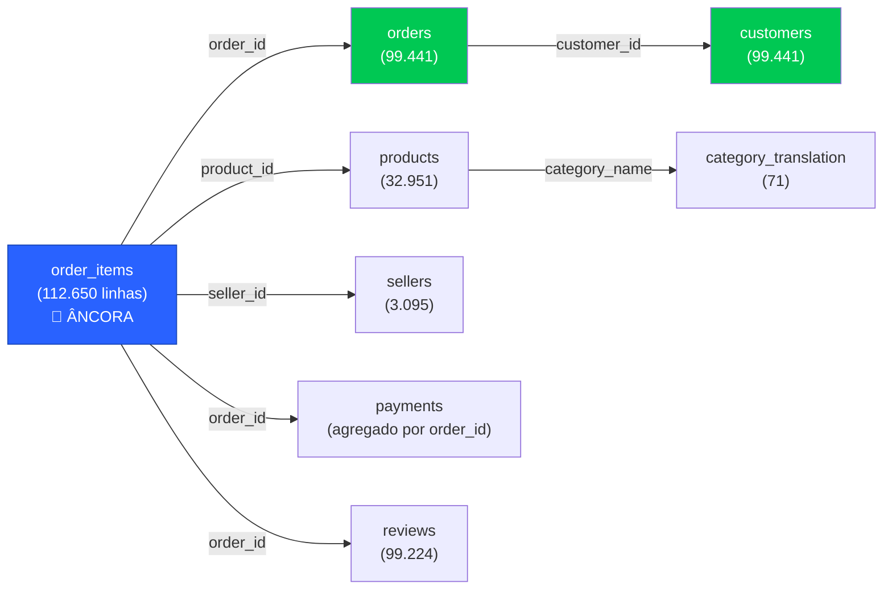

# 🔗 Plano de Implementação — DataFrame Unificado Olist

> **Passo 2 da TODO List:** Construir DataFrame unificado (join de todas as tabelas)

---

## 1. Objetivo

Criar um **DataFrame analítico único** que consolide as 9 tabelas da Olist em uma estrutura pronta para análise, com granularidade de **item do pedido** (1 linha = 1 item vendido em 1 pedido).

---

## 2. Estratégia de Joins

### 2.1 Tabela Âncora

A tabela âncora é `order_items` (112.650 linhas) porque:
- É a tabela com **maior granularidade transacional** (nível item)
- Conecta pedidos, produtos e vendedores simultaneamente
- Contém preço e frete (dados financeiros)

### 2.2 Diagrama de Joins



### 2.3 Ordem de Execução dos Joins

| Passo | Join | Tipo | Chave | Cardinalidade | Resultado Esperado |
|---|---|---|---|---|---|
| 1 | `order_items` ← `orders` | LEFT | `order_id` | N:1 | 112.650 linhas |
| 2 | + `customers` | LEFT | `customer_id` | 1:1 | 112.650 linhas |
| 3 | + `products` | LEFT | `product_id` | N:1 | 112.650 linhas |
| 4 | + `category_translation` | LEFT | `product_category_name` | N:1 | 112.650 linhas |
| 5 | + `sellers` | LEFT | `seller_id` | N:1 | 112.650 linhas |
| 6 | + `reviews` | LEFT | `order_id` | 1:N ⚠️ | ~113.400 linhas* |
| 7 | + `payments` (agregado) | LEFT | `order_id` | 1:1 | sem mudança |

> ⚠️ **Passo 6 — Reviews:** Como existem 814 review_ids duplicados (mesmo conteúdo, order_ids diferentes), o join por `order_id` é 1:1 na maioria dos casos. Mas ~217 pedidos não têm review (99.441 orders - 99.224 reviews), então o LEFT join gerará NaN em `review_score` para esses pedidos.

> ⚠️ **Passo 7 — Payments:** Um pedido pode ter múltiplas formas de pagamento, então **agregar antes** do join (soma de `payment_value` + contagem de parcelas + tipo dominante).

---

## 3. Tratamento da Tabela `payments` (Pré-agregação)

Antes do join, agregar por `order_id`:

```python
payments_agg = payments.groupby('order_id').agg(
    payment_value_total=('payment_value', 'sum'),
    payment_installments_max=('payment_installments', 'max'),
    payment_types=('payment_type', lambda x: ','.join(sorted(x.unique()))),
    payment_type_main=('payment_type', lambda x: x.value_counts().index[0]),
    n_payment_methods=('payment_sequential', 'nunique'),
).reset_index()
```

Isso transforma 103.886 linhas → ~99k linhas (1 por pedido).

---

## 4. Tratamento da Tabela `geolocation` (Decisão)

A geolocalização é **problemática** (1M de linhas, múltiplas coordenadas por CEP). Duas opções:

| Opção | Descrição | Recomendação |
|---|---|---|
| **A — Não incluir no DataFrame unificado** | Usar sob demanda apenas quando precisar de mapas | ⭐ Recomendada |
| **B — Agregar por CEP (mediana lat/lng)** e incluir | Adiciona 2 colunas (lat, lng) para cliente e seller | Mais trabalho, útil se for fazer mapas |

---

## 5. Features Derivadas (Enriquecimento)

Após o join, criar colunas calculadas:

| Feature | Fórmula | Utilidade |
|---|---|---|
| `lead_time_days` | `delivered_customer_date - purchase_timestamp` | KPI logístico |
| `delay_days` | `delivered_customer_date - estimated_delivery_date` | Indicador de atraso |
| `is_late` | `delay_days > 0` | Flag binária |
| `approval_time_hours` | `approved_at - purchase_timestamp` | Tempo de aprovação |
| `year_month` | `purchase_timestamp.to_period('M')` | Análise temporal |
| `dow` | `purchase_timestamp.dt.dayofweek` | Dia da semana |
| `freight_ratio` | `freight_value / price` | % frete sobre preço |
| `has_review_text` | `review_comment_message.notna()` | Flag para NLP |
| `product_category_en` | join com tradução | Categoria em inglês |
| `is_cross_state` | `seller_state != customer_state` | Flag logística |

---

## 6. Validações Pós-Join

| Verificação | Critério |
|---|---|
| Contagem de linhas | Deve ser ~112.650 (± variação dos reviews) |
| Nulos em `order_id` | Deve ser 0 |
| Nulos em `order_status` | Deve ser 0 |
| Nulos em `review_score` | ~217 (pedidos sem review) — aceitável |
| Nulos em `product_category_name` | ~1.603 items (610 produtos) — rotular como `"sem_categoria"` |
| Consistência de receita | `sum(price)` deve bater com o total original |

---

## 7. Output

| Artefato | Descrição |
|---|---|
| `olist_unified.parquet` | DataFrame unificado salvo em Parquet (compacto, tipado) |
| `olist_unified_schema.md` | Documentação do schema final (colunas, tipos, origem) |
| Validação no console | Prints de contagem, nulos e sanity checks |

---

## 8. Decisões em Aberto (para sua aprovação)

1. **Geolocalização:** incluir no unificado (opção B) ou deixar separada (opção A)?
2. **Produtos sem categoria:** rotular como `"sem_categoria"` (opção D do doc anterior) ou tratar de outra forma?
3. **Reviews duplicados:** manter todos (contextual) ou deduplicar no join?
4. **Formato de saída:** Parquet (recomendado) ou CSV?
5. **Granularidade:** nível item (112k linhas) ou nível pedido (99k linhas, agregando itens)?

---

> [!IMPORTANT]
> O plano acima **não inclui** a geolocalização no DataFrame unificado por padrão (opção A). Se quiser mapas ou análises geográficas com lat/lng, precisa confirmar a opção B.
