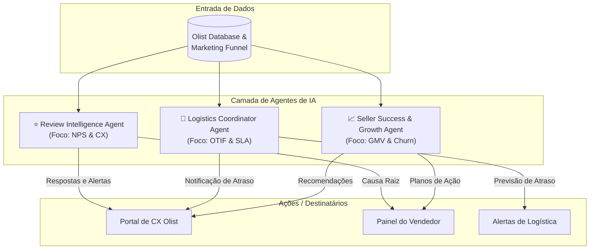
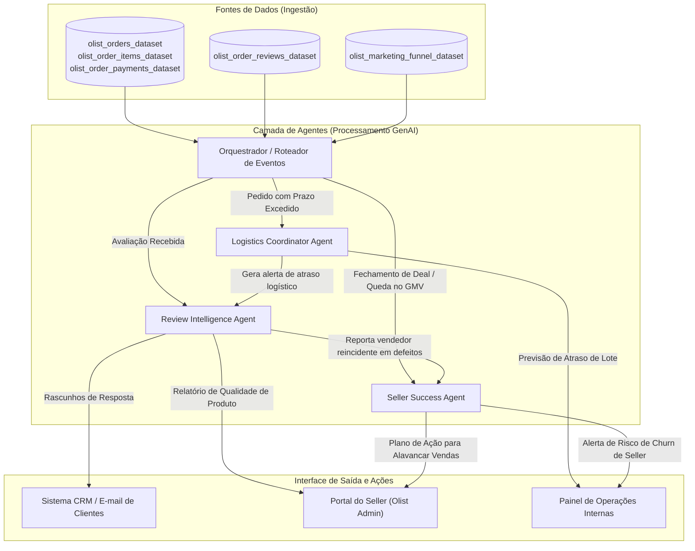

# 🤖 Proposta Executiva de IA Agêntica — Olist Intelligent Marketplace
> **Alinhamento com os Requisitos do Tech Challenge — Fase 1**
>
> Este documento complementa o [Relatório de Discovery](file:///c:/Users/paler/Documents/DataScience/POS%20TECH%20Agentes%20de%20IA/FASE%201/TechChallenge/discovery_olist_marketplace.md) e fornece a estrutura conceitual, o mapa de agentes, a arquitetura e os prompts estruturados exigidos pelos entregáveis oficiais do PDF da Fase 1.

---

## 1. Mapeamento de Oportunidades & Desafios (Base do Dataset)

Com base nas análises executadas no dataset da Olist, identificamos três alavancas críticas de negócio que podem ser transformadas com o uso de **IA Generativa e Agentes de IA**:

1. **Retenção e Fidelização de Clientes (Taxa de Recompra de 3,12%):** A taxa de recompra é extremamente baixa. Há a necessidade de um relacionamento pós-venda hiper-personalizado e inteligência para recuperação de clientes insatisfeitos.
2. **Logística e Tempo de Entrega (8,1% de Atrasos - Principal Detrator de Satisfação):** A comunidade do Kaggle e nossos dados confirmam que o tempo de entrega é o fator nº 1 que afeta o NPS. Precisamos de monitoramento preditivo e alertas proativos para evitar que atrasos virem avaliações de 1 estrela.
3. **Engajamento e Qualidade dos Vendedores (Sellers):** 60% dos vendedores estão concentrados em SP, mas a demanda é nacional. Precisamos capacitar vendedores de outras regiões e reter sellers de alta performance, cruzando dados com o funil de marketing.

---

## 2. Mapa de Agentes de IA Propostos

Propomos a implementação de **3 agentes inteligentes** integrados para atuar nas dores mais latentes identificadas no discovery:



---

### 2.1 Agente 1: Review Intelligence Agent (Agente de Satisfação)

*   **Objetivo:** Analisar avaliações de clientes em tempo real (notas 1 a 5, títulos e textos), classificar automaticamente a causa raiz da insatisfação e gerar rascunhos de respostas personalizadas.
*   **Problema Resolvido:** Alto volume de comentários não estruturados e falta de categorização sistemática de reclamações.
*   **Usuários Envolvidos:** Equipe de Customer Experience (CX) da Olist e Vendedores (Sellers).
*   **Ancoragem Analítica no Dataset:**
    *   **Volume de reviews:** O dataset `olist_order_reviews_dataset` contém **99.224 registros**, dos quais **11,51% são nota 1** (detratores puros) e **57,78% são nota 5**.
    *   **Campo de texto livre:** **41,3% dos reviews (mais de 40.000)** contêm comentários em formato livre (`review_comment_message`). Analisá-los manualmente é financeiramente inviável.
    *   **NPS de +62,4:** Há uma clara oportunidade de recuperar detratores (14,7% com notas 1 e 2) respondendo instantaneamente no pós-venda.
*   **Benefício Esperado:**
    *   Aumento do NPS Proxy através de respostas e resoluções mais ágeis.
    *   Identificação imediata de produtos com defeito ou propaganda enganosa para suspensão preventiva do anúncio.

### 2.2 Agente 2: Logistics Coordinator Agent (Agente de SLA)

*   **Objetivo:** Monitorar a jornada de entrega de cada pedido comparando a data atual com a data estimada de entrega (`order_estimated_delivery_date`) e gerar alertas proativos quando houver alta probabilidade de atraso.
*   **Problema Resolvido:** 8,1% de pedidos entregues fora do prazo e o impacto direto disso na satisfação.
*   **Usuários Envolvidos:** Operadores Logísticos da Olist e Analistas de Atendimento.
*   **Ancoragem Analítica no Dataset:**
    *   **Lead Time:** O tempo médio de trânsito em `olist_orders_dataset` é de **12,6 dias** (mediana 10,4 dias).
    *   **Correlação com Notas Baixas:** O cruzamento das datas de entrega com `review_score` prova que o principal vetor de nota 1 é a diferença de dias entre a entrega real e a estimada.
    *   **Estrutura de Rastreamento:** O dataset possui timestamps granulares (`order_purchase_timestamp`, `order_approved_at`, `order_delivered_carrier_date`, `order_delivered_customer_date`), ideais para monitoramento em tempo real.
*   **Benefício Esperado:**
    *   Mitigação proativa de insatisfação enviando e-mails ou mensagens para o cliente explicando o atraso *antes* que ele reclame.
    *   Identificação de gargalos em transportadoras parceiras específicas.

### 2.3 Agente 3: Seller Success & Growth Agent (Agente de Engajamento)

*   **Objetivo:** Analisar o comportamento de vendas e performance dos vendedores no marketplace, cruzando dados de GMV, cancelamentos e taxas de atraso para sugerir melhorias operacionais e evitar churn de vendedores.
*   **Problema Resolvido:** Baixa taxa de recompra de clientes e desequilíbrio na distribuição geográfica da oferta.
*   **Usuários Envolvidos:** Vendedores (Sellers) e Gerentes de Contas da Olist.
*   **Ancoragem Analítica no Dataset:**
    *   **Taxa de Recompra Crítica:** A análise aponta que **96,88% dos clientes compram apenas uma vez** (taxa de recompra de 3,12% em `customer_unique_id`). Fidelizar requer melhorar a variedade e preços dos sellers.
    *   **Concentração Geográfica Extrema:** **59,7% dos sellers estão em SP**, enquanto estados como RJ (12,9% dos clientes) e MG (11,7% dos clientes) têm poucos sellers (5,5% e 7,9%, respectivamente), gerando frete alto e insatisfação.
    *   **Funil de Marketing:** Integração com o `Marketing Funnel Dataset` da Olist (8.000 leads) para correlacionar o tipo de anúncio/origem do lead com o GMV final.
*   **Benefício Esperado:**
    *   Aumento do GMV global através do crescimento de sellers menores e fora do eixo SP.
    *   Redução da taxa de cancelamento de pedidos (atualmente em 0,63% geral, mas concentrada em poucos sellers ruins).

---

## 3. Arquitetura Conceitual Inicial

Esta arquitetura demonstra o fluxo de dados, a interação entre os agentes e as interfaces de usuário finais.



---

## 4. Estruturação de Prompts para os Agentes

Abaixo, apresentamos os prompts estruturados e prontos para teste com modelos de LLM (ex: Claude 3.5 Sonnet, GPT-4o, Gemini 1.5 Pro).

### 4.1 Prompt do Review Intelligence Agent

*   **a) Objetivo do Prompt:** Classificar o sentimento e identificar a causa raiz de avaliações negativas, gerando uma sugestão de resposta imediata em português.
*   **b) Contexto fornecido:**
    *   Dados do Pedido: ID, data da compra, data estimada de entrega, data real de entrega, se houve atraso.
    *   Dados do Produto: Categoria do produto.
    *   Dados da Avaliação: Nota (review_score) e comentário do cliente.
*   **c) Instrução Principal (Prompt):**

```text
Você é o Review Intelligence Agent da Olist, um especialista sênior em Customer Experience (CX) no e-commerce brasileiro.
Sua tarefa é analisar o comentário de avaliação abaixo e extrair informações críticas estruturadas.

DADOS DO PEDIDO:
- ID do Pedido: {order_id}
- Categoria do Produto: {product_category}
- Dias de Atraso Logístico: {days_late} (se 0 ou negativo, foi entregue no prazo)
- Nota da Avaliação (1 a 5): {review_score}
- Texto do Comentário do Cliente: "{review_comment}"

INSTRUÇÕES:
1. Classifique a CAUSA RAIZ principal da reclamação entre:
   - "Atraso na Entrega" (se o foco for prazo, demora ou logística)
   - "Qualidade do Produto" (se o foco for produto quebrado, diferente do anúncio, estragado ou defeito)
   - "Atendimento ao Cliente" (se reclamar de falta de resposta ou grosseria)
   - "Problema com Pagamento/Estorno"
   - "Outro" (especificar)
2. Determine o SENTIMENTO do texto do cliente: "Muito Negativo", "Negativo", "Neutro", "Positivo".
3. Escreva um RASCUNHO DE RESPOSTA ao cliente em português (PT-BR) que seja empática, profissional, comece com um pedido de desculpas sincero e ofereça os próximos passos claros para resolução do problema. Use o nome do cliente se disponível.
4. Escreva um ALERTA INTERNO DE AÇÃO para o vendedor (Seller) caso o problema seja de Qualidade de Produto ou Atraso no Envio.

Responda EXCLUSIVAMENTE em formato JSON com as chaves: "causa_raiz", "sentimento", "justificativa_causa_raiz", "rascunho_resposta", "alerta_seller".
```

*   **d) Resultado Esperado:**
    *   JSON contendo a classificação exata e uma resposta empática pronta, reduzindo o esforço do atendente humano.

---

### 4.2 Prompt do Logistics Coordinator Agent

*   **a) Objetivo do Prompt:** Identificar o risco de atraso de um pedido que está em trânsito e recomendar ações de contingência para a transportadora.
*   **b) Contexto fornecido:**
    *   Datas de postagem e limite de envio.
    *   Localização (Cidade/Estado do cliente e do vendedor).
    *   Transportadora responsável (GOT House).
    *   Histórico recente de atrasos naquela rota específica.
*   **c) Instrução Principal (Prompt):**

```text
Você é o Logistics Coordinator Agent da Olist. Seu papel é atuar preventivamente para garantir o SLA de entrega.
Analise a situação do pedido abaixo e determine o risco de atraso.

DADOS DE LOGÍSTICA:
- ID do Pedido: {order_id}
- UF de Origem (Vendedor): {seller_state}
- UF de Destino (Cliente): {customer_state}
- Data de Postagem: {delivered_carrier_date}
- Data Limite Estimada de Entrega: {estimated_delivery_date}
- Histórico de Atrasos nessa Rota (Últimos 30 dias): {route_delay_rate}% de atraso histórico
- Transportadora Responsável: {carrier_name}

INSTRUÇÕES:
1. Calcule o risco de atraso ("Baixo", "Médio", "Alto") com base na rota, histórico recente e dias restantes até o SLA.
2. Identifique o gargalo principal da operação logístico neste caso (ex: distância, ineficiência da transportadora, atraso de despacho do seller).
3. Gere uma recomendação de ação de contingência para a equipe de operações.
4. Crie uma sugestão de notificação preventiva (e-mail/SMS) para o cliente final caso o risco seja "Alto", acalmando-o e garantindo que estamos monitorando.

Responda em formato JSON com as chaves: "nivel_risco", "fator_risco_principal", "acao_contingencia", "mensagem_preventiva_cliente".
```

*   **d) Resultado Esperado:**
    *   Análise preditiva de risco e mensagem automatizada de atualização para o cliente, antecipando-se à abertura de tickets de reclamação.

---

### 4.3 Prompt do Seller Success & Growth Agent

*   **a) Objetivo do Prompt:** Analisar a queda de vendas ou má performance de um vendedor e estruturar um plano de recuperação de 3 passos para ele.
*   **b) Contexto fornecido:**
    *   Dados do Seller: ID, tempo de casa (meses), categoria dominante.
    *   Performance Comercial: GMV dos últimos 3 meses, número de itens vendidos, taxa de cancelamento do seller.
    *   Performance de Qualidade: Nota média de avaliações recebidas.
*   **c) Instrução Principal (Prompt):**

```text
Você é o Seller Success & Growth Agent da Olist. Seu objetivo é ajudar parceiros lojistas a venderem mais e com melhor qualidade, prevenindo cancelamentos e churn.
Analise a ficha do vendedor abaixo e desenhe um plano de recuperação focado.

DADOS DO SELLER:
- ID do Seller: {seller_id}
- Categoria Principal: {top_category}
- GMV dos últimos 3 meses: R$ {gmv_3m} (Tendência: {gmv_trend})
- Taxa de Cancelamento de Pedidos pelo Seller: {cancellation_rate}% (Meta: < 1.0%)
- Média de Avaliações (Review Score Médio): {avg_review_score} estrelas (Meta: > 4.2)

INSTRUÇÕES:
1. Diagnostique os 2 maiores problemas operacionais ou de catálogo que estão travando o crescimento desse Seller.
2. Formule um Plano de Recuperação prático em 3 passos específicos para este lojista (ex: melhoria de embalagem, revisão de estoque, otimização de preços de frete).
3. Escreva um e-mail de engajamento amigável e motivador, convidando o Seller a rever sua estratégia e apresentando os 3 passos do plano.

Responda em formato JSON com as chaves: "diagnostico", "plano_recuperacao_passos" (lista), "email_engajamento".
```

*   **d) Resultado Esperado:**
    *   Um e-mail de mentoria e diagnóstico operacional personalizado enviado diretamente ao vendedor parceiro, gerando melhoria de catálogo descentralizada.

---

## 5. Como Apresentar Estes Entregáveis (Checklist para o Usuário)

Quando você for montar o relatório final de 10 a 20 páginas (em Word/Canva/Notion), siga esta ordem estrutural recomendada para garantir a nota máxima nos critérios de avaliação (Visão Estratégica, Raciocínio Executivo e Qualidade Visual):

1.  **Introdução & Visão Executiva:** O desafio da Olist em escalar mantendo a qualidade.
2.  **Diagnóstico dos Dados (Fatos & KPIs):** Insira os dados de lead time, taxa de recompra de 3,12% e o NPS calculados no nosso [Discovery Report](file:///c:/Users/paler/Documents/DataScience/POS%20TECH%20Agentes%20de%20IA/FASE%201/TechChallenge/discovery_olist_marketplace.md).
3.  **Proposta de Solução (IA Agêntica):** Apresente os 3 agentes de IA propostos na Seção 2 deste documento.
4.  **Desenho da Arquitetura:** Use o diagrama Mermaid da Seção 3 (gere a imagem no Draw.io ou Miro para colar no relatório).
5.  **Engenharia de Prompts:** Copie a estrutura de prompts da Seção 4 para mostrar letramento e pragmatismo no uso de LLMs.
6.  **Conclusão e Próximos Passos (Fase 2):** Como a Olist implementará esses agentes de forma incremental.
