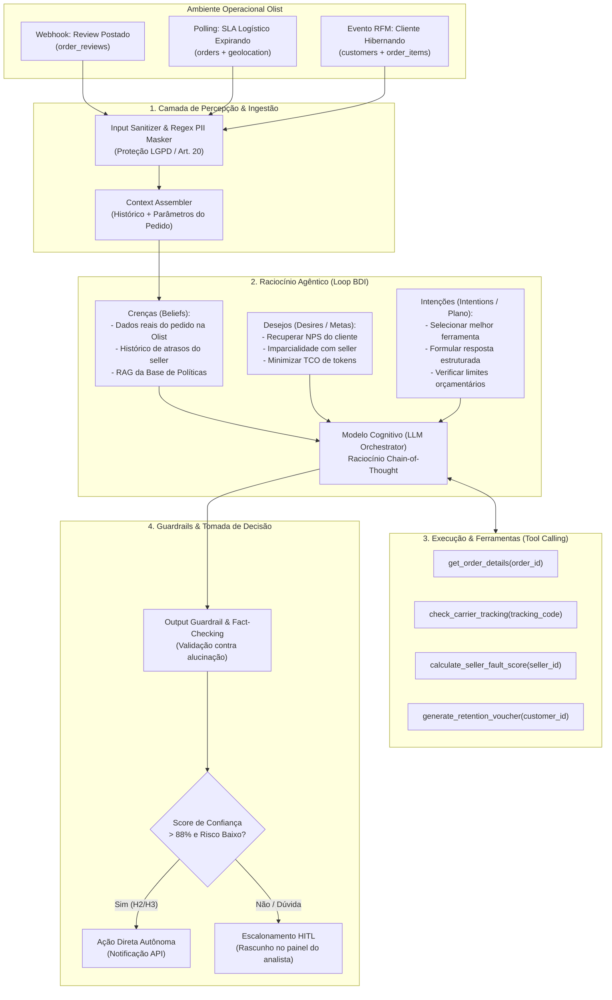
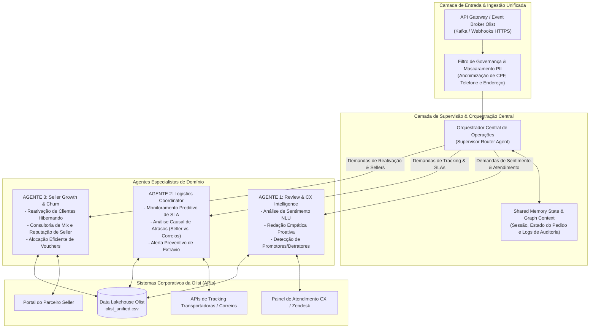
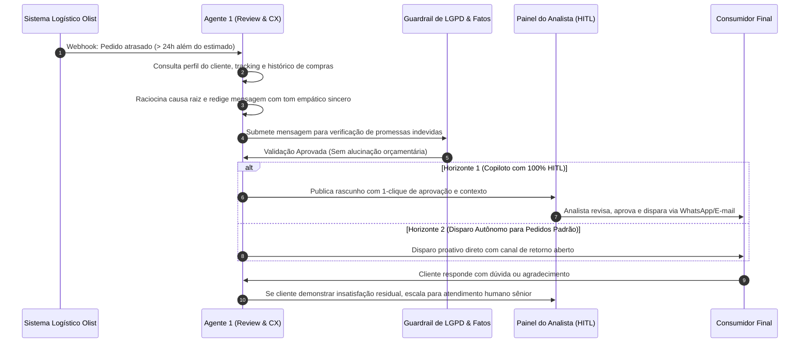
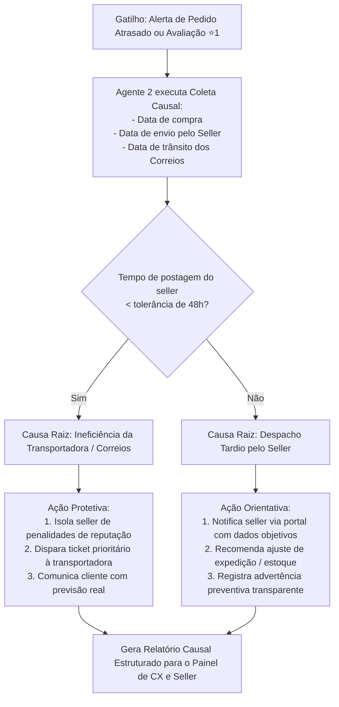
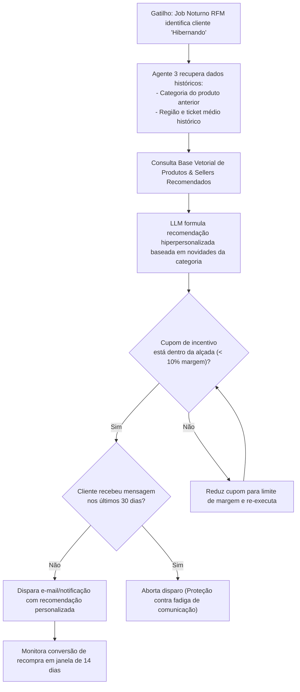

# Plano Diretor e Registro de Contexto: Transição Fase 1 ➔ Fase 2
**Programa:** Pós-Tech em Agentes de IA — FIAP / Alura  
**Desafio:** Tech Challenge — Fase 2 (Identificar Potenciais e Arquitetar Soluções)  
**Estudo de Caso:** Olist Intelligent Marketplace  
**Data de Registro:** Setembro / 2026  

### Grupo de Consultoria
* **Alessandro Dos Santos** — RM 376092
* **André Palermo** — RM 374038
* **Michel Lages Balbuena** — RM 375667
* **Willian Souza** — RM 375240

---

## 1. Visão Geral do Ecossistema do Projeto

O projeto simula uma consultoria executiva especializada em IA Agêntica prestando serviços para a diretoria da **Olist**. A pós-graduação estrutura a maturidade corporativa em 5 fases evolutivas:

* **Fase 1 (Concluída):** Diagnóstico de dados, visão estratégica inicial e identificação de oportunidades.
* **Fase 2 (Em Andamento):** Estruturação detalhada de casos de uso, arquitetura de sistemas e desenho de jornadas dos agentes.
* **Fase 3 (Futura):** Benchmarking de plataformas e prototipação funcional low-code/no-code (ex.: n8n, Dify, LangFlow) e testes.
* **Fase 4 (Futura):** Orquestração de múltiplos agentes e automação sistêmica avançada.
* **Fase 5 (Futura):** Governança corporativa, liderança e escala organizacional.

---

## 2. Herança e Ativos Consolidados na FASE 1

Na Fase 1, foram analisadas 9 tabelas relacionais do dataset da Olist (~100 mil pedidos de 2016 a 2018), resultando no pipeline de dados e nos entregáveis arquivados na pasta `Tech Challenge/Entrega Fase 1`:

### 2.1 Principais Diagnósticos Quantitativos
1. **Qualidade e Unificação de Dados:** Tratamento de categorias ausentes, geolocalização por mediana de CEP e desduplicação de reviews gerando a base unificada de pedidos com 99.441 linhas e 52 atributos (`olist_unified.csv`).
2. **Correlação Tempo de Entrega vs. Satisfação:**
   * Correlação de Spearman negativa (`-0.1758`) entre atraso em dias e nota da avaliação.
   * Nas notas ⭐1 (detratores), **37,9% dos pedidos atrasaram** (média de 3,3 dias além do prazo estimado).
   * Nas notas ⭐5 (promotores), apenas **3,0% dos pedidos atrasaram** (entregues em média 12,7 dias antes do prazo).
   * O **NPS Proxy despenca de +73,6 (pedidos no prazo) para -19,5 (pedidos com atraso)** — uma queda abrupta de 93,1 pontos.
3. **Segmentação RFM (Recência, Frequência e Valor Monetário):**
   * **96,88%** dos clientes compraram apenas uma única vez na plataforma (baixo LTV e ausência de retenção).
   * O cluster de clientes **"Hibernando"** (recência média de 445 dias e frequência = 1) representa 22,5% dos clientes, mas é responsável por **33,7% de todo o faturamento histórico (R$ 4,57 milhões)**.
   * Forte concentração geográfica: **59,7% dos vendedores (sellers) concentram-se no Estado de São Paulo**, encarecendo e atrasando as entregas para outras regiões do país.

### 2.2 O Portfólio Amplo de Oportunidades Candidatas (Base de Dados Olist)

Para simular com fidelidade uma consultoria executiva de IA, a definição dos agentes não partiu de escolhas arbitrárias, mas de uma varredura analítica completa sobre as 9 tabelas relacionais da Olist. A partir dos dados fidedignos, foram mapeadas **6 iniciativas candidatas**:

| ID | Iniciativa Candidata | Tabelas do Dataset Olist | Dor Concreta Extraída dos Dados |
|:---:|---|---|---|
| **A** | **Review Intelligence Agent** | `order_reviews`, `orders`, `customers` | 14,6% de detratores (⭐1 e ⭐2). Em notas ⭐1, o atraso médio é de 3,3 dias e 37,9% dos pedidos atrasaram. NPS despenca 93,1 pontos. |
| **B** | **Logistics Coordinator Agent** | `orders`, `order_items`, `geolocation` | 59,7% dos sellers em SP enfrentam gargalos logísticos interestaduais. Atraso na entrega destrói a percepção da marca da Olist. |
| **C** | **Seller Success & Growth Agent** | `sellers`, `order_items`, `products`, `orders` | 96,88% dos clientes nunca recompraram na Olist. O cluster "Hibernando" (recência 445 dias) concentra **R$ 4,57 milhões (33,7% da receita)** parados. |
| **D** | **Catalog Enrichment & Auto-SEO** | `products`, `product_category_name_translation` | 32.951 produtos distintos com títulos curtos, descrições heterogêneas e fotos insuficientes, prejudicando conversão orgânica. |
| **E** | **Autonomous Repricing Agent** | `order_items`, `products`, `sellers` | Disputa de buy-box entre os 3.095 vendedores para produtos concorrentes idênticos em busca de maior volume. |
| **F** | **Boleto Recovery Reminder** | `order_payments` | 19,0% dos pedidos são faturados via boleto bancário, apresentando taxa de abandono e não-pagamento antes da confirmação. |

### 2.3 Racional Metodológico do Afunilamento e Seleção da Tríade

Ao submeter as 6 iniciativas aos frameworks das apostilas da Fase 2, estabeleceu-se o funil decisório demonstrado graficamente na **Matriz Impacto × Viabilidade com Análise de Risco (3D)**:

1. **Filtro de Natureza Cognitiva (Framework EPOCH / MIT Sloan — Cap. 4 / Aula 2):**
   * *Iniciativa F (Lembrete de Boleto):* Identificada como processo **100% determinístico baseado em regras**. Consiste no disparo condicional de código de barras após webhook de criação de pedido. Não possui ambiguidade nem exige raciocínio probabilístico de LLM. Alocar um agente autônomo violaria o princípio de *Total Cost of Ownership (TCO)*. **Decisão: Tratar via automação tradicional de CRM/marketing automation.**
   * *Iniciativa D (Enriquecimento de Catálogo):* Predominantemente determinística e regras de padronização. Possui altíssima viabilidade, mas baixo impacto no sangramento de NPS e margem. **Decisão: Classificada como Melhoria Oportunista secundária.**
2. **Filtro de Risco e Viabilidade do Gargalo (Estudo RAND & Regra do Mínimo — Cap. 4 / Aula 3):**
   * *Iniciativa E (Reprecificação Autônoma):* Possui impacto teórico alto, porém bate na **Regra do Mínimo de Viabilidade (Nota 1.75)** devido à inexistência de APIs de concorrentes em tempo real e ERPs conectados. Além disso, apresenta **Risco Crítico (4.8/5 - maior bolha do gráfico)**: risco de dumping indevido, conflito comercial com a rede de sellers e passivos jurídicos. **Decisão: Descarte sem Culpa precoce.**
3. **Consolidação da Tríade de Agentes Selecionados para a Fase 2:**
   * **Agente 1 (Review Intelligence Agent):** Posicionado como **Vitória Rápida (*Quick Win*)** (Impacto 4.2 | Viabilidade 4.0 | Risco Baixo 2.0). Dados prontos no dataset, tarefa cognitiva pontual com modelo NLP/LLM maduro e 100% de supervisão humana (HITL), gerando credibilidade executiva imediata para a consultoria.
   * **Agente 2 (Logistics Coordinator Agent):** Posicionado como **Aposta Estratégica / Quick Win de Alto Impacto** (Impacto 4.85 | Viabilidade 3.0 | Risco Moderado-Alto 3.8). Ataca a causa raiz do problema número 1 da Olist (a queda de 93 pontos no NPS), com orquestração de APIs de rastreio e protocolos de mitigação preventiva.
   * **Agente 3 (Seller Success & Growth Agent):** Posicionado como **Aposta Estratégica** (Impacto 4.45 | Viabilidade 2.45 | Risco Moderado 2.8). Ataca a métrica financeira de maior valor reprimido da Olist: reativação dos clientes hibernando (R$ 4,57 milhões) e aumento da taxa de recompra de 3,12% para patamares saudáveis de mercado.

---


## 3. Matriz Metodológica dos 4 Capítulos da FASE 2

A Fase 2 introduz o rigor de arquitetura e governança por meio de frameworks consagrados distribuídos em seus 4 capítulos de estudo:

### Capítulo 4: Mapeamento de Oportunidades com IA (Diagnóstico e Priorização)
* **SIPOC (Suppliers, Inputs, Process, Outputs, Customers):** Mapeamento do fluxo de valor real de ponta a ponta na cadeia da Olist antes de propor qualquer intervenção tecnológica.
* **Matriz de Diagnóstico de Tarefas (Framework EPOCH / MIT Sloan):**
  * *Determinísticas / Baseadas em Regras:* Processos estáveis, repetitivos, sem ambiguidade (cálculo de atraso de frete, disparo de alertas transacionais) ➔ automação tradicional, scripts ou fluxos low-code determinísticos.
  * *Cognitivas / Julgamento:* Processos que exigem interpretação de contexto, nuance e ambiguidade (análise de reviews abertos, diagnóstico de causa raiz, consultoria estratégica de mix) ➔ agentes inteligentes com raciocínio LLM e camada de supervisão humana (HITL).
* **Matriz Impacto × Viabilidade com Análise de Risco Ponderada (3D):**
  * **Eixo Y — Impacto no Negócio (1 a 5):** Consolidação de retorno financeiro (receita incremental, margem) e eficiência operacional (redução de tempo de ciclo, mitigação de atrito).
  * **Eixo X — Viabilidade Técnica e Operacional (1 a 5):** Avaliada nas 4 dimensões essenciais: *Dados* (qualidade, acesso, permissão), *Complexidade da Solução* (regras vs. modelos cognitivos vs. orquestração de ferramentas), *Integração* (APIs existentes vs. planilhas/telas legadas) e *Pessoas* (dono do processo, prontidão para mudança).
  * **⚠️ Regra de Ouro do Gargalo (Aula 3):** A nota de viabilidade é **estritamente puxada pelo menor valor (mínimo)** entre as 4 dimensões, e nunca pela média. Uma iniciativa com dados nota 1 é inviável, mesmo com as outras notas em 5.
  * **3ª Dimensão — Magnitude do Risco (Tamanho do Ponto / Ícone):** O diâmetro visual do ponto reflete o risco ponderado sob as **4 faces do risco em IA**:
    1. *Custo do Erro:* Consequência da falha/alucinação (minuto perdido vs. prejuízo financeiro vs. ação judicial).
    2. *Reversibilidade:* Ação reversível (rascunho com HITL) vs. irreversível (notificação direta ou estorno bancário).
    3. *Regulatório e Privacidade:* Conformidade estrita com LGPD (tratamento de dados de clientes) e transparência algorítmica.
    4. *Reputacional:* Exposição externa da marca (o erro fica interno ou viraliza como captura de tela?).
  * **Quadrantes Estratégicos:**
    * *Superior Direito (Alto Impacto, Alta Viabilidade):* **Vitórias Rápidas (*Quick Wins*)** — entregas pioneiras que geram valor, credibilidade e aprendizado para o programa.
    * *Superior Esquerdo (Alto Impacto, Baixa/Média Viabilidade):* **Apostas Estratégicas** — exigem investimento estruturante prévio (arrumação de dados ou parcerias de integração).
    * *Inferior Direito (Baixo Impacto, Alta Viabilidade):* **Melhorias Oportunistas** — executadas se sobrar capacidade técnica.
    * *Inferior Esquerdo (Baixo Impacto, Baixa Viabilidade):* **Descarte sem Culpa** — ideias eliminadas precocemente.
  * **Artefato Visual Plotado:** Imagem de alta resolução gerada e arquivada em `assets/matriz_impacto_viabilidade_risco.png`.
* **Priorização AI-RICE:** Adaptação formal do framework RICE para agentes autônomos:
  $$\text{AI-RICE} = \frac{\text{Reach (execuções/mês)} \times \text{Impact (0,25 a 3,0)} \times \text{Confidence (\%)}}{\text{Effort (pessoa-mês)}}$$
* **Roadmap "Agora / Em seguida / Mais tarde" & Briefs de Caso de Uso:** Sequenciamento com dependências técnicas e credibilidade, consolidado em briefs padronizados de 1 página por iniciativa.

### Capítulo 2: Estruturação de Casos de Uso (Contrato de Valor e Governança)
* **Jobs-to-be-Done (JTBD):**
  * *Job Statement:* *"Quando [situação], eu quero [motivação], para que eu possa [resultado esperado]"*.
  * *As 4 Forças do Progresso:* Empurrada da dor atual (*Push*), Atração da nova solução (*Pull*), Ansiedade com riscos/alucinações (*Anxiety*) e Inércia dos hábitos legados (*Habit*).
  * *Técnica dos 5 Porquês:* Investigação em cascata da causa raiz (ex.: por que o pedido atrasou? por que o seller despachou tarde? por que faltou estoque?).
* **Mapa de Stakeholders (Poder × Interesse):**
  * *Alto Poder / Alto Interesse:* Gerenciar de perto (*Manage Closely*) — Patrocinador Executivo, Diretor de CX/Operações.
  * *Alto Poder / Baixo Interesse:* Manter satisfeito (*Keep Satisfied*) — DPO / Jurídico (poder de veto por LGPD), Segurança da Informação.
  * *Baixo Poder / Alto Interesse:* Manter informado (*Keep Informed*) — Atendentes de SAC, Analistas de Logística.
  * *Baixo Poder / Baixo Interesse:* Monitorar (*Monitor*) — Comunidade geral de sellers e usuários finais.
* **Matriz RACI Adaptada para IA:** Definição clara de papéis: Responsável (*Responsible* - MLOps/Dev), Autoridade (*Accountable* - Sponsor do Negócio), Consultado (*Consulted* - DPO/Jurídico/Especialistas) e Informado (*Informed* - Operação/Usuários).
* **Matriz de Riscos de Governança (Probabilidade × Severidade):** Mapeamento específico dos 4 riscos de IA (Alucinação, Vazamento de PII/LGPD, Viés Algorítmico e Dependência de APIs de Terceiros) com protocolos de contingência e barreiras de segurança.
* **TCO (Total Cost of Ownership) em IA:** Modelagem orçamentária que considera infraestrutura em nuvem, custos de inferência (tokens de entrada/saída de LLMs) e horas contínuas de curadoria, auditoria e supervisão humana (a RAND aponta subinvestimento pós-piloto como causa número 1 de falha).
* **Planejamento Incremental em 3 Horizontes de Autonomia:**
  * *Horizonte 1 (0-3 meses):* Copilotos com 100% de supervisão humana (HITL estrito).
  * *Horizonte 2 (3-6 meses):* Autonomia condicional com bypass para casos rotineiros de baixo risco e auditoria por amostragem.
  * *Horizonte 3 (6-12 meses):* Automação sistêmica multiagente e auto-otimização contínua.

### Capítulo 1: Design e Arquitetura de Agentes Inteligentes (Topologia e Cognição)
* **Loop Cognitivo Percepção-Raciocínio-Ação:** Ciclo contínuo de ingestão de eventos, tomada de decisão fundamentada e execução de ferramentas (*tool calling*).
* **Modelagem BDI (Beliefs, Desires, Intentions):**
  * *Beliefs (Crenças):* Estado atual do ecossistema e dados históricos (status do pedido, perfil do cliente, histórico do seller).
  * *Desires (Desejos):* Metas operacionais (ex.: zero clientes sem resposta, entrega dentro da tolerância de SLA).
  * *Intentions (Intenções):* Planos e ferramentas acionadas para atingir os desejos (buscar dados, classificar, gerar alerta).
* **Modelagem iStar:** Mapeamento formal de atores, dependências de metas (*softgoals*), recursos e tarefas na Olist.
* **Topologias Multiagentes (MAS):**
  * *Workflow:* Sequencial e previsível.
  * *Graphs (LangGraph / Flowise / Dify):* Não-linear, com ciclos de reflexão, feedback e ramificações condicionais.
  * *Hierárquica (Supervisor-Especialistas):* Adotada como topologia mestra para a Olist por garantir governança centralizada, auditoria e roteamento seguro de contexto.
  * *Swarm:* Colaborativo e descentralizado.
* **Memória e Conectividade:** Buffer de contexto (curto prazo), base vetorial/RAG (longo prazo) e conectividade via APIs REST e webhooks com os sistemas de ERP, Transportadoras e CRM da Olist.

### Capítulo 3: Storyboard — Como o Agente de IA vai Atuar (Experiência Humano-IA)
* **Matriz HCAI (Human-Centered AI - Ben Shneiderman):** Matriz 2×2 cruzando *Controle Humano (Baixo vs. Alto)* com *Automação de IA (Baixa vs. Alta)*. O projeto rejeita a "caixa preta" e se posiciona no quadrante de excelência: **Alta Automação com Alto Controle Humano**.
* **Os 5 Componentes Centrais da Jornada:**
  1. *Gatilho e Entradas:* Eventos assíncronos (webhook de review postado, atraso de tracking detectado).
  2. *Percepção e Raciocínio:* Diagnóstico contextual, validação contra base de dados.
  3. *Tomada de Decisão:* Classificação do nível de severidade e definição da rota de ação.
  4. *Human-in-the-Loop (HITL) & Alçadas:* Regras de escalonamento para aprovação humana prévia.
  5. *Mecanismos de Fallback Humano:* Procedimentos de contingência para falhas de modelo, dados inconsistentes ou indisponibilidade de APIs.
* **Acessibilidade e Usabilidade (WCAG 2.2):** Garantia de contraste, legibilidade e simplicidade nas interfaces de interação dos analistas e clientes com os outputs dos agentes.

---

## 4. Inventário Completo de Matrizes, Diagramas e Plotagens Consolidadas

Para garantir o mais alto nível executivo e atender com rigor absoluto aos requisitos do Tech Challenge da Fase 2, o portfólio contemplou a modelagem e plotagem de **todas as matrizes e frameworks recomendados nas apostilas e aulas**:

| Capítulo Origem | Ferramenta / Tipo | Nome do Artefato / Matriz | Racional e Decisão de Design | Arquivo / Imagem Gerada | Status |
|:---:|:---:|---|---|---|:---:|
| **Cap. 4 (Aula 3)** | **Python / Matplotlib (PNG)** | **Matriz Impacto × Viabilidade (3D com Risco)** | Posicionamento das 6 iniciativas do funil com a Regra do Gargalo (Viabilidade mínima) e diâmetro ponderado pelo Risco. | `assets/matriz_impacto_viabilidade_risco.png` | ✅ **Gerado (300 DPI)** |
| **Cap. 4 (Aula 2)** | **Python / Matplotlib (PNG)** | **Matriz EPOCH de Diagnóstico de Tarefas** | Classificação de tarefas determinísticas/regras vs. cognitivas/julgamento (MIT Sloan / Anthropic). | `assets/matriz_epoch_diagnostico.png` | ✅ **Gerado (300 DPI)** |
| **Cap. 4 (Aula 4)** | **Python / Matplotlib (PNG)** | **Gráfico de Priorização AI-RICE** | Ranking numérico formal AI-RICE justificando a ordem de entrega (Agente 1 = 864 pts, Agente 2 = 400 pts, Agente 3 = 375 pts). | `assets/grafico_priorizacao_airice.png` | ✅ **Gerado (300 DPI)** |
| **Cap. 4 (Aula 4)** | **Python / Matplotlib (PNG)** | **Roadmap "Agora / Em seguida / Mais tarde"** | Linha do tempo executiva com metas de entrega, herança técnica e *Kill Criteria* formais. | `assets/roadmap_agora_em_seguida_mais_tarde.png` | ✅ **Gerado (300 DPI)** |
| **Cap. 2 (Aula 1)** | **Python / Matplotlib (PNG)** | **Matriz das 4 Forças do Progresso (JTBD)** | Mapeamento dinâmico de forças: Push, Pull, Anxiety e Habit para a transição dos agentes. | `assets/matriz_jtbd_4forcas.png` | ✅ **Gerado (300 DPI)** |
| **Cap. 2 (Aula 3)** | **Python / Matplotlib (PNG)** | **Mapa de Stakeholders (Poder × Interesse)** | Matriz de Mendelow adaptada posicionando Sponsor, DPO/Jurídico (poder de veto), MLOps, CX e Sellers. | `assets/mapa_stakeholders_poder_interesse.png` | ✅ **Gerado (300 DPI)** |
| **Cap. 2 (Aula 3)** | **Python / Matplotlib (PNG)** | **Matriz de Riscos de Governança de IA** | Heatmap 5x5 (Probabilidade × Severidade) cobrindo Alucinação, LGPD/PII, Viés e Falhas de API (NIST AI RMF). | `assets/matriz_riscos_governanca.png` | ✅ **Gerado (300 DPI)** |
| **Cap. 2 (Aula 4)** | **Python / Matplotlib (PNG)** | **Modelagem de Curva TCO e HITL (12 Meses)** | Decomposição do TCO (Dev + Tokens + Curadoria) e curva de desengajamento humano com break-even no Mês 4. | `assets/curva_tco_12meses.png` | ✅ **Gerado (300 DPI)** |
| **Cap. 3 (Aula 1)** | **Python / Matplotlib (PNG)** | **Matriz HCAI de Ben Shneiderman** | Matriz 2×2 posicionando a Olist no quadrante ideal de Alta Automação com Alto Controle Humano. | `assets/matriz_hcai_shneiderman.png` | ✅ **Gerado (300 DPI)** |
| **Cap. 2 (Aula 3)** | **Tabela Matricial** | **Matriz RACI de Governança de IA** | Distribuição formal de papéis (Responsible, Accountable, Consulted, Informed) para todo o ciclo de vida. | *Seção 7 do Documento* | ✅ **Estruturado** |
| **Cap. 2 (Aula 4)** | **Quadro Estruturado** | **Matriz dos 3 Horizontes de Autonomia** | Evolução de maturidade: H1 Copiloto 100% HITL ➔ H2 Bypass condicional ➔ H3 Orquestração autônoma. | *Seção 8 do Documento* | ✅ **Estruturado** |
| **Cap. 1 (Aula 1)** | **Diagrama Mermaid** | **Loop Cognitivo BDI / Percepção-Raciocínio-Ação** | Arquitetura cognitiva interna dos agentes com Crenças, Desejos, Intenções e Tool Calling. | *Seção 9 do Documento* | ✅ **Estruturado** |
| **Cap. 1 (Aula 2)** | **Diagrama Mermaid** | **Topologia Multiagente Hierárquica da Olist** | Arquitetura do Supervisor de Operações orquestrando os 3 agentes especialistas com ferramentas e memórias. | *Seção 10 do Documento* | ✅ **Estruturado** |
| **Cap. 3 (Aulas 1-3)** | **Diagramas Mermaid** | **Storyboards Operacionais das 3 Jornadas** | 3 fluxogramas ponta a ponta detalhando Gatilhos, Entradas, Decisões, Ações, HITL e Fallbacks. | *Seção 11 do Documento* | ✅ **Estruturado** |

---

## 5. Requisitos Oficiais do Tech Challenge - Fase 2

Conforme especificado em `POSTECH - Tech Challenge - Fase 2.pdf`:

| Nº | Entregável Requerido | Descrição Detalhada |
|:---:|---|---|
| **1** | **Evolução do Relatório Executivo** | Documento consolidado entre **15 e 30 páginas**, expandindo o relatório da Fase 1 com os novos frameworks e arquiteturas da Fase 2. |
| **2** | **Detalhamento dos 3 Casos de Uso** | Estruturação individualizada dos 3 agentes contemplando:<br/>a) Objetivo do agente<br/>b) Problema resolvido<br/>c) Usuários envolvidos<br/>d) Dados utilizados (tabelas do dataset)<br/>e) Entradas e saídas<br/>f) Indicadores impactados (KPIs) |
| **3** | **Jornada de Funcionamento dos Agentes** | Fluxogramas claros (Miro/Mermaid/PowerPoint) demonstrando: gatilhos, entradas, decisões, ações executadas, interação humana (HITL) e saídas esperadas. |
| **4** | **Estruturação Inicial de Prompts** | Prompts estruturados contendo: a) Objetivo, b) Contexto fornecido, c) Instrução principal e d) Resultado esperado (formato estruturado/JSON). |
| **5** | **Vídeo Executivo (Até 5 minutos)** | Pitch executivo simulando apresentação para C-Level, destacando a evolução técnica, arquitetura, storyboards e solicitação de aprovação para a Fase 3. |

---

## 6. Status dos Entregáveis da Fase 2

| Entregável Oficial | Status | Componentes Desenvolvidos |
|---|:---:|---|
| **1. Matrizes e Frameworks dos 4 Capítulos** | ✅ **100% Concluído** | 9 visualizações em PNG de alta resolução geradas em `assets/` cobrindo Viabilidade 3D, EPOCH, AI-RICE, Roadmap, Stakeholders, Riscos NIST, Curva TCO, Matriz HCAI e 4 Forças do JTBD. |
| **2. Detalhamento dos 3 Casos de Uso** | ✅ **Estruturado** | Racionais de negócio amarrados nos 99.441 pedidos do dataset Olist, com definição de KPIs, tabelas de dados, entradas e saídas. |
| **3. Arquitetura Cognitiva e Multiagente** | ✅ **Modelado** | Loop Cognitivo BDI (Percepção-Raciocínio-Ação) e Topologia Multiagente Hierárquica em Mermaid (Supervisor + Especialistas). |
| **4. Storyboards das 3 Jornadas Operacionais** | ✅ **Modelado** | Fluxogramas ponta a ponta em Mermaid com nós de Human-in-the-Loop (HITL), alçadas decisórias e protocolos de Fallback. |
| **5. Engenharia de Prompts e Schemas JSON** | ✅ **Modelado** | Prompts estruturados de nível de produção com validação Pydantic/JSON Schema para cada agente. |
| **6. Relatório Executivo Expandido (15-30 págs)** | 🔄 **Em Elaboração** | Minuta consolidando toda a fundamentação para compor o documento oficial de entrega. |
| **7. Roteiro e Apresentação do Vídeo (5 min)** | ⏳ **Próxima Etapa** | Roteiro estruturado cronometrado e slides de pitch para a diretoria. |

---

## 7. Galeria Executiva das Matrizes Plotadas e Seus Racionais

### 7.1 Matriz Impacto × Viabilidade com Magnitude de Risco (3D)
* **Arquivo:** `assets/matriz_impacto_viabilidade_risco.png`
* **Framework:** Matriz 2×2 clássica enriquecida pela **Regra do Mínimo (Gargalo Técnico)** e **3ª Dimensão de Risco (RAND AI Safety)**.
* **Racional de Negócio:** Mapeia as 6 iniciativas do funil Olist. Demonstra graficamente por que a Iniciativa E (Reprecificação) foi descartada precocemente (risco desmedido e viabilidade bloqueada por falta de APIs), por que a Iniciativa F (Lembretes de Boletos) foi encaminhada para automação clássica, e como a tríade (Agente 1, 2 e 3) preenche os quadrantes de *Quick Wins* e *Apostas Estratégicas*.

### 7.2 Matriz de Diagnóstico de Tarefas (Framework EPOCH / MIT Sloan)
* **Arquivo:** `assets/matriz_epoch_diagnostico.png`
* **Framework:** MIT Sloan / Anthropic Task Decomposition (Capítulo 4 / Aula 2).
* **Racional de Negócio:** Separa tarefas determinísticas lineares de tarefas cognitivas ambíguas. Protege o TCO da Olist evitando o desperdício de tokens de LLM em disparos de boletos ou cálculo numérico de dias de frete, reservando a IA generativa para interpretação empática de reviews, diagnóstico causal de gargalos e ofertas hiperpersonalizadas.

### 7.3 Ranking Formal de Priorização AI-RICE
* **Arquivo:** `assets/grafico_priorizacao_airice.png`
* **Framework:** AI-RICE Scoring (Capítulo 4 / Aula 4).
* **Racional de Negócio:**
  * **Agente 1 (Review Intelligence):** 864 pontos (Reach 12k × Impact 2.0 × Conf 90% / Effort 2.5). Prioridade 1 incontestável: implantação rápida, dados prontos no dataset e validação humana imediata.
  * **Agente 2 (Logistics Coordinator):** 400 pontos (Reach 4k × Impact 3.0 × Conf 80% / Effort 4.0). Prioridade 2: ataca a maior dor do marketplace (queda de 93 pts no NPS), exigindo integração de APIs de tracking.
  * **Agente 3 (Seller Growth & Churn):** 375 pontos (Reach 10k × Impact 2.5 × Conf 75% / Effort 5.0). Prioridade 3: reativa a base hibernada de R$ 4,57M, dependendo da esteira de dados de sellers estabilizada.

### 7.4 Roadmap Executivo "Agora / Em seguida / Mais tarde"
* **Arquivo:** `assets/roadmap_agora_em_seguida_mais_tarde.png`
* **Framework:** Lean Product Roadmap (Teresa Torres / Cap. 4 Aula 4).
* **Racional de Negócio:** Organiza as entregas em horizontes temporais com entregáveis tangíveis, herança tecnológica cumulativa e critérios de interrupção formal (*Kill Criteria*) para assegurar responsabilidade com o capital investido.

### 7.5 Mapa Estratégico de Stakeholders (Poder × Interesse)
* **Arquivo:** `assets/mapa_stakeholders_poder_interesse.png`
* **Framework:** Matriz de Mendelow adaptada para Governança de IA (Capítulo 2 / Aula 3).
* **Racional de Negócio:** Mapeia 7 atores cruciais do ecossistema Olist. Destaca o **DPO / Compliance Jurídico** no quadrante *Manter Satisfeito* com **poder de veto mandatório (LGPD / Art. 20)**, os analistas de CX no quadrante *Manter Informado* como operadores do Copiloto HITL, e o VP de Operações como *Sponsor Executivo*.

### 7.6 Matriz de Riscos de Governança de IA (Probabilidade × Severidade)
* **Arquivo:** `assets/matriz_riscos_governanca.png`
* **Framework:** NIST AI Risk Management Framework 1.0 / RAND AI Safety Guidelines (Capítulo 2 / Aula 3).
* **Racional de Negócio:** Heatmap 5×5 que classifica as 6 maiores vulnerabilidades operacionais do projeto. Destaca como riscos críticos o vazamento de dados de clientes (PII) e alucinações em promessas de estorno, associando cada risco à sua barreira de contenção (Guardrails, Mascaramento regex e Circuit Breakers).

### 7.7 Modelagem de Curva TCO e Economia da Curadoria Humana (12 Meses)
* **Arquivo:** `assets/curva_tco_12meses.png`
* **Framework:** Total Cost of Ownership e Curadoria HITL em Sistemas Agênticos (Capítulo 2 / Aula 4).
* **Racional de Negócio:** Gráficos duplos demonstrando:
  1. A composição de custos (Dev + Tokens + Curadoria Humana) cruzada com a curva de retorno/economia, atingindo o **Break-Even no Mês 4** com ROI positivo crescente.
  2. A queda gradual da taxa de intervenção humana (de 95% no Mês 1 para 12% no Mês 12) acompanhando a redução drástica do custo unitário por ticket resolvido (de R$ 14,80 para R$ 2,40).

### 7.8 Matriz HCAI de Ben Shneiderman (Controle Humano × Automação de IA)
* **Arquivo:** `assets/matriz_hcai_shneiderman.png`
* **Framework:** Human-Centered AI (Ben Shneiderman / Stanford HAI - Cap. 3 / Aula 1).
* **Racional de Negócio:** Rejeita o mito da automação cega ("caixa preta") e a ineficiência do trabalho manual exaustivo. Posiciona a arquitetura Olist no ápice da maturidade de IA: **Alta Automação com Alto Controle Humano**, empoderando os colaboradores através de copilotos auditáveis e explicáveis.

### 7.9 Matriz das 4 Forças do Progresso (Jobs to be Done)
* **Arquivo:** `assets/matriz_jtbd_4forcas.png`
* **Framework:** The Four Forces of Progress (Bob Moesta & Clayton Christensen - Cap. 2 / Aula 1).
* **Racional de Negócio:** Analisa a equação de adoção organizacional `(Push + Pull) > (Anxiety + Habit)`. Detalha como as dores insustentáveis da Olist e o valor dos agentes superam o medo de alucinações e o hábito de planilhas manuais através de copilotos integrados ao ecossistema existente.

---

## 8. Governança Corporativa: Matriz RACI e Horizontes de Autonomia

### 8.1 Matriz RACI de Governança de IA
Baseada nas diretrizes do Capítulo 2 (Aula 3), a governança define claramente as responsabilidades ao longo do ciclo de vida:

| Atividade do Ciclo de Vida da IA | Sponsor Negócio (VP CX) | DPO / Jurídico | MLOps & Eng. Dados | Atendentes / CX (HITL) | Sellers Parceiros | Agente Autônomo |
|---|:---:|:---:|:---:|:---:|:---:|:---:|
| **Definição de Métricas de Negócio e ROI** | **A** | C | C | I | I | - |
| **Aprovação de Conformidade LGPD & Mascaramento PII** | C | **A** | R | I | I | - |
| **Engenharia de Prompts, RAG e Guardrails** | C | C | **A / R** | C | - | - |
| **Triagem e Geração de Rascunhos de Resposta** | I | - | I | I | I | **R** |
| **Aprovação e Validação Final do Ticket (HITL)** | I | - | I | **A / R** | I | - |
| **Diagnóstico Causal de Atrasos e Penalidades** | C | C | I | I | C | **R** |
| **Aplicação de Sanções / Suspensão de Seller** | **A** | C | - | I | I | - |
| **Monitoramento de Latência, Drift e TCO** | I | - | **A / R** | I | - | - |
| **Acionamento de Kill Switch / Contingência Fallback** | **A** | C | **R** | I | - | - |

*Legenda: **R** = Responsible (Quem executa) | **A** = Accountable (Autoridade final) | **C** = Consulted (Quem opina/valida) | **I** = Informed (Quem recebe ciência).*

### 8.2 Matriz dos 3 Horizontes de Autonomia e Maturidade

```
[HORIZONTE 1: COPILOTO SUPERVISIONADO] (Mês 0 a 3)
- Nível de Autonomia: Baixo | HITL: 100% dos casos
- Operação: O agente atua apenas como copiloto de redação e analista de diagnóstico.
- Regra de Ouro: Nenhuma mensagem sai para o cliente ou seller sem aprovação humana expressa (1-clique).
- Foco: Coleta de feedback, calibragem de prompts, ajuste de guardrails e geração de confiança.

              ⬇ (Após 10.000 tickets validados e taxa de concordância > 92%)

[HORIZONTE 2: BYPASS CONDICIONAL / AUTONOMIA COM EXCEÇÃO] (Mês 4 a 8)
- Nível de Autonomia: Médio | HITL: 20% a 30% dos casos (Apenas exceções)
- Operação: Tickets com Score de Confiança do Modelo > 88% e com valor de pedido < R$ 250 são disparados autonomamente.
- Alçada de Escalonamento: Casos de churn crítico, clientes VIP, reviews com ameaça jurídica ou incerteza do modelo seguem para a esteira de validação humana obrigatória.
- Auditoria: Amostragem aleatória diária de 5% dos disparos autônomos revisada pela supervisão de CX.

              ⬇ (Após estabilidade de NPS e drift nulo de guardrails)

[HORIZONTE 3: ORQUESTRAÇÃO MULTIAGENTE ADAPTATIVA] (Mês 9 a 12+)
- Nível de Autonomia: Elevado | HITL: < 12% dos casos
- Operação: Supervisor central roteia demandas complexas entre Agente 1, 2 e 3 em malha fechada.
- Otimização Contínua: Feedback de aceitação retroalimenta a base de memória contextual vetorial (Few-Shot dinâmico).
```

---

## 9. Arquitetura Cognitiva e Topologias Multiagentes (Capítulo 1)

### 9.1 Loop Cognitivo BDI (Percepção - Raciocínio - Ação)
Cada um dos agentes especialistas opera sob a arquitetura clássica BDI (*Beliefs, Desires, Intentions*), enriquecida com **Guardrails de Entrada/Saída** e **Chamada de Ferramentas (*Tool Calling*)**:



### 9.2 Topologia Multiagente Hierárquica da Olist
A arquitetura adota uma topologia **Hierárquica com Supervisor Central**, assegurando roteamento determinístico de contexto, isolamento de dados por domínio e auditoria centralizada:



---

## 10. Storyboards Operacionais das 3 Jornadas Ponta a Ponta (Capítulo 3)

### 10.1 Storyboard 1: Resolução Proativa de Atrasos e Satisfação (Agente 1)
* **Ator Principal:** Consumidor B2C que comprou na Olist e teve a entrega atrasada.
* **Problema:** Atraso gera queda de 93,1 pontos de NPS e avaliações ⭐1.
* **Fluxo:**



### 10.2 Storyboard 2: Diagnóstico Causal de Atrasos e Disputas de Sellers (Agente 2)
* **Ator Principal:** Seller parceiro da Olist com avaliação em risco por atraso logístico interestadual.
* **Problema:** Sellers em SP sofrem penalizações injustas causadas por gargalos da malha dos Correios.
* **Fluxo:**



### 10.3 Storyboard 3: Reativação Inteligente da Base Hibernando (Agente 3)
* **Ator Principal:** Cliente do cluster "Hibernando" (recência 445 dias, 1 compra, potencial alto).
* **Problema:** 96,88% dos clientes nunca recompraram na Olist, represando R$ 4,57M de receita.
* **Fluxo:**



---

## 11. Contratos de Dados, System Prompts e Schemas JSON

Para garantir que a transição para a **Fase 3 (Prototipação Funcional em Plataformas Low-Code/No-Code)** ocorra com 100% de compatibilidade técnica e interoperabilidade, os prompts dos 3 agentes foram estruturados com instruções restritivas e contratos de dados rígidos no padrão JSON Schema:

### 11.1 Prompt Estruturado — Agente 1 (Review Intelligence & CX)
```json
{
  "system_instruction": "Você é o Agente 1 de Inteligência de Atendimento e CX da Olist. Sua missão é diagnosticar avaliações de clientes e redigir respostas proativas de acolhimento empático. Você NUNCA promete indenizações financeiras ou frete grátis sem autorização explícita de alçada. Siga rigorosamente as diretrizes da LGPD, nunca repetindo CPFs ou dados bancários.",
  "input_context": {
    "order_id": "string",
    "customer_name": "string (mascarado)",
    "customer_state": "string",
    "delivery_delay_days": "integer",
    "review_score": "integer (1 a 5)",
    "review_comment": "string"
  },
  "output_json_schema": {
    "sentiment": "detractor | neutral | promoter",
    "root_cause_category": "delivery_delay | defective_product | wrong_item | customer_service | other",
    "urgency_level": "low | medium | high | critical",
    "draft_response": "string (mensagem empática e transparente em tom profissional)",
    "suggested_action": "apologize_and_track | escalate_to_human | offer_assistance",
    "requires_hitl_approval": "boolean"
  }
}
```

### 11.2 Prompt Estruturado — Agente 2 (Logistics Coordinator)
```json
{
  "system_instruction": "Você é o Agente 2 Coordenador Logístico da Olist. Sua função é auditar a cadeia de transporte e determinar causalmente se o atraso de uma entrega é responsabilidade do Seller (postagem tardia) ou da Transportadora/Correios (trânsito excessivo). Mantenha total imparcialidade técnica e fundamente suas conclusões nas métricas temporais.",
  "input_context": {
    "order_id": "string",
    "seller_id": "string",
    "seller_state": "string",
    "customer_state": "string",
    "seller_dispatch_hours": "float",
    "carrier_transit_days": "float",
    "estimated_delivery_days": "float"
  },
  "output_json_schema": {
    "delay_attribution": "seller_fault | carrier_fault | shared_fault | unpreventable_weather",
    "seller_fault_score": "float (0.0 a 1.0)",
    "is_seller_reputation_protected": "boolean",
    "recommended_seller_feedback": "string",
    "carrier_sla_breach_detected": "boolean",
    "suggested_carrier_ticket": "string"
  }
}
```

### 11.3 Prompt Estruturado — Agente 3 (Seller Success & Growth)
```json
{
  "system_instruction": "Você é o Agente 3 de Crescimento e Sucesso de Vendedores da Olist. Sua missão é analisar dados de clientes inativos ou hibernando e recomendar produtos complementares de sellers qualificados da mesma região, respeitando as políticas orçamentárias de incentivo e evitando fadiga de spam.",
  "input_context": {
    "customer_id": "string",
    "rfm_cluster": "Hibernando | Campeões | Em Risco",
    "days_since_last_purchase": "integer",
    "preferred_category": "string",
    "average_ticket": "float",
    "eligible_sellers_catalog": "array"
  },
  "output_json_schema": {
    "recommended_category": "string",
    "recommended_product_id": "string",
    "discount_voucher_percentage": "integer (max 10%)",
    "hyperpersonalized_message_hook": "string",
    "estimated_reengagement_probability": "float (0.0 a 1.0)",
    "marketing_opt_out_compliant": "boolean"
  }
}
```

---

## 12. Próximos Passos Imediatos para a Entrega da Fase 2

1. **Geração do Documento Consolidado de Relatório Executivo (15-30 págs):** Montagem do arquivo final estruturado integrando todas as seções, gráficos em alta resolução e códigos de suporte.
2. **Elaboração do Roteiro e Apresentação do Vídeo Executivo (Até 5 minutos):** Criação dos slides e minutagem de fala profissional para a diretoria da Olist.


