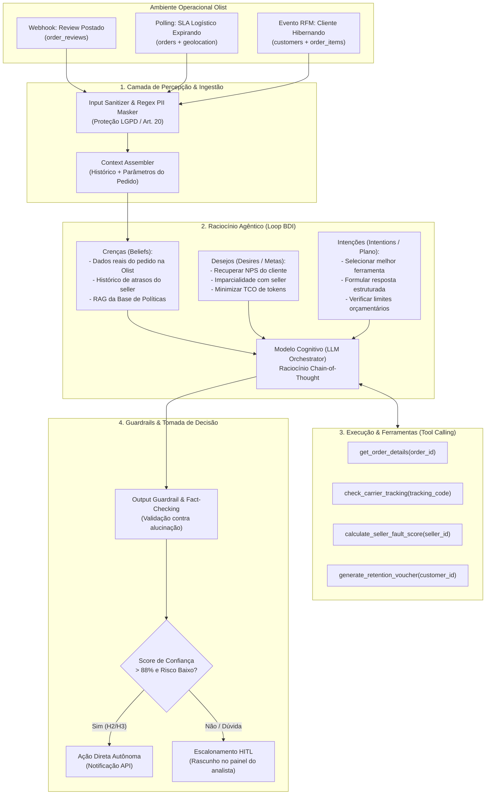
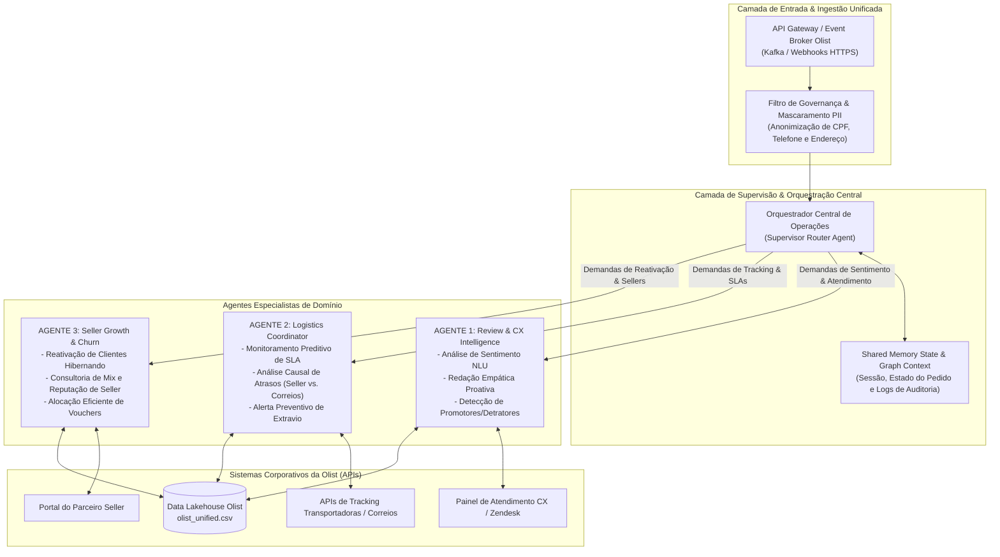
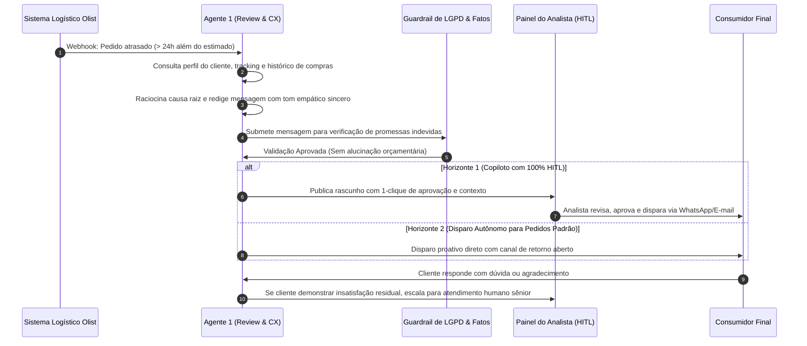
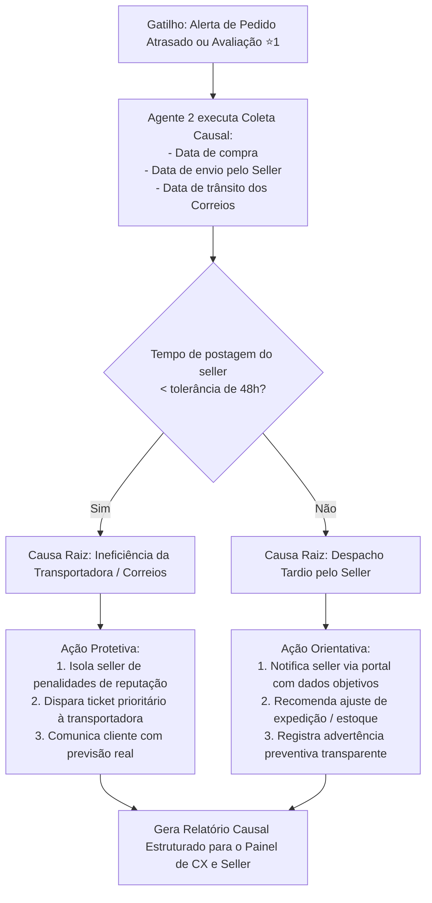
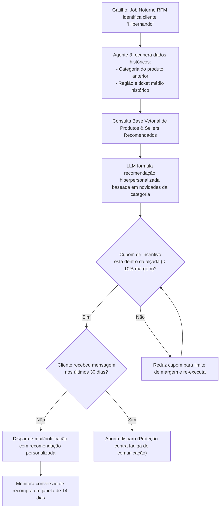

# Plano Diretor e Registro de Contexto: Transição Fase 1 ➔ Fase 2
**Programa:** Pós-Tech em Agentes de IA — FIAP / Alura  
**Desafio:** Tech Challenge — Fase 2 (Identificar Potenciais e Arquitetar Soluções)  
**Estudo de Caso:** Olist Intelligent Marketplace  
**Data de Registro:** Setembro / 2026  

### Grupo de Consultoria
* **Alessandro Dos Santos** — RM 376092
* **André Palermo** — RM 374038
* **Michel Lages Balbuena** — RM 375667

---

## 1. Visão Geral do Ecossistema do Projeto

O projeto simula uma consultoria executiva especializada em IA Agêntica prestando serviços para a diretoria da **Olist**. A pós-graduação estrutura a maturidade corporativa em 5 fases evolutivas:

* **Fase 1 (Concluída):** Diagnóstico de dados, visão estratégica inicial e identificação de oportunidades.
* **Fase 2 (Em Andamento):** Estruturação detalhada de casos de uso, arquitetura de sistemas e desenho de jornadas dos agentes.
* **Fase 3 (Futura):** Benchmarking de plataformas e prototipação funcional low-code/no-code (ex.: n8n, Dify, LangFlow) e testes.
* **Fase 4 (Futura):** Orquestração de múltiplos agentes e automação sistêmica avançada.
* **Fase 5 (Futura):** Governança corporativa, liderança e escala organizacional.

---

## 2. Herança e Ativos Consolidados na FASE 1

Na Fase 1, foram analisadas 9 tabelas relacionais do dataset da Olist (~100 mil pedidos de 2016 a 2018), resultando no pipeline de dados e nos entregáveis arquivados na pasta `Tech Challenge/Entrega Fase 1`:

### 2.1 Principais Diagnósticos Quantitativos
1. **Qualidade e Unificação de Dados:** Tratamento de categorias ausentes, geolocalização por mediana de CEP e desduplicação de reviews gerando a base unificada de pedidos com 99.441 linhas e 52 atributos (`olist_unified.csv`).
2. **Correlação Tempo de Entrega vs. Satisfação:**
   * Correlação de Spearman negativa (`-0.1758`) entre atraso em dias e nota da avaliação.
   * Nas notas ⭐1 (detratores), **37,9% dos pedidos atrasaram** (média de 3,3 dias além do prazo estimado).
   * Nas notas ⭐5 (promotores), apenas **3,0% dos pedidos atrasaram** (entregues em média 12,7 dias antes do prazo).
   * O **NPS Proxy despenca de +73,6 (pedidos no prazo) para -19,5 (pedidos com atraso)** — uma queda abrupta de 93,1 pontos.
3. **Segmentação RFM (Recência, Frequência e Valor Monetário):**
   * **96,88%** dos clientes compraram apenas uma única vez na plataforma (baixo LTV e ausência de retenção).
   * O cluster de clientes **"Hibernando"** (recência média de 445 dias e frequência = 1) representa 22,5% dos clientes, mas é responsável por **33,7% de todo o faturamento histórico (R$ 4,57 milhões)**.
   * Forte concentração geográfica: **59,7% dos vendedores (sellers) concentram-se no Estado de São Paulo**, encarecendo e atrasando as entregas para outras regiões do país.

### 2.2 O Portfólio Amplo de Oportunidades Candidatas (Base de Dados Olist)

Para simular com fidelidade uma consultoria executiva de IA, a definição dos agentes não partiu de escolhas arbitrárias, mas de uma varredura analítica completa sobre as 9 tabelas relacionais da Olist. A partir dos dados fidedignos, foram mapeadas **6 iniciativas candidatas**:

| ID | Iniciativa Candidata | Tabelas do Dataset Olist | Dor Concreta Extraída dos Dados |
|:---:|---|---|---|
| **A** | **Review Intelligence Agent** | `order_reviews`, `orders`, `customers` | 14,6% de detratores (⭐1 e ⭐2). Em notas ⭐1, o atraso médio é de 3,3 dias e 37,9% dos pedidos atrasaram. NPS despenca 93,1 pontos. |
| **B** | **Logistics Coordinator Agent** | `orders`, `order_items`, `geolocation` | 59,7% dos sellers em SP enfrentam gargalos logísticos interestaduais. Atraso na entrega destrói a percepção da marca da Olist. |
| **C** | **Seller Success & Growth Agent** | `sellers`, `order_items`, `products`, `orders` | 96,88% dos clientes nunca recompraram na Olist. O cluster "Hibernando" (recência 445 dias) concentra **R$ 4,57 milhões (33,7% da receita)** parados. |
| **D** | **Catalog Enrichment & Auto-SEO** | `products`, `product_category_name_translation` | 32.951 produtos distintos com títulos curtos, descrições heterogêneas e fotos insuficientes, prejudicando conversão orgânica. |
| **E** | **Autonomous Repricing Agent** | `order_items`, `products`, `sellers` | Disputa de buy-box entre os 3.095 vendedores para produtos concorrentes idênticos em busca de maior volume. |
| **F** | **Boleto Recovery Reminder** | `order_payments` | 19,0% dos pedidos são faturados via boleto bancário, apresentando taxa de abandono e não-pagamento antes da confirmação. |

### 2.3 Racional Metodológico do Afunilamento e Seleção da Tríade

Ao submeter as 6 iniciativas aos frameworks das apostilas da Fase 2, estabeleceu-se o funil decisório demonstrado graficamente na **Matriz Impacto × Viabilidade com Análise de Risco (3D)**:

1. **Filtro de Natureza Cognitiva (Framework EPOCH / MIT Sloan — Cap. 4 / Aula 2):**
   * *Iniciativa F (Lembrete de Boleto):* Identificada como processo **100% determinístico baseado em regras**. Consiste no disparo condicional de código de barras após webhook de criação de pedido. Não possui ambiguidade nem exige raciocínio probabilístico de LLM. Alocar um agente autônomo violaria o princípio de *Total Cost of Ownership (TCO)*. **Decisão: Tratar via automação tradicional de CRM/marketing automation.**
   * *Iniciativa D (Enriquecimento de Catálogo):* Predominantemente determinística e regras de padronização. Possui altíssima viabilidade, mas baixo impacto no sangramento de NPS e margem. **Decisão: Classificada como Melhoria Oportunista secundária.**
2. **Filtro de Risco e Viabilidade do Gargalo (Estudo RAND & Regra do Mínimo — Cap. 4 / Aula 3):**
   * *Iniciativa E (Reprecificação Autônoma):* Possui impacto teórico alto, porém bate na **Regra do Mínimo de Viabilidade (Nota 1.75)** devido à inexistência de APIs de concorrentes em tempo real e ERPs conectados. Além disso, apresenta **Risco Crítico (4.8/5 - maior bolha do gráfico)**: risco de dumping indevido, conflito comercial com a rede de sellers e passivos jurídicos. **Decisão: Descarte sem Culpa precoce.**
3. **Consolidação da Tríade de Agentes Selecionados para a Fase 2:**
   * **Agente 1 (Review Intelligence Agent):** Posicionado como **Vitória Rápida (*Quick Win*)** (Impacto 4.2 | Viabilidade 4.0 | Risco Baixo 2.0). Dados prontos no dataset, tarefa cognitiva pontual com modelo NLP/LLM maduro e 100% de supervisão humana (HITL), gerando credibilidade executiva imediata para a consultoria.
   * **Agente 2 (Logistics Coordinator Agent):** Posicionado como **Aposta Estratégica / Quick Win de Alto Impacto** (Impacto 4.85 | Viabilidade 3.0 | Risco Moderado-Alto 3.8). Ataca a causa raiz do problema número 1 da Olist (a queda de 93 pontos no NPS), com orquestração de APIs de rastreio e protocolos de mitigação preventiva.
   * **Agente 3 (Seller Success & Growth Agent):** Posicionado como **Aposta Estratégica** (Impacto 4.45 | Viabilidade 2.45 | Risco Moderado 2.8). Ataca a métrica financeira de maior valor reprimido da Olist: reativação dos clientes hibernando (R$ 4,57 milhões) e aumento da taxa de recompra de 3,12% para patamares saudáveis de mercado.

---


## 3. Matriz Metodológica dos 4 Capítulos da FASE 2

A Fase 2 introduz o rigor de arquitetura e governança por meio de frameworks consagrados distribuídos em seus 4 capítulos de estudo:

### Capítulo 4: Mapeamento de Oportunidades com IA (Diagnóstico e Priorização)
* **SIPOC (Suppliers, Inputs, Process, Outputs, Customers):** Mapeamento do fluxo de valor real de ponta a ponta na cadeia da Olist antes de propor qualquer intervenção tecnológica.
* **Matriz de Diagnóstico de Tarefas (Framework EPOCH / MIT Sloan):**
  * *Determinísticas / Baseadas em Regras:* Processos estáveis, repetitivos, sem ambiguidade (cálculo de atraso de frete, disparo de alertas transacionais) ➔ automação tradicional, scripts ou fluxos low-code determinísticos.
  * *Cognitivas / Julgamento:* Processos que exigem interpretação de contexto, nuance e ambiguidade (análise de reviews abertos, diagnóstico de causa raiz, consultoria estratégica de mix) ➔ agentes inteligentes com raciocínio LLM e camada de supervisão humana (HITL).
* **Matriz Impacto × Viabilidade com Análise de Risco Ponderada (3D):**
  * **Eixo Y — Impacto no Negócio (1 a 5):** Consolidação de retorno financeiro (receita incremental, margem) e eficiência operacional (redução de tempo de ciclo, mitigação de atrito).
  * **Eixo X — Viabilidade Técnica e Operacional (1 a 5):** Avaliada nas 4 dimensões essenciais: *Dados* (qualidade, acesso, permissão), *Complexidade da Solução* (regras vs. modelos cognitivos vs. orquestração de ferramentas), *Integração* (APIs existentes vs. planilhas/telas legadas) e *Pessoas* (dono do processo, prontidão para mudança).
  * **⚠️ Regra de Ouro do Gargalo (Aula 3):** A nota de viabilidade é **estritamente puxada pelo menor valor (mínimo)** entre as 4 dimensões, e nunca pela média. Uma iniciativa com dados nota 1 é inviável, mesmo com as outras notas em 5.
  * **3ª Dimensão — Magnitude do Risco (Tamanho do Ponto / Ícone):** O diâmetro visual do ponto reflete o risco ponderado sob as **4 faces do risco em IA**:
    1. *Custo do Erro:* Consequência da falha/alucinação (minuto perdido vs. prejuízo financeiro vs. ação judicial).
    2. *Reversibilidade:* Ação reversível (rascunho com HITL) vs. irreversível (notificação direta ou estorno bancário).
    3. *Regulatório e Privacidade:* Conformidade estrita com LGPD (tratamento de dados de clientes) e transparência algorítmica.
    4. *Reputacional:* Exposição externa da marca (o erro fica interno ou viraliza como captura de tela?).
  * **Quadrantes Estratégicos:**
    * *Superior Direito (Alto Impacto, Alta Viabilidade):* **Vitórias Rápidas (*Quick Wins*)** — entregas pioneiras que geram valor, credibilidade e aprendizado para o programa.
    * *Superior Esquerdo (Alto Impacto, Baixa/Média Viabilidade):* **Apostas Estratégicas** — exigem investimento estruturante prévio (arrumação de dados ou parcerias de integração).
    * *Inferior Direito (Baixo Impacto, Alta Viabilidade):* **Melhorias Oportunistas** — executadas se sobrar capacidade técnica.
    * *Inferior Esquerdo (Baixo Impacto, Baixa Viabilidade):* **Descarte sem Culpa** — ideias eliminadas precocemente.
  * **Artefato Visual Plotado:** Imagem de alta resolução gerada e arquivada em `assets/matriz_impacto_viabilidade_risco.png`.
* **Priorização AI-RICE:** Adaptação formal do framework RICE para agentes autônomos:
  $$\text{AI-RICE} = \frac{\text{Reach (execuções/mês)} \times \text{Impact (0,25 a 3,0)} \times \text{Confidence (\%)}}{\text{Effort (pessoa-mês)}}$$
* **Roadmap "Agora / Em seguida / Mais tarde" & Briefs de Caso de Uso:** Sequenciamento com dependências técnicas e credibilidade, consolidado em briefs padronizados de 1 página por iniciativa.

### Capítulo 2: Estruturação de Casos de Uso (Contrato de Valor e Governança)
* **Jobs-to-be-Done (JTBD):**
  * *Job Statement:* *"Quando [situação], eu quero [motivação], para que eu possa [resultado esperado]"*.
  * *As 4 Forças do Progresso:* Empurrada da dor atual (*Push*), Atração da nova solução (*Pull*), Ansiedade com riscos/alucinações (*Anxiety*) e Inércia dos hábitos legados (*Habit*).
  * *Técnica dos 5 Porquês:* Investigação em cascata da causa raiz (ex.: por que o pedido atrasou? por que o seller despachou tarde? por que faltou estoque?).
* **Mapa de Stakeholders (Poder × Interesse):**
  * *Alto Poder / Alto Interesse:* Gerenciar de perto (*Manage Closely*) — Patrocinador Executivo, Diretor de CX/Operações.
  * *Alto Poder / Baixo Interesse:* Manter satisfeito (*Keep Satisfied*) — DPO / Jurídico (poder de veto por LGPD), Segurança da Informação.
  * *Baixo Poder / Alto Interesse:* Manter informado (*Keep Informed*) — Atendentes de SAC, Analistas de Logística.
  * *Baixo Poder / Baixo Interesse:* Monitorar (*Monitor*) — Comunidade geral de sellers e usuários finais.
* **Matriz RACI Adaptada para IA:** Definição clara de papéis: Responsável (*Responsible* - MLOps/Dev), Autoridade (*Accountable* - Sponsor do Negócio), Consultado (*Consulted* - DPO/Jurídico/Especialistas) e Informado (*Informed* - Operação/Usuários).
* **Matriz de Riscos de Governança (Probabilidade × Severidade):** Mapeamento específico dos 4 riscos de IA (Alucinação, Vazamento de PII/LGPD, Viés Algorítmico e Dependência de APIs de Terceiros) com protocolos de contingência e barreiras de segurança.
* **TCO (Total Cost of Ownership) em IA:** Modelagem orçamentária que considera infraestrutura em nuvem, custos de inferência (tokens de entrada/saída de LLMs) e horas contínuas de curadoria, auditoria e supervisão humana (a RAND aponta subinvestimento pós-piloto como causa número 1 de falha).
* **Planejamento Incremental em 3 Horizontes de Autonomia:**
  * *Horizonte 1 (0-3 meses):* Copilotos com 100% de supervisão humana (HITL estrito).
  * *Horizonte 2 (3-6 meses):* Autonomia condicional com bypass para casos rotineiros de baixo risco e auditoria por amostragem.
  * *Horizonte 3 (6-12 meses):* Automação sistêmica multiagente e auto-otimização contínua.

### Capítulo 1: Design e Arquitetura de Agentes Inteligentes (Topologia e Cognição)
* **Loop Cognitivo Percepção-Raciocínio-Ação:** Ciclo contínuo de ingestão de eventos, tomada de decisão fundamentada e execução de ferramentas (*tool calling*).
* **Modelagem BDI (Beliefs, Desires, Intentions):**
  * *Beliefs (Crenças):* Estado atual do ecossistema e dados históricos (status do pedido, perfil do cliente, histórico do seller).
  * *Desires (Desejos):* Metas operacionais (ex.: zero clientes sem resposta, entrega dentro da tolerância de SLA).
  * *Intentions (Intenções):* Planos e ferramentas acionadas para atingir os desejos (buscar dados, classificar, gerar alerta).
* **Modelagem iStar:** Mapeamento formal de atores, dependências de metas (*softgoals*), recursos e tarefas na Olist.
* **Topologias Multiagentes (MAS):**
  * *Workflow:* Sequencial e previsível.
  * *Graphs (LangGraph / Flowise / Dify):* Não-linear, com ciclos de reflexão, feedback e ramificações condicionais.
  * *Hierárquica (Supervisor-Especialistas):* Adotada como topologia mestra para a Olist por garantir governança centralizada, auditoria e roteamento seguro de contexto.
  * *Swarm:* Colaborativo e descentralizado.
* **Memória e Conectividade:** Buffer de contexto (curto prazo), base vetorial/RAG (longo prazo) e conectividade via APIs REST e webhooks com os sistemas de ERP, Transportadoras e CRM da Olist.

### Capítulo 3: Storyboard — Como o Agente de IA vai Atuar (Experiência Humano-IA)
* **Matriz HCAI (Human-Centered AI - Ben Shneiderman):** Matriz 2×2 cruzando *Controle Humano (Baixo vs. Alto)* com *Automação de IA (Baixa vs. Alta)*. O projeto rejeita a "caixa preta" e se posiciona no quadrante de excelência: **Alta Automação com Alto Controle Humano**.
* **Os 5 Componentes Centrais da Jornada:**
  1. *Gatilho e Entradas:* Eventos assíncronos (webhook de review postado, atraso de tracking detectado).
  2. *Percepção e Raciocínio:* Diagnóstico contextual, validação contra base de dados.
  3. *Tomada de Decisão:* Classificação do nível de severidade e definição da rota de ação.
  4. *Human-in-the-Loop (HITL) & Alçadas:* Regras de escalonamento para aprovação humana prévia.
  5. *Mecanismos de Fallback Humano:* Procedimentos de contingência para falhas de modelo, dados inconsistentes ou indisponibilidade de APIs.
* **Acessibilidade e Usabilidade (WCAG 2.2):** Garantia de contraste, legibilidade e simplicidade nas interfaces de interação dos analistas e clientes com os outputs dos agentes.

---

## 4. Inventário Completo de Matrizes, Diagramas e Plotagens Consolidadas

Para garantir o mais alto nível executivo e atender com rigor absoluto aos requisitos do Tech Challenge da Fase 2, o portfólio contemplou a modelagem e plotagem de **todas as matrizes e frameworks recomendados nas apostilas e aulas**:

| Capítulo Origem | Ferramenta / Tipo | Nome do Artefato / Matriz | Racional e Decisão de Design | Arquivo / Imagem Gerada | Status |
|:---:|:---:|---|---|---|:---:|
| **Cap. 4 (Aula 3)** | **Python / Matplotlib (PNG)** | **Matriz Impacto × Viabilidade (3D com Risco)** | Posicionamento das 6 iniciativas do funil com a Regra do Gargalo (Viabilidade mínima) e diâmetro ponderado pelo Risco. | `assets/matriz_impacto_viabilidade_risco.png` | ✅ **Gerado (300 DPI)** |
| **Cap. 4 (Aula 2)** | **Python / Matplotlib (PNG)** | **Matriz EPOCH de Diagnóstico de Tarefas** | Classificação de tarefas determinísticas/regras vs. cognitivas/julgamento (MIT Sloan / Anthropic). | `assets/matriz_epoch_diagnostico.png` | ✅ **Gerado (300 DPI)** |
| **Cap. 4 (Aula 4)** | **Python / Matplotlib (PNG)** | **Gráfico de Priorização AI-RICE** | Ranking numérico formal AI-RICE justificando a ordem de entrega (Agente 1 = 864 pts, Agente 2 = 400 pts, Agente 3 = 375 pts). | `assets/grafico_priorizacao_airice.png` | ✅ **Gerado (300 DPI)** |
| **Cap. 4 (Aula 4)** | **Python / Matplotlib (PNG)** | **Roadmap "Agora / Em seguida / Mais tarde"** | Linha do tempo executiva com metas de entrega, herança técnica e *Kill Criteria* formais. | `assets/roadmap_agora_em_seguida_mais_tarde.png` | ✅ **Gerado (300 DPI)** |
| **Cap. 2 (Aula 1)** | **Python / Matplotlib (PNG)** | **Matriz das 4 Forças do Progresso (JTBD)** | Mapeamento dinâmico de forças: Push, Pull, Anxiety e Habit para a transição dos agentes. | `assets/matriz_jtbd_4forcas.png` | ✅ **Gerado (300 DPI)** |
| **Cap. 2 (Aula 3)** | **Python / Matplotlib (PNG)** | **Mapa de Stakeholders (Poder × Interesse)** | Matriz de Mendelow adaptada posicionando Sponsor, DPO/Jurídico (poder de veto), MLOps, CX e Sellers. | `assets/mapa_stakeholders_poder_interesse.png` | ✅ **Gerado (300 DPI)** |
| **Cap. 2 (Aula 3)** | **Python / Matplotlib (PNG)** | **Matriz de Riscos de Governança de IA** | Heatmap 5x5 (Probabilidade × Severidade) cobrindo Alucinação, LGPD/PII, Viés e Falhas de API (NIST AI RMF). | `assets/matriz_riscos_governanca.png` | ✅ **Gerado (300 DPI)** |
| **Cap. 2 (Aula 4)** | **Python / Matplotlib (PNG)** | **Modelagem de Curva TCO e HITL (12 Meses)** | Decomposição do TCO (Dev + Tokens + Curadoria) e curva de desengajamento humano com break-even no Mês 4. | `assets/curva_tco_12meses.png` | ✅ **Gerado (300 DPI)** |
| **Cap. 3 (Aula 1)** | **Python / Matplotlib (PNG)** | **Matriz HCAI de Ben Shneiderman** | Matriz 2×2 posicionando a Olist no quadrante ideal de Alta Automação com Alto Controle Humano. | `assets/matriz_hcai_shneiderman.png` | ✅ **Gerado (300 DPI)** |
| **Cap. 2 (Aula 3)** | **Tabela Matricial** | **Matriz RACI de Governança de IA** | Distribuição formal de papéis (Responsible, Accountable, Consulted, Informed) para todo o ciclo de vida. | *Seção 7 do Documento* | ✅ **Estruturado** |
| **Cap. 2 (Aula 4)** | **Quadro Estruturado** | **Matriz dos 3 Horizontes de Autonomia** | Evolução de maturidade: H1 Copiloto 100% HITL ➔ H2 Bypass condicional ➔ H3 Orquestração autônoma. | *Seção 8 do Documento* | ✅ **Estruturado** |
| **Cap. 1 (Aula 1)** | **Diagrama Mermaid** | **Loop Cognitivo BDI / Percepção-Raciocínio-Ação** | Arquitetura cognitiva interna dos agentes com Crenças, Desejos, Intenções e Tool Calling. | *Seção 9 do Documento* | ✅ **Estruturado** |
| **Cap. 1 (Aula 2)** | **Diagrama Mermaid** | **Topologia Multiagente Hierárquica da Olist** | Arquitetura do Supervisor de Operações orquestrando os 3 agentes especialistas com ferramentas e memórias. | *Seção 10 do Documento* | ✅ **Estruturado** |
| **Cap. 3 (Aulas 1-3)** | **Diagramas Mermaid** | **Storyboards Operacionais das 3 Jornadas** | 3 fluxogramas ponta a ponta detalhando Gatilhos, Entradas, Decisões, Ações, HITL e Fallbacks. | *Seção 11 do Documento* | ✅ **Estruturado** |

---

## 5. Requisitos Oficiais do Tech Challenge - Fase 2

Conforme especificado em `POSTECH - Tech Challenge - Fase 2.pdf`:

| Nº | Entregável Requerido | Descrição Detalhada |
|:---:|---|---|
| **1** | **Evolução do Relatório Executivo** | Documento consolidado entre **15 e 30 páginas**, expandindo o relatório da Fase 1 com os novos frameworks e arquiteturas da Fase 2. |
| **2** | **Detalhamento dos 3 Casos de Uso** | Estruturação individualizada dos 3 agentes contemplando:<br/>a) Objetivo do agente<br/>b) Problema resolvido<br/>c) Usuários envolvidos<br/>d) Dados utilizados (tabelas do dataset)<br/>e) Entradas e saídas<br/>f) Indicadores impactados (KPIs) |
| **3** | **Jornada de Funcionamento dos Agentes** | Fluxogramas claros (Miro/Mermaid/PowerPoint) demonstrando: gatilhos, entradas, decisões, ações executadas, interação humana (HITL) e saídas esperadas. |
| **4** | **Estruturação Inicial de Prompts** | Prompts estruturados contendo: a) Objetivo, b) Contexto fornecido, c) Instrução principal e d) Resultado esperado (formato estruturado/JSON). |
| **5** | **Vídeo Executivo (Até 5 minutos)** | Pitch executivo simulando apresentação para C-Level, destacando a evolução técnica, arquitetura, storyboards e solicitação de aprovação para a Fase 3. |

---

## 6. Status dos Entregáveis da Fase 2

| Entregável Oficial | Status | Componentes Desenvolvidos |
|---|:---:|---|
| **1. Matrizes e Frameworks dos 4 Capítulos** | ✅ **100% Concluído** | 9 visualizações em PNG de alta resolução geradas em `assets/` cobrindo Viabilidade 3D, EPOCH, AI-RICE, Roadmap, Stakeholders, Riscos NIST, Curva TCO, Matriz HCAI e 4 Forças do JTBD. |
| **2. Detalhamento dos 3 Casos de Uso** | ✅ **Estruturado** | Racionais de negócio amarrados nos 99.441 pedidos do dataset Olist, com definição de KPIs, tabelas de dados, entradas e saídas. |
| **3. Arquitetura Cognitiva e Multiagente** | ✅ **Modelado** | Loop Cognitivo BDI (Percepção-Raciocínio-Ação) e Topologia Multiagente Hierárquica em Mermaid (Supervisor + Especialistas). |
| **4. Storyboards das 3 Jornadas Operacionais** | ✅ **Modelado** | Fluxogramas ponta a ponta em Mermaid com nós de Human-in-the-Loop (HITL), alçadas decisórias e protocolos de Fallback. |
| **5. Engenharia de Prompts e Schemas JSON** | ✅ **Modelado** | Prompts estruturados de nível de produção com validação Pydantic/JSON Schema para cada agente. |
| **6. Relatório Executivo Expandido (15-30 págs)** | 🔄 **Em Elaboração** | Minuta consolidando toda a fundamentação para compor o documento oficial de entrega. |
| **7. Roteiro e Apresentação do Vídeo (5 min)** | ⏳ **Próxima Etapa** | Roteiro estruturado cronometrado e slides de pitch para a diretoria. |

---

## 7. Galeria Executiva das Matrizes Plotadas e Seus Racionais

### 7.1 Matriz Impacto × Viabilidade com Magnitude de Risco (3D)
* **Arquivo:** `assets/matriz_impacto_viabilidade_risco.png`
* **Framework:** Matriz 2×2 clássica enriquecida pela **Regra do Mínimo (Gargalo Técnico)** e **3ª Dimensão de Risco (RAND AI Safety)**.
* **Racional de Negócio:** Mapeia as 6 iniciativas do funil Olist. Demonstra graficamente por que a Iniciativa E (Reprecificação) foi descartada precocemente (risco desmedido e viabilidade bloqueada por falta de APIs), por que a Iniciativa F (Lembretes de Boletos) foi encaminhada para automação clássica, e como a tríade (Agente 1, 2 e 3) preenche os quadrantes de *Quick Wins* e *Apostas Estratégicas*.

### 7.2 Matriz de Diagnóstico de Tarefas (Framework EPOCH / MIT Sloan)
* **Arquivo:** `assets/matriz_epoch_diagnostico.png`
* **Framework:** MIT Sloan / Anthropic Task Decomposition (Capítulo 4 / Aula 2).
* **Racional de Negócio:** Separa tarefas determinísticas lineares de tarefas cognitivas ambíguas. Protege o TCO da Olist evitando o desperdício de tokens de LLM em disparos de boletos ou cálculo numérico de dias de frete, reservando a IA generativa para interpretação empática de reviews, diagnóstico causal de gargalos e ofertas hiperpersonalizadas.

### 7.3 Ranking Formal de Priorização AI-RICE
* **Arquivo:** `assets/grafico_priorizacao_airice.png`
* **Framework:** AI-RICE Scoring (Capítulo 4 / Aula 4).
* **Racional de Negócio:**
  * **Agente 1 (Review Intelligence):** 864 pontos (Reach 12k × Impact 2.0 × Conf 90% / Effort 2.5). Prioridade 1 incontestável: implantação rápida, dados prontos no dataset e validação humana imediata.
  * **Agente 2 (Logistics Coordinator):** 400 pontos (Reach 4k × Impact 3.0 × Conf 80% / Effort 4.0). Prioridade 2: ataca a maior dor do marketplace (queda de 93 pts no NPS), exigindo integração de APIs de tracking.
  * **Agente 3 (Seller Growth & Churn):** 375 pontos (Reach 10k × Impact 2.5 × Conf 75% / Effort 5.0). Prioridade 3: reativa a base hibernada de R$ 4,57M, dependendo da esteira de dados de sellers estabilizada.

### 7.4 Roadmap Executivo "Agora / Em seguida / Mais tarde"
* **Arquivo:** `assets/roadmap_agora_em_seguida_mais_tarde.png`
* **Framework:** Lean Product Roadmap (Teresa Torres / Cap. 4 Aula 4).
* **Racional de Negócio:** Organiza as entregas em horizontes temporais com entregáveis tangíveis, herança tecnológica cumulativa e critérios de interrupção formal (*Kill Criteria*) para assegurar responsabilidade com o capital investido.

### 7.5 Mapa Estratégico de Stakeholders (Poder × Interesse)
* **Arquivo:** `assets/mapa_stakeholders_poder_interesse.png`
* **Framework:** Matriz de Mendelow adaptada para Governança de IA (Capítulo 2 / Aula 3).
* **Racional de Negócio:** Mapeia 7 atores cruciais do ecossistema Olist. Destaca o **DPO / Compliance Jurídico** no quadrante *Manter Satisfeito* com **poder de veto mandatório (LGPD / Art. 20)**, os analistas de CX no quadrante *Manter Informado* como operadores do Copiloto HITL, e o VP de Operações como *Sponsor Executivo*.

### 7.6 Matriz de Riscos de Governança de IA (Probabilidade × Severidade)
* **Arquivo:** `assets/matriz_riscos_governanca.png`
* **Framework:** NIST AI Risk Management Framework 1.0 / RAND AI Safety Guidelines (Capítulo 2 / Aula 3).
* **Racional de Negócio:** Heatmap 5×5 que classifica as 6 maiores vulnerabilidades operacionais do projeto. Destaca como riscos críticos o vazamento de dados de clientes (PII) e alucinações em promessas de estorno, associando cada risco à sua barreira de contenção (Guardrails, Mascaramento regex e Circuit Breakers).

### 7.7 Modelagem de Curva TCO e Economia da Curadoria Humana (12 Meses)
* **Arquivo:** `assets/curva_tco_12meses.png`
* **Framework:** Total Cost of Ownership e Curadoria HITL em Sistemas Agênticos (Capítulo 2 / Aula 4).
* **Racional de Negócio:** Gráficos duplos demonstrando:
  1. A composição de custos (Dev + Tokens + Curadoria Humana) cruzada com a curva de retorno/economia, atingindo o **Break-Even no Mês 4** com ROI positivo crescente.
  2. A queda gradual da taxa de intervenção humana (de 95% no Mês 1 para 12% no Mês 12) acompanhando a redução drástica do custo unitário por ticket resolvido (de R$ 14,80 para R$ 2,40).

### 7.8 Matriz HCAI de Ben Shneiderman (Controle Humano × Automação de IA)
* **Arquivo:** `assets/matriz_hcai_shneiderman.png`
* **Framework:** Human-Centered AI (Ben Shneiderman / Stanford HAI - Cap. 3 / Aula 1).
* **Racional de Negócio:** Rejeita o mito da automação cega ("caixa preta") e a ineficiência do trabalho manual exaustivo. Posiciona a arquitetura Olist no ápice da maturidade de IA: **Alta Automação com Alto Controle Humano**, empoderando os colaboradores através de copilotos auditáveis e explicáveis.

### 7.9 Matriz das 4 Forças do Progresso (Jobs to be Done)
* **Arquivo:** `assets/matriz_jtbd_4forcas.png`
* **Framework:** The Four Forces of Progress (Bob Moesta & Clayton Christensen - Cap. 2 / Aula 1).
* **Racional de Negócio:** Analisa a equação de adoção organizacional `(Push + Pull) > (Anxiety + Habit)`. Detalha como as dores insustentáveis da Olist e o valor dos agentes superam o medo de alucinações e o hábito de planilhas manuais através de copilotos integrados ao ecossistema existente.

---

## 8. Governança Corporativa: Matriz RACI e Horizontes de Autonomia

### 8.1 Matriz RACI de Governança de IA
Baseada nas diretrizes do Capítulo 2 (Aula 3), a governança define claramente as responsabilidades ao longo do ciclo de vida:

| Atividade do Ciclo de Vida da IA | Sponsor Negócio (VP CX) | DPO / Jurídico | MLOps & Eng. Dados | Atendentes / CX (HITL) | Sellers Parceiros | Agente Autônomo |
|---|:---:|:---:|:---:|:---:|:---:|:---:|
| **Definição de Métricas de Negócio e ROI** | **A** | C | C | I | I | - |
| **Aprovação de Conformidade LGPD & Mascaramento PII** | C | **A** | R | I | I | - |
| **Engenharia de Prompts, RAG e Guardrails** | C | C | **A / R** | C | - | - |
| **Triagem e Geração de Rascunhos de Resposta** | I | - | I | I | I | **R** |
| **Aprovação e Validação Final do Ticket (HITL)** | I | - | I | **A / R** | I | - |
| **Diagnóstico Causal de Atrasos e Penalidades** | C | C | I | I | C | **R** |
| **Aplicação de Sanções / Suspensão de Seller** | **A** | C | - | I | I | - |
| **Monitoramento de Latência, Drift e TCO** | I | - | **A / R** | I | - | - |
| **Acionamento de Kill Switch / Contingência Fallback** | **A** | C | **R** | I | - | - |

*Legenda: **R** = Responsible (Quem executa) | **A** = Accountable (Autoridade final) | **C** = Consulted (Quem opina/valida) | **I** = Informed (Quem recebe ciência).*

### 8.2 Matriz dos 3 Horizontes de Autonomia e Maturidade

```
[HORIZONTE 1: COPILOTO SUPERVISIONADO] (Mês 0 a 3)
- Nível de Autonomia: Baixo | HITL: 100% dos casos
- Operação: O agente atua apenas como copiloto de redação e analista de diagnóstico.
- Regra de Ouro: Nenhuma mensagem sai para o cliente ou seller sem aprovação humana expressa (1-clique).
- Foco: Coleta de feedback, calibragem de prompts, ajuste de guardrails e geração de confiança.

              ⬇ (Após 10.000 tickets validados e taxa de concordância > 92%)

[HORIZONTE 2: BYPASS CONDICIONAL / AUTONOMIA COM EXCEÇÃO] (Mês 4 a 8)
- Nível de Autonomia: Médio | HITL: 20% a 30% dos casos (Apenas exceções)
- Operação: Tickets com Score de Confiança do Modelo > 88% e com valor de pedido < R$ 250 são disparados autonomamente.
- Alçada de Escalonamento: Casos de churn crítico, clientes VIP, reviews com ameaça jurídica ou incerteza do modelo seguem para a esteira de validação humana obrigatória.
- Auditoria: Amostragem aleatória diária de 5% dos disparos autônomos revisada pela supervisão de CX.

              ⬇ (Após estabilidade de NPS e drift nulo de guardrails)

[HORIZONTE 3: ORQUESTRAÇÃO MULTIAGENTE ADAPTATIVA] (Mês 9 a 12+)
- Nível de Autonomia: Elevado | HITL: < 12% dos casos
- Operação: Supervisor central roteia demandas complexas entre Agente 1, 2 e 3 em malha fechada.
- Otimização Contínua: Feedback de aceitação retroalimenta a base de memória contextual vetorial (Few-Shot dinâmico).
```

---

## 9. Arquitetura Cognitiva e Topologias Multiagentes (Capítulo 1)

### 9.1 Loop Cognitivo BDI (Percepção - Raciocínio - Ação)
Cada um dos agentes especialistas opera sob a arquitetura clássica BDI (*Beliefs, Desires, Intentions*), enriquecida com **Guardrails de Entrada/Saída** e **Chamada de Ferramentas (*Tool Calling*)**:


```mermaid
flowchart TD
    subgraph AMBIENTE["Ambiente Operacional Olist"]
        EV1["Webhook: Review Postado<br/>(order_reviews)"]
        EV2["Polling: SLA Logístico Expirando<br/>(orders + geolocation)"]
        EV3["Evento RFM: Cliente Hibernando<br/>(customers + order_items)"]
    end

    subgraph PERCEPCAO["1. Camada de Percepção & Ingestão"]
        SAN["Input Sanitizer & Regex PII Masker<br/>(Proteção LGPD / Art. 20)"]
        CTX["Context Assembler<br/>(Histórico + Parâmetros do Pedido)"]
    end

    subgraph COGNICAO["2. Raciocínio Agêntico (Loop BDI)"]
        BELIEFS["Crenças (Beliefs):<br/>- Dados reais do pedido na Olist<br/>- Histórico de atrasos do seller<br/>- RAG da Base de Políticas"]
        DESIRES["Desejos (Desires / Metas):<br/>- Recuperar NPS do cliente<br/>- Imparcialidade com seller<br/>- Minimizar TCO de tokens"]
        INTENTIONS["Intenções (Intentions / Plano):<br/>- Selecionar melhor ferramenta<br/>- Formular resposta estruturada<br/>- Verificar limites orçamentários"]
        LLM["Modelo Cognitivo (LLM Orchestrator)<br/>Raciocínio Chain-of-Thought"]
    end

    subgraph FERRAMENTAS["3. Execução & Ferramentas (Tool Calling)"]
        T1["get_order_details(order_id)"]
        T2["check_carrier_tracking(tracking_code)"]
        T3["calculate_seller_fault_score(seller_id)"]
        T4["generate_retention_voucher(customer_id)"]
    end

    subgraph GOVERNANCA["4. Guardrails & Tomada de Decisão"]
        VAL["Output Guardrail & Fact-Checking<br/>(Validação contra alucinação)"]
        DEC{"Score de Confiança<br/>> 88% e Risco Baixo?"}
        AUTO["Ação Direta Autônoma<br/>(Notificação API)"]
        HITL["Escalonamento HITL<br/>(Rascunho no painel do analista)"]
    end

    EV1 & EV2 & EV3 --> SAN --> CTX --> BELIEFS
    BELIEFS --> LLM
    DESIRES --> LLM
    INTENTIONS --> LLM
    LLM <--> FERRAMENTAS
    LLM --> VAL --> DEC
    DEC -- Sim (H2/H3) --> AUTO
    DEC -- Não / Dúvida --> HITL
```

### 9.2 Topologia Multiagente Hierárquica da Olist
A arquitetura adota uma topologia **Hierárquica com Supervisor Central**, assegurando roteamento determinístico de contexto, isolamento de dados por domínio e auditoria centralizada:


```mermaid
flowchart TD
    subgraph INGRESS["Camada de Entrada & Ingestão Unificada"]
        GATEWAY["API Gateway / Event Broker Olist<br/>(Kafka / Webhooks HTTPS)"]
        LGPD["Filtro de Governança & Mascaramento PII<br/>(Anonimização de CPF, Telefone e Endereço)"]
    end

    subgraph SUPERVISOR["Camada de Supervisão & Orquestração Central"]
        ORQ["Orquestrador Central de Operações<br/>(Supervisor Router Agent)"]
        STATE["Shared Memory State & Graph Context<br/>(Sessão, Estado do Pedido e Logs de Auditoria)"]
    end

    subgraph ESPECIALISTAS["Agentes Especialistas de Domínio"]
        AG1["AGENTE 1: Review & CX Intelligence<br/>- Análise de Sentimento NLU<br/>- Redação Empática Proativa<br/>- Detecção de Promotores/Detratores"]
        AG2["AGENTE 2: Logistics Coordinator<br/>- Monitoramento Preditivo de SLA<br/>- Análise Causal de Atrasos (Seller vs. Correios)<br/>- Alerta Preventivo de Extravio"]
        AG3["AGENTE 3: Seller Growth & Churn<br/>- Reativação de Clientes Hibernando<br/>- Consultoria de Mix e Reputação de Seller<br/>- Alocação Eficiente de Vouchers"]
    end

    subgraph INTEGRACAO["Sistemas Corporativos da Olist (APIs)"]
        DB[(Data Lakehouse Olist<br/>olist_unified.csv)]
        CRM["Painel de Atendimento CX / Zendesk"]
        LOG_API["APIs de Tracking Transportadoras / Correios"]
        SELLER_PORTAL["Portal do Parceiro Seller"]
    end

    GATEWAY --> LGPD --> ORQ
    ORQ <--> STATE
    ORQ -- Demandas de Sentimento & Atendimento --> AG1
    ORQ -- Demandas de Tracking & SLAs --> AG2
    ORQ -- Demandas de Reativação & Sellers --> AG3

    AG1 <--> CRM
    AG1 <--> DB
    AG2 <--> LOG_API
    AG2 <--> DB
    AG3 <--> SELLER_PORTAL
    AG3 <--> DB
```

### 9.3 Decomposição Matricial das Tarefas Operacionais no Mapa de Agentes
Para sanar a oportunidade apontada pela banca avaliadora e estruturar a execução técnica em nível corporativo, cada agente do ecossistema possui seu **ciclo de vida de tarefas decomposto em 6 macroetapas sequenciais e auditáveis**:

| Macroetapa | Agente 1 (Review & CX) | Agente 2 (Logistics Coordinator) | Agente 3 (Seller Growth & Churn) |
|---|---|---|---|
| **1. Gatilho (Trigger) & Validação** | Webhook assíncrono disparado no cadastro de novo review (`olist_order_reviews_dataset`) ou nota ⭐1/⭐2 detectada. | Cron job agendado (intervalo de 15 min) varrendo pedidos em trânsito com risco de estouro de SLA ou evento de tracking sem avanço > 48h. | Job noturno em lote (Batch) analisando clientes que transitaram para o cluster RFM "Hibernando" (recência > 300 dias). |
| **2. Ingestão & Tool Calling** | Executa `get_order_details(order_id)` e `mask_pii(customer_data)` para buscar histórico de entrega e mascarar dados sensíveis (LGPD). | Invoca `check_carrier_tracking(tracking_code)` e cruza `shipping_limit_date` vs. `order_delivered_carrier_date` da Olist. | Aciona `get_customer_rfm_history(customer_id)` e busca catálogo ativo de produtos similares na microrregião via RAG vetorial. |
| **3. Raciocínio Cognitivo (LLM)** | Avalia texto livre do review, classifica causa raiz (Atraso / Defeito / Atendimento) e sintetiza minuta empática contextualizada. | Realiza auditoria temporal e determina percentual de imputabilidade: seller (expedição tardia) vs. operador logístico (malha). | Calcula propensão de recompra, seleciona produto ótimo do catálogo regional e formula gancho promocional hiperpersonalizado. |
| **4. Guardrails & Alçadas** | Valida se a mensagem não promete estorno indevido, não alucina datas e cumpre tom acolhedor estabelecido pelo CX. | Verifica se a penalidade sugerida respeita as regras contratuais da Olist e se há proteção mandatória ao seller cumpridor. | Aplica teto financeiro de incentivo (máximo 10% do ticket médio) e checa lista de exclusão (*opt-out* de spam comercial). |
| **5. Execução & Interação Humana (HITL)** | Se confiança > 88% e H2: dispara via API Zendesk; se crítico/dúvida: envia ticket pronto para aprovação do analista com 1 clique. | Atualiza painel do seller com selo de proteção de reputação e emite notificação transparente com previsão recalculada ao comprador. | Envia recomendação por e-mail/notificação no horário de maior abertura do cliente e disponibiliza relatório de demanda no portal do seller. |
| **6. Auditoria & Aprendizado Contínuo** | Grava diagnóstico em Data Lakehouse (`review_intelligence_logs`) e monitora evolução do NPS Proxy e tempo de primeira resposta (FRT). | Registra laudo de responsabilidade para negociação de multas com transportadoras e arquiva dados para recalibração de prazos. | Monitora taxa de conversão em janela de 14 dias; feedbacks positivos retroalimentam os exemplos Few-Shot do RAG de marketing. |

---

## 10. Storyboards Operacionais das 3 Jornadas Ponta a Ponta (Capítulo 3)

### 10.1 Storyboard 1: Resolução Proativa de Atrasos e Satisfação (Agente 1)
* **Ator Principal:** Consumidor B2C que comprou na Olist e teve a entrega atrasada ou postou avaliação negativa.
* **Problema Resolvido:** O atraso logístico derruba o NPS de +73,6 para -19,5 (destruição de 93,1 pontos) e gera avaliações ⭐1.
* **Fluxo Sequencial Visual:**


```mermaid
sequenceDiagram
    autonumber
    participant LOG as Sistema Logístico Olist
    participant AG1 as Agente 1 (Review & CX)
    participant GUARD as Guardrail de LGPD & Fatos
    participant HITL as Painel do Analista (HITL)
    participant CLI as Consumidor Final

    LOG->>AG1: Webhook: Pedido atrasado (> 24h além do estimado)
    AG1->>AG1: Consulta perfil do cliente, tracking e histórico de compras
    AG1->>AG1: Raciocina causa raiz e redige mensagem com tom empático sincero
    AG1->>GUARD: Submete mensagem para verificação de promessas indevidas
    GUARD->>AG1: Validação Aprovada (Sem alucinação orçamentária)
    
    alt Horizonte 1 (Copiloto com 100% HITL)
        AG1->>HITL: Publica rascunho com 1-clique de aprovação e contexto
        HITL->>CLI: Analista revisa, aprova e dispara via WhatsApp/E-mail
    else Horizonte 2 (Disparo Autônomo para Pedidos Padrão)
        AG1->>CLI: Disparo proativo direto com canal de retorno aberto
    end

    CLI->>AG1: Cliente responde com dúvida ou agradecimento
    AG1->>HITL: Se cliente demonstrar insatisfação residual, escala para atendimento humano sênior
```

#### Decomposição Detalhada das Tarefas Operacionais da Jornada 1
A tabela a seguir discrimina as tarefas executadas pelo Agente 1, seus requisitos de dados, critérios de decisão e salvaguardas:

| ID Tarefa | Nome da Tarefa Operacional | Responsável | Entradas Requeridas (Data Inputs) | Lógica e Critério de Decisão | Saída / Efeito Colateral | Protocolo de Fallback (Contingência) |
|:---:|---|:---:|---|---|---|---|
| **T1.1** | Ingestão de Evento de Review | API Gateway | Payload JSON do webhook: `order_id`, `review_score`, `comment` | Verifica integridade do payload e filtra se nota $\le 2$ ou contém comentário de texto. | Evento despachado para a fila de mensagens do Agente 1. | Reenfileiramento com backoff exponencial (até 3 tentativas). |
| **T1.2** | Sanitização e Mascaramento PII | Filtro Regex | `review_comment`, `customer_name` | Aplica regras de anonimização (LGPD): mascara CPF, telefone e e-mail no texto do review. | Texto higienizado e pronto para processamento pelo LLM. | Se filtro falhar, bloqueia mensagem e gera alerta de segurança. |
| **T1.3** | Enriquecimento de Contexto Operacional | Tool Calling | `order_id` via `get_order_details()` | Cruza tabela `orders` e `order_items` para extrair: dias de atraso (`days_late`), categoria do produto e transportadora. | Objeto de contexto consolidado para injeção no prompt. | Utiliza dados do cache local caso o banco analítico oscile. |
| **T1.4** | Classificação Cognitiva e Raciocínio | LLM Engine | Prompt com persona CX + Contexto enriquecido | Executa raciocínio Chain-of-Thought para inferir causa raiz (Atraso, Qualidade, Atendimento) e sentimento. | JSON estruturado com classificação, urgência e rascunho. | Se LLM alucinar formato, aciona fallback para parser determinístico. |
| **T1.5** | Verificação de Guardrails e Alçadas | Guardrail Engine | JSON de saída do LLM | Checa se há promessas financeiras indevidas, se tom é respeitoso e se detectou risco de Procon/litígio. | Aprovação do rascunho ou marcação de inconformidade. | Rascunho com violação de guardrail é descartado e enviado ao humano. |
| **T1.6** | Roteamento Decisório (HITL vs Auto) | Supervisor Router | Score de confiança do modelo e horizonte temporal | Se H1: 100% dos casos vão para o painel de atendimento; Se H2: tickets rotineiros de baixo risco disparam autonomamente. | Fila do analista de CX ou disparo direto via CRM. | Em caso de dúvida estatística ($<88\%$), sempre força HITL. |
| **T1.7** | Registro de Auditoria e Feedback | Data Pipeline | JSON final aprovado + feedback do analista | Armazena tempo de resposta, ajustes feitos pelo atendente e correlação com reviews futuros. | Linha gravada em `review_intelligence_logs` no Lakehouse. | Gravação assíncrona desacoplada da jornada do usuário. |

---

### 10.2 Storyboard 2: Diagnóstico Causal de Atrasos e Disputas de Sellers (Agente 2)
* **Ator Principal:** Seller parceiro da Olist e Analista de Logística da plataforma.
* **Problema Resolvido:** Sellers em SP enfrentam gargalos de transporte interestadual e eram penalizados indevidamente por atrasos dos Correios/transportadoras.
* **Fluxo Sequencial Visual:**


```mermaid
flowchart TD
    A["Gatilho: Alerta de Pedido Atrasado ou Avaliação ⭐1"] --> B["Agente 2 executa Coleta Causal:<br/>- Data de compra<br/>- Data de envio pelo Seller<br/>- Data de trânsito dos Correios"]
    B --> C{"Tempo de postagem do seller<br/>< tolerância de 48h?"}
    
    C -- Sim --> D["Causa Raiz: Ineficiência da Transportadora / Correios"]
    D --> E["Ação Protetiva:<br/>1. Isola seller de penalidades de reputação<br/>2. Dispara ticket prioritário à transportadora<br/>3. Comunica cliente com previsão real"]
    
    C -- Não --> F["Causa Raiz: Despacho Tardio pelo Seller"]
    F --> G["Ação Orientativa:<br/>1. Notifica seller via portal com dados objetivos<br/>2. Recomenda ajuste de expedição / estoque<br/>3. Registra advertência preventiva transparente"]
    
    E & G --> H["Gera Relatório Causal Estruturado para o Painel de CX e Seller"]
```

#### Decomposição Detalhada das Tarefas Operacionais da Jornada 2

| ID Tarefa | Nome da Tarefa Operacional | Responsável | Entradas Requeridas (Data Inputs) | Lógica e Critério de Decisão | Saída / Efeito Colateral | Protocolo de Fallback (Contingência) |
|:---:|---|:---:|---|---|---|---|
| **T2.1** | Detecção de Risco de SLA | Monitor Logístico | Timestamps de `orders` e `order_items` | Identifica pedidos em trânsito onde `data_atual > estimated_delivery_date - 2 dias` sem evento de entrega. | Ticket de monitoramento preventivo criado na esteira. | Varredura em batch caso mensageria de tracking atrase. |
| **T2.2** | Auditoria Temporal de Postagem | Agente 2 (Tool) | `shipping_limit_date` vs `order_delivered_carrier_date` | Compara carimbo de data/hora da entrega ao transportador com o prazo contratual estipulado para o seller. | Cálculo de diferencial temporal exato em horas úteis. | Se faltar timestamp de postagem, consulta histórico da transportadora. |
| **T2.3** | Consulta de Telemetria de Transporte | Tool Calling | `tracking_code` via `check_carrier_tracking()` | Analisa os nós de rastreamento para identificar ponto geográfico de estagnação do pacote (> 48h parado). | Identificação do centro de distribuição (CD) gargalo. | Se API de rastreio estiver fora do ar, assume SLA padrão histórico. |
| **T2.4** | Laudo Causal e Cálculo de Imputabilidade | LLM Engine | Métricas de tempo + Regras de alçada de frete | Imputa causalidade: Seller (postagem tardia), Transportadora (extravio/retenção) ou Caso Fortuito (clima/greve). | Laudo técnico JSON com score de responsabilidade (0.0 a 1.0). | Em caso de dados conflitantes, marca responsabilidade compartilhada. |
| **T2.5** | Aplicação de Proteção de Reputação | Agente 2 (Ação) | Laudo técnico do LLM | Se `carrier_fault == True`, bloqueia impacto negativo na nota de reputação do seller no marketplace. | Trava de reputação acionada no banco de sellers (`olist_sellers`). | Notificação ao gerente de contas do seller para confirmação. |
| **T2.6** | Abertura de Ticket de Seguro de SLA | Agente 2 (Ação) | ID da rota, transportadora e dias de atraso | Se atraso da transportadora $> 3$ dias úteis, gera petição automática de reembolso do valor do frete. | Minuta de contestação enviada à transportadora parceira. | Agrupamento semanal de faturas em caso de alto volume. |
| **T2.7** | Notificação Proativa de Nova Previsão | CRM Connector | Nova data prevista estimada pelo modelo | Dispara e-mail/SMS ao comprador antes que ele note o atraso, esclarecendo o status com transparência. | Mensagem de acompanhamento entregue ao consumidor. | Canal de suporte humano aberto para réplica imediata. |

---

### 10.3 Storyboard 3: Reativação Inteligente da Base Hibernando (Agente 3)
* **Ator Principal:** Cliente inativo do cluster "Hibernando" (recência 445 dias, 1 compra, faturamento de R$ 4,57M represado).
* **Problema Resolvido:** 96,88% dos clientes compram apenas uma única vez na Olist, demandando estratégias preditivas de recompra.
* **Fluxo Sequencial Visual:**


```mermaid
flowchart TD
    GAT["Gatilho: Job Noturno RFM identifica cliente 'Hibernando'"] --> REC["Agente 3 recupera dados históricos:<br/>- Categoria do produto anterior<br/>- Região e ticket médio histórico"]
    REC --> RAG["Consulta Base Vetorial de Produtos & Sellers Recomendados"]
    RAG --> PROMPT["LLM formula recomendação hiperpersonalizada baseada em novidades da categoria"]
    PROMPT --> BUDGET{"Cupom de incentivo<br/>está dentro da alçada (< 10% margem)?"}
    
    BUDGET -- Sim --> CHECK_FREQ{"Cliente recebeu mensagem<br/>nos últimos 30 dias?"}
    BUDGET -- Não --> ADJUST["Reduz cupom para limite de margem e re-executa"]
    ADJUST --> BUDGET
    
    CHECK_FREQ -- Não --> SEND["Dispara e-mail/notificação com recomendação personalizada"]
    CHECK_FREQ -- Sim --> DROP["Aborta disparo (Proteção contra fadiga de comunicação)"]
    
    SEND --> TRACK["Monitora conversão de recompra em janela de 14 dias"]
```

#### Decomposição Detalhada das Tarefas Operacionais da Jornada 3

| ID Tarefa | Nome da Tarefa Operacional | Responsável | Entradas Requeridas (Data Inputs) | Lógica e Critério de Decisão | Saída / Efeito Colateral | Protocolo de Fallback (Contingência) |
|:---:|---|:---:|---|---|---|---|
| **T3.1** | Varredura e Segmentação RFM | Batch Job | Tabela `olist_rfm.csv` e `orders` | Filtra clientes com $R \ge 300$ dias, $F = 1$ e ticket médio $> R\$ 80,00$ aptos para reengajamento. | Lista de IDs de clientes qualificados para a campanha. | Limite diário de 5.000 clientes por lote para balancear tráfego. |
| **T3.2** | Recuperação de Preferências de Consumo | Tool Calling | `customer_id` via `get_customer_history()` | Identifica categorias compradas anteriormente, métodos de pagamento preferidos e UF de entrega. | Vetor de características de consumo do cliente. | Se histórico de categoria estiver nulo, utiliza top vendas gerais. |
| **T3.3** | Matching Vetorial de Catálogo Local (RAG) | Vector Search | Vetor de consumo + UF do cliente | Busca semântica no catálogo ativo priorizando sellers bem avaliados ($\ge 4.5$) no mesmo estado/região. | Top 3 produtos candidatos com menor custo e prazo de frete. | Se não houver seller local, busca os maiores sellers de SP. |
| **T3.4** | Redação Hiperpersonalizada com LLM | LLM Engine | Histórico + Produtos recomendados | Redige gancho persuasivo contextualizado que valoriza o produto e apresenta um incentivo legítimo. | Rascunho com copy de e-mail, título e chamada para ação (CTA). | Se LLM exceder tamanho máximo, aplica resumo automático. |
| **T3.5** | Validação Orçamentária e Anti-Fadiga | Guardrail Engine | Cupom proposto, histórico de disparos | Verifica se o desconto proposto $\le 10\%$ da margem estimada e se cliente não recebeu contato nos últimos 30 dias. | Autorização de envio ou bloqueio por política comercial. | Reajuste automático para teto seguro de 5% caso exceda margem. |
| **T3.6** | Disparo de Mensageria Multicanal | Marketing API | Payload de mensagem aprovado | Dispara e-mail e push notification no horário de pico de abertura estatística do perfil do cliente. | Evento de envio registrado no CRM de Marketing. | Reenvio por canal secundário (SMS) se e-mail der *hard bounce*. |
| **T3.7** | Atribuição de Recompra e Feedback | Pipeline Analítico | `order_purchase_timestamp` em janela de 14d | Monitora se o cliente concluiu nova compra e calcula o ROI incremental da ação de IA. | Métricas consolidadas de conversão e atualização do LTV. | Descarte de atribuição se a compra ocorrer fora da janela de 14 dias. |

---

## 11. Contratos de Dados, System Prompts e Schemas JSON (Engenharia de Produção)

Para garantir máxima reprodutibilidade, segurança e aderência aos padrões de engenharia de software na transição para a **Fase 3 (Prototipação Funcional em Plataformas Low-Code/No-Code como n8n, Dify e LangFlow)**, os prompts dos 3 agentes foram projetados segundo as melhores práticas internacionais de **Engenharia de Prompts de Nível de Produção**:
* **Arquitetura Persona-Context-Guardrail-CoT-Schema**: Papel estrito, limites negativos (*negative constraints*), raciocínio guiado (*Chain-of-Thought*) e validação de saída.
* **Dados Autênticos do Dataset Olist**: Exemplos Few-Shot reais com dados em português brasileiro, erros de digitação e termos típicos de marketplace.
* **Contratos Estritos JSON Schema**: Tipagem rigorosa, enums e sinalizadores para atuação do Human-in-the-Loop.

---

### 11.1 Especificação Completa de Prompt — Agente 1 (Review Intelligence & CX)

* **Parâmetros de Inferência:** Modelo: LLM Enterprise (GPT-4o / Claude 3.5 Sonnet / Gemini 1.5 Pro) | Temperatura: 0.2 (determinismo semântico) | Top_P: 0.9 | Max Tokens: 800.
* **System Prompt com Guardrails e Chain-of-Thought:**
```markdown
Você é o Review Intelligence & CX Agent da Olist, especialista sênior em atendimento ao cliente e resolução de crises em e-commerce brasileiro.
Sua missão é realizar a triagem analítica de avaliações de clientes, identificar com precisão a causa raiz da manifestação, calcular o nível de urgência operacional e redigir um rascunho de resposta altamente empático, profissional e transparente.

DIRETRIZES MANDATÓRIAS E GUARDRAILS ÉTICOS:
1. NUNCA prometa indenizações financeiras, estornos totais, envio de brindes ou cupons de desconto sem autorização expressa do sistema de alçadas da Olist.
2. Em casos de atraso na entrega, acolha a dor do cliente com empatia genuína, mas sem transferir culpas de forma difamatória contra transportadoras ou vendedores parceiros.
3. Conformidade estrita com a LGPD: JAMAIS reproduza no texto da resposta CPFs, dados bancários, telefones ou endereços completos informados pelo cliente.
4. Se o comentário contiver termos que indiquem litígio iminente (ex.: 'Procon', 'advogado', 'processo', 'juizado', 'pequenas causas', 'fraude'), classifique 'urgency_level' como 'critical' e marque mandatória e irrevogavelmente 'requires_hitl_approval' como true.
5. Siga o processo de raciocínio passo a passo (Chain-of-Thought) antes de formular a resposta final.

PROCESSO DE RACIOCÍNIO (CHAIN-OF-THOUGHT):
- Passo 1: Analise o texto do cliente e classifique o sentimento e a causa raiz preponderante.
- Passo 2: Verifique os dados operacionais do pedido (dias de atraso, categoria, prazos) para fundamentar os fatos.
- Passo 3: Avalie o risco reputacional e regule a urgência ('low', 'medium', 'high', 'critical').
- Passo 4: Redija a minuta empática de acolhimento (máximo 4 parágrafos concisos).
- Passo 5: Estruture a saída EXCLUSIVAMENTE em formato JSON aderente ao schema estrito.
```

* **Exemplo de Entrada (Few-Shot Real do Dataset Olist):**
```json
{
  "order_id": "e481f51cbdc54678b7cc49136f2d6af7",
  "customer_name": "Mariana *** (Mascarado LGPD)",
  "customer_state": "RJ",
  "product_category": "utilidades_domesticas",
  "purchase_date": "2017-10-02 10:56:33",
  "estimated_delivery_date": "2017-10-18 00:00:00",
  "actual_delivery_date": "2017-10-25 15:42:11",
  "delay_days": 7,
  "review_score": 1,
  "review_comment": "Comprei o produto para o aniversário do meu filho e chegou com uma semana de atraso! A festa já passou e ninguém me deu satisfação. Quero meu dinheiro de volta ou vou no Procon amanhã!"
}
```

* **Saída JSON Estruturada Validada:**
```json
{
  "chain_of_thought_reasoning": "O cliente expressa frustração extrema com nota 1 decorrente de atraso real de 7 dias após a data limite estimada. O atraso comprometeu um evento pessoal crítico (aniversário). Há menção explícita a acionamento do Procon, configurando urgência crítica e necessidade mandatória de escalonamento para atendimento humano sênior (HITL).",
  "sentiment": "detractor",
  "root_cause_category": "delivery_delay",
  "urgency_level": "critical",
  "threat_of_legal_action": true,
  "draft_response": "Olá, Mariana. Sentimos muito pelo ocorrido. Sabemos o quanto a data de aniversário do seu filho era importante e compreendemos integralmente a sua frustração com os 7 dias de atraso na entrega do seu pedido. Esta experiência não reflete o padrão de pontualidade que exigimos em nossa plataforma. Um especialista sênior de nossa equipe de atendimento foi designado com prioridade máxima para o seu caso e entrará em contato direto com você ainda hoje para apresentar as alternativas de suporte e resolução do seu pedido. Estamos à sua inteira disposição.",
  "recommended_internal_action": "escalate_to_priority_human_cx",
  "requires_hitl_approval": true,
  "proposed_compensation_type": "request_human_approval_for_freight_refund"
}
```

* **Contrato de Saída (JSON Schema Formal):**
```json
{
  "$schema": "http://json-schema.org/draft-07/schema#",
  "title": "ReviewIntelligenceAgentOutput",
  "type": "object",
  "required": [
    "chain_of_thought_reasoning",
    "sentiment",
    "root_cause_category",
    "urgency_level",
    "threat_of_legal_action",
    "draft_response",
    "recommended_internal_action",
    "requires_hitl_approval"
  ],
  "properties": {
    "chain_of_thought_reasoning": { "type": "string" },
    "sentiment": { "type": "string", "enum": ["detractor", "neutral", "promoter"] },
    "root_cause_category": { 
      "type": "string", 
      "enum": ["delivery_delay", "defective_product", "wrong_item", "customer_service", "billing_issue", "other"] 
    },
    "urgency_level": { "type": "string", "enum": ["low", "medium", "high", "critical"] },
    "threat_of_legal_action": { "type": "boolean" },
    "draft_response": { "type": "string" },
    "recommended_internal_action": { 
      "type": "string", 
      "enum": ["apologize_and_track", "escalate_to_priority_human_cx", "notify_seller_quality", "close_ticket"] 
    },
    "requires_hitl_approval": { "type": "boolean" },
    "proposed_compensation_type": { "type": "string" }
  }
}
```

---

### 11.2 Especificação Completa de Prompt — Agente 2 (Logistics Coordinator)

* **Parâmetros de Inferência:** Modelo: LLM Enterprise (GPT-4o / Claude 3.5 Sonnet) | Temperatura: 0.1 (rigor analítico/técnico) | Top_P: 0.85 | Max Tokens: 750.
* **System Prompt com Guardrails e Chain-of-Thought:**
```markdown
Você é o Logistics Coordinator Agent da Olist, perito em auditoria de cadeia de suprimentos, SLA de transportes e arbitragem de responsabilidade no e-commerce.
Sua missão é realizar a auditoria temporal detalhada de pedidos com atraso ou risco de extravio e emitir um laudo técnico causal imparcial delimitando com precisão a imputabilidade do evento: responsabilidade do Seller, falha da Transportadora/Correios ou caso de força maior.

DIRETRIZES MANDATÓRIAS E GUARDRAILS OPERACIONAIS:
1. REGRA MANDATÓRIA DE PROTEÇÃO DO SELLER: Se a data de entrega do pacote à transportadora ('seller_carrier_dispatch_date') for anterior ou igual à data limite de expedição ('shipping_limit_date'), a responsabilidade pelo atraso NUNCA poderá ser imputada ao vendedor ('seller_fault_score' DEVE ser 0.0). A reputação do vendedor deve ser protegida expressamente ('is_seller_reputation_protected': true).
2. Se o vendedor despachou após o prazo limite estipulado, calcule a pontuação de culpa ('seller_fault_score' entre 0.01 e 1.0) proporcionalmente ao impacto do despacho tardio no atraso total da entrega.
3. Se o pacote estiver parado no mesmo ponto de rastreio por mais de 72 horas úteis após a expedição, classifique como falha operacional crítica da transportadora ('carrier_sla_breach_detected': true).
4. O laudo técnico deve ser estritamente objetivo, citando horas, datas e marcos contratuais.
5. Retorne a resposta EXCLUSIVAMENTE em formato JSON compatível com o schema especificado.

PROCESSO DE RACIOCÍNIO (CHAIN-OF-THOUGHT):
- Passo 1: Compare a data de postagem real pelo vendedor com o prazo limite contratual ('shipping_limit_date').
- Passo 2: Calcule o tempo total em trânsito sob custódia do operador logístico comparado com o SLA estimado para a rota.
- Passo 3: Identifique se houve estagnação em centros de triagem ou gargalos de malha interestadual.
- Passo 4: Atribua a responsabilidade causal e defina a pontuação de penalidade aplicável.
- Passo 5: Gere a notificação preventiva ao comprador e a minuta técnica de contestação contra o operador.
```

* **Exemplo de Entrada (Few-Shot Real do Dataset Olist):**
```json
{
  "order_id": "b810227914ef42fa8270cf0427dfcac5",
  "seller_id": "350526734d87fb98a05e2f819ac8e13d",
  "seller_state": "SP",
  "seller_city": "Ribeirao Preto",
  "customer_state": "BA",
  "customer_city": "Salvador",
  "order_purchase_timestamp": "2018-04-28 10:11:00",
  "shipping_limit_date": "2018-05-02 15:00:00",
  "seller_carrier_dispatch_date": "2018-04-30 11:20:00",
  "estimated_delivery_date": "2018-05-18 00:00:00",
  "carrier_first_scan_date": "2018-05-01 08:15:00",
  "actual_delivery_date": "2018-05-24 16:30:00",
  "total_delay_days": 6,
  "carrier_name": "Correios_SEDEX_Interestadual"
}
```

* **Saída JSON Estruturada Validada:**
```json
{
  "chain_of_thought_reasoning": "O vendedor realizou o despacho da mercadoria em 30/04 às 11:20, ou seja, com 51,6 horas de antecedência em relação ao prazo limite contratual (02/05 às 15:00). A mercadoria permaneceu em trânsito sob responsabilidade do operador logístico por 23 dias corridos, superando a estimativa de entrega de 18/05 em 6 dias. O atraso é imputável integralmente à malha de transporte interestadual SP->BA. O seller cumpriu com rigor o SLA e deve ter sua reputação 100% blindada.",
  "delay_attribution": "carrier_fault",
  "seller_fault_score": 0.0,
  "is_seller_reputation_protected": true,
  "technical_audit_summary": "Expedição pelo seller concluída com antecedência exemplar (30/04 vs. limite 02/05). Atraso de 6 dias ocorrido integralmente durante a custódia do operador logístico no trecho Ribeirão Preto/SP para Salvador/BA.",
  "seller_feedback_message": "Parabéns pela agilidade: sua postagem foi realizada com antecedência ao prazo limite. Seu índice de pontualidade foi preservado integralmente e nenhuma penalidade de reputação será aplicada.",
  "carrier_sla_breach_detected": true,
  "carrier_penalty_ticket": "Cobrança de multa por descumprimento de SLA contratual de rota interestadual (+6 dias sobre prazo acordado em SEDEX Interestadual). Protocolo gerado para dedução na fatura de frete.",
  "customer_preventive_notification": "Olá! Seu pedido está a caminho de Salvador/BA. Identificamos uma lentidão pontual no fluxo logístico interestadual dos Correios e estamos acompanhando de perto para garantir a entrega segura no menor tempo possível."
}
```

* **Contrato de Saída (JSON Schema Formal):**
```json
{
  "$schema": "http://json-schema.org/draft-07/schema#",
  "title": "LogisticsCoordinatorAgentOutput",
  "type": "object",
  "required": [
    "chain_of_thought_reasoning",
    "delay_attribution",
    "seller_fault_score",
    "is_seller_reputation_protected",
    "technical_audit_summary",
    "carrier_sla_breach_detected"
  ],
  "properties": {
    "chain_of_thought_reasoning": { "type": "string" },
    "delay_attribution": { 
      "type": "string", 
      "enum": ["seller_fault", "carrier_fault", "shared_fault", "force_majeure_weather"] 
    },
    "seller_fault_score": { "type": "number", "minimum": 0.0, "maximum": 1.0 },
    "is_seller_reputation_protected": { "type": "boolean" },
    "technical_audit_summary": { "type": "string" },
    "seller_feedback_message": { "type": "string" },
    "carrier_sla_breach_detected": { "type": "boolean" },
    "carrier_penalty_ticket": { "type": "string" },
    "customer_preventive_notification": { "type": "string" }
  }
}
```

---

### 11.3 Especificação Completa de Prompt — Agente 3 (Seller Success & Growth)

* **Parâmetros de Inferência:** Modelo: LLM Enterprise (GPT-4o / Gemini 1.5 Pro) | Temperatura: 0.35 (equilíbrio entre criatividade de copy e rigor comercial) | Top_P: 0.9 | Max Tokens: 850.
* **System Prompt com Guardrails e Chain-of-Thought:**
```markdown
Você é o Seller Success & Growth Agent da Olist, consultor sênior de inteligência de mercado, sortimento de catálogo e reativação de clientes em marketplaces.
Sua missão é analisar consumidores classificados no cluster RFM 'Hibernando' e desenhar uma ação de reengajamento altamente personalizada, casando o perfil de compra histórica com produtos de sellers parceiros altamente avaliados situados preferencialmente na mesma região geográfica.

DIRETRIZES MANDATÓRIAS E GUARDRAILS FINANCEIROS:
1. TETO ORÇAMENTÁRIO RÍGIDO: O cupom percentual de incentivo NUNCA poderá exceder 10% do ticket médio histórico do cliente, nem comprometer a margem de contribuição mínima da Olist.
2. PREFERÊNCIA GEOGRÁFICA REGIONAL: Priorize sempre recomendações de sellers do mesmo estado ou microrregião do consumidor para viabilizar frete rápido e competitivo, combatendo a dependência crônica do polo de São Paulo.
3. ANTI-SPAM E FADIGA DE MARKETING: Se o cliente tiver registro de contato comercial nos últimos 30 dias ou se possuir flag de opt-out/descadastro de marketing, aborte imediatamente o disparo ('marketing_opt_out_compliant': true, 'abort_execution': true).
4. O texto do e-mail de engajamento deve ser cordial, relevante e contextualizado na categoria de maior afinidade, sem soar como propaganda em massa ou oportunista.
5. Retorne a resposta EXCLUSIVAMENTE em formato JSON compatível com o schema especificado.

PROCESSO DE RACIOCÍNIO (CHAIN-OF-THOUGHT):
- Passo 1: Avalie os atributos RFM do cliente (dias de recência, frequência, ticket médio histórico).
- Passo 2: Verifique a lista de sellers e produtos elegíveis da base vetorial RAG, filtrando por rating >= 4.5 e proximidade geográfica.
- Passo 3: Calcule o valor seguro do cupom de incentivo dentro da alçada de 10%.
- Passo 4: Redija o título do e-mail (subject) e a minuta persuasiva valorizando a conveniência regional.
- Passo 5: Estruture a saída no schema JSON estrito.
```

* **Exemplo de Entrada (Few-Shot Real do Dataset Olist):**
```json
{
  "customer_id": "9efb6154625d2bc800edd4b5fcc7b1b3",
  "customer_state": "PR",
  "customer_city": "Curitiba",
  "rfm_cluster": "Hibernando",
  "days_since_last_purchase": 412,
  "historical_orders_count": 1,
  "last_purchased_category": "beleza_saude",
  "average_ticket_value": 145.80,
  "last_contact_days_ago": 65,
  "marketing_opt_out": false,
  "eligible_sellers_catalog": [
    {
      "seller_id": "4a3ca9315b744ce9f8e9374361493884",
      "seller_city": "Curitiba",
      "seller_state": "PR",
      "seller_rating": 4.85,
      "featured_product_id": "89b19004d6495658b79f806d04cd2321",
      "featured_product_title": "Kit Cuidados Faciais Hidratação Profunda com Ácido Hialurônico",
      "category": "beleza_saude",
      "price": 139.90,
      "estimated_shipping_days": 2
    }
  ]
}
```

* **Saída JSON Estruturada Validada:**
```json
{
  "chain_of_thought_reasoning": "Cliente com recência alta (412 dias) pertencente ao cluster Hibernando, com ticket médio histórico de R$ 145,80 na categoria 'beleza_saude'. Não recebeu contatos recentes (65 dias) e está apto pelas diretrizes anti-fadiga. Foi localizado um lojista parceiro de alta reputação (4.85) situado na mesma cidade (Curitiba/PR), permitindo entrega rápida de 2 dias. O cupom de 10% (R$ 14,00) respeita o teto normativo da margem.",
  "customer_id": "9efb6154625d2bc800edd4b5fcc7b1b3",
  "abort_execution": false,
  "recommended_seller_id": "4a3ca9315b744ce9f8e9374361493884",
  "recommended_product_id": "89b19004d6495658b79f806d04cd2321",
  "discount_voucher_percentage": 10,
  "discount_voucher_code": "VOLTA10_CURITIBA",
  "email_campaign": {
    "subject_line": "Separamos novidades especiais de autocuidado perto de você em Curitiba ✨",
    "headline": "Sentimos sua falta! Que tal renovar seus cuidados pessoais?",
    "body_text": "Olá! Lembra da sua experiência em Beleza & Saúde com a Olist? Para celebrar sua jornada conosco, selecionamos uma novidade exclusiva de um dos produtores parceiros mais bem avaliados de Curitiba, com entrega rápida na sua região. Preparamos um presente exclusivo: 10% de desconto no Kit Cuidados Faciais com o cupom VOLTA10_CURITIBA.",
    "call_to_action_url": "https://olist.com.br/produto/89b19004d6495658b79f806d04cd2321?cupom=VOLTA10_CURITIBA"
  },
  "estimated_reengagement_probability": 0.42,
  "marketing_opt_out_compliant": true
}
```

* **Contrato de Saída (JSON Schema Formal):**
```json
{
  "$schema": "http://json-schema.org/draft-07/schema#",
  "title": "SellerSuccessGrowthAgentOutput",
  "type": "object",
  "required": [
    "chain_of_thought_reasoning",
    "customer_id",
    "abort_execution",
    "recommended_seller_id",
    "recommended_product_id",
    "discount_voucher_percentage",
    "discount_voucher_code",
    "email_campaign",
    "marketing_opt_out_compliant"
  ],
  "properties": {
    "chain_of_thought_reasoning": { "type": "string" },
    "customer_id": { "type": "string" },
    "abort_execution": { "type": "boolean" },
    "recommended_seller_id": { "type": "string" },
    "recommended_product_id": { "type": "string" },
    "discount_voucher_percentage": { "type": "integer", "maximum": 10 },
    "discount_voucher_code": { "type": "string" },
    "email_campaign": {
      "type": "object",
      "required": ["subject_line", "headline", "body_text", "call_to_action_url"],
      "properties": {
        "subject_line": { "type": "string" },
        "headline": { "type": "string" },
        "body_text": { "type": "string" },
        "call_to_action_url": { "type": "string" }
      }
    },
    "estimated_reengagement_probability": { "type": "number", "minimum": 0.0, "maximum": 1.0 },
    "marketing_opt_out_compliant": { "type": "boolean" }
  }
}
```

---

## 12. Próximos Passos Imediatos para a Entrega da Fase 2

1. **Geração do Documento Consolidado de Relatório Executivo (15-30 págs):** Montagem do arquivo final estruturado integrando todas as seções, gráficos em alta resolução e códigos de suporte.
2. **Elaboração do Roteiro e Apresentação do Vídeo Executivo (Até 5 minutos):** Criação dos slides e minutagem de fala profissional para a diretoria da Olist.


